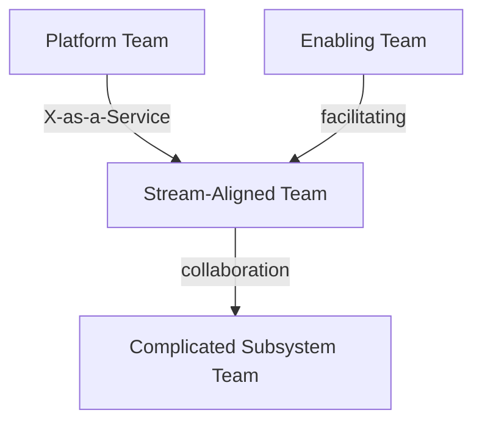
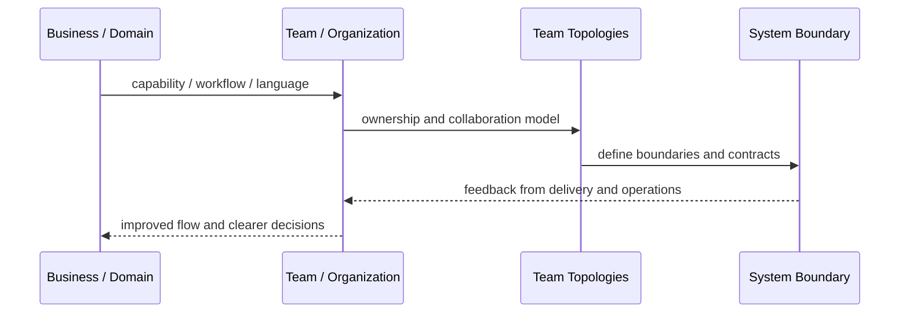
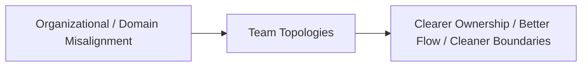

# Team Topologies

## Core Idea

Team Topologies organizes teams around flow of change using team types such as stream-aligned, platform, enabling, and complicated-subsystem teams.

---

## Problem It Solves

Teams are organized in ways that create excessive handoffs, unclear ownership, overloaded communication, and slow delivery.

---

## 3 Concrete Examples

### Example 1: Stream-Aligned Product Team

A team owns a customer-facing product stream end-to-end, including delivery and operations.

### Example 2: Platform Team

A platform team provides self-service deployment, observability, and runtime capabilities.

### Example 3: Enabling Team

A temporary enabling team helps product teams adopt security, testing, or cloud practices.

---

## Architect Questions

- What are the main streams of value?
- Which teams are stream-aligned?
- What cognitive load is too high for product teams?
- What platform capabilities should be self-service?
- Where are enabling teams needed temporarily?
- Which team interactions should be collaboration, X-as-a-Service, or facilitating?

---

## Main Diagram



---

## Runtime / Systems Thinking Flow



---

## Implementation Shape

```txt
1. Identify the systems problem: unclear ownership, overloaded teams, confused language, duplicated capabilities, or legacy contamination.
2. Map the business domain, value streams, teams, and current system boundaries.
3. Identify mismatches between team structure, domain boundaries, and software architecture.
4. Define ownership boundaries and collaboration contracts.
5. Decide what changes: teams, modules, services, platform capabilities, shared services, or integration boundaries.
6. Add feedback loops: delivery lead time, handoff count, incident ownership, cognitive load, dependency wait time, and customer impact.
7. Keep the pattern strategic. Do not turn systems thinking into diagrams nobody uses.
```

---

## When to Use

- Team structure is causing delivery friction.
- Cognitive load is too high.
- You need clearer team interaction modes.

---

## When Not to Use

- Team names change but responsibilities do not.
- Leadership will not address cognitive load or dependencies.
- It becomes org-chart theater.

---

## Common Smell That Suggests This Pattern

```txt
Delivery is slow not because engineers are weak,
but because ownership, language, team boundaries,
business capabilities, and software boundaries are misaligned.
```

---

## Common Mistakes

```txt
Drawing architecture without changing ownership.

Creating shared services that nobody truly owns.

Using DDD tactical patterns without understanding the domain.

Treating team topology as an org-chart rename.

Creating bounded contexts around technical layers instead of business language.

Letting legacy models leak into new systems.

Running workshops that produce sticky notes but no decisions.
```

---

## Best Visual Summary



## Final Meaning

Team Topologies is useful when it improves alignment between business reality, team ownership, and software boundaries. If it does not change decisions or ownership, it is just a diagram.
