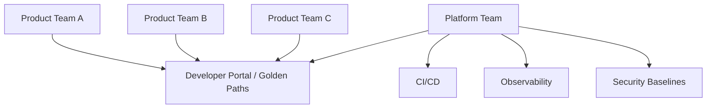
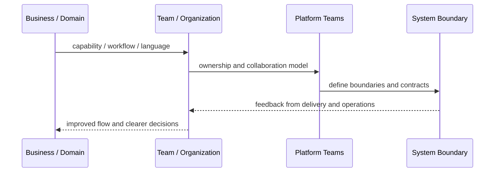
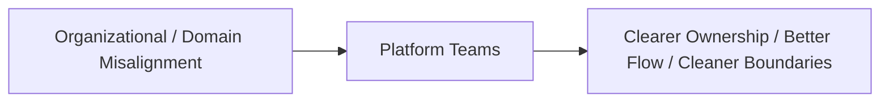

# Platform Teams

## Core Idea

Platform Teams build internal products that help stream-aligned teams deliver faster and safer through self-service capabilities.

---

## Problem It Solves

Product teams waste time repeatedly solving infrastructure, deployment, observability, security, and operational problems.

---

## 3 Concrete Examples

### Example 1: Deployment Platform

Platform team provides standardized CI/CD templates, environment creation, and rollback tools.

### Example 2: Observability Platform

Platform team provides logging, metrics, tracing, alerting, and dashboards as a supported service.

### Example 3: Developer Portal

Platform team offers service scaffolding, documentation, ownership metadata, and golden paths.

---

## Architect Questions

- What repeated friction do product teams face?
- What should become self-service?
- Who are the platform's users?
- What APIs, templates, or portals should the platform expose?
- How is platform adoption measured?
- Is the platform helping teams or becoming a bottleneck?

---

## Main Diagram



---

## Runtime / Systems Thinking Flow



---

## Implementation Shape

```txt
1. Identify the systems problem: unclear ownership, overloaded teams, confused language, duplicated capabilities, or legacy contamination.
2. Map the business domain, value streams, teams, and current system boundaries.
3. Identify mismatches between team structure, domain boundaries, and software architecture.
4. Define ownership boundaries and collaboration contracts.
5. Decide what changes: teams, modules, services, platform capabilities, shared services, or integration boundaries.
6. Add feedback loops: delivery lead time, handoff count, incident ownership, cognitive load, dependency wait time, and customer impact.
7. Keep the pattern strategic. Do not turn systems thinking into diagrams nobody uses.
```

---

## When to Use

- Product teams repeatedly solve the same infrastructure problems.
- Self-service internal platforms would improve flow.
- There is enough demand to justify platform ownership.

---

## When Not to Use

- The platform is forced instead of solving team pain.
- The platform team becomes a ticket queue.
- There are too few product teams to justify it.

---

## Common Smell That Suggests This Pattern

```txt
Delivery is slow not because engineers are weak,
but because ownership, language, team boundaries,
business capabilities, and software boundaries are misaligned.
```

---

## Common Mistakes

```txt
Drawing architecture without changing ownership.

Creating shared services that nobody truly owns.

Using DDD tactical patterns without understanding the domain.

Treating team topology as an org-chart rename.

Creating bounded contexts around technical layers instead of business language.

Letting legacy models leak into new systems.

Running workshops that produce sticky notes but no decisions.
```

---

## Best Visual Summary



## Final Meaning

Platform Teams is useful when it improves alignment between business reality, team ownership, and software boundaries. If it does not change decisions or ownership, it is just a diagram.
