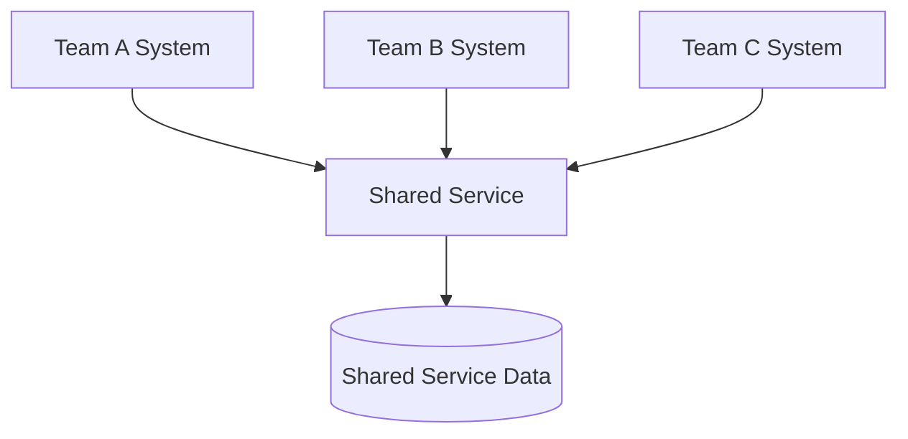
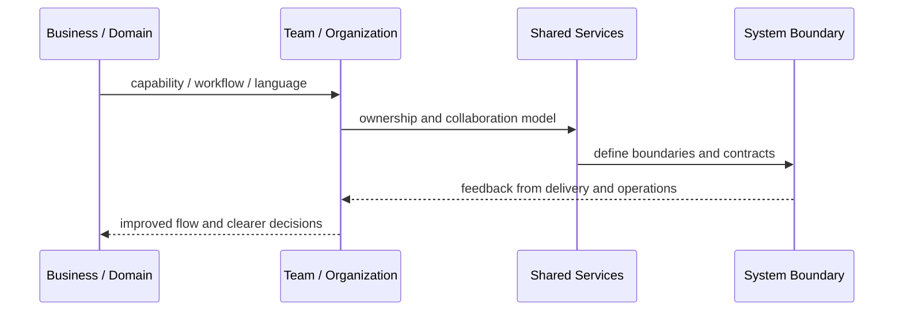
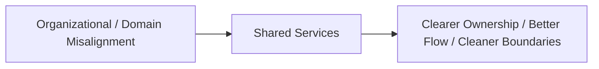

# Shared Services

## Core Idea

Shared Services centralize common capabilities used by multiple teams or systems.

---

## Problem It Solves

Multiple teams repeatedly build duplicate capabilities such as identity, billing, notifications, search, or reporting.

---

## 3 Concrete Examples

### Example 1: Identity Service

All applications use a shared identity and access service instead of implementing login separately.

### Example 2: Notification Service

Teams call one shared service for email, SMS, push, and delivery tracking.

### Example 3: Billing Service

Product teams use shared billing APIs for invoices, subscriptions, and payment records.

---

## Architect Questions

- What capability is genuinely shared?
- Who owns the shared service?
- What contract does it expose?
- How are teams prevented from being blocked by it?
- What SLAs and support model exist?
- Is this shared service becoming a bottleneck or god service?

---

## Main Diagram



---

## Runtime / Systems Thinking Flow



---

## Implementation Shape

```txt
1. Identify the systems problem: unclear ownership, overloaded teams, confused language, duplicated capabilities, or legacy contamination.
2. Map the business domain, value streams, teams, and current system boundaries.
3. Identify mismatches between team structure, domain boundaries, and software architecture.
4. Define ownership boundaries and collaboration contracts.
5. Decide what changes: teams, modules, services, platform capabilities, shared services, or integration boundaries.
6. Add feedback loops: delivery lead time, handoff count, incident ownership, cognitive load, dependency wait time, and customer impact.
7. Keep the pattern strategic. Do not turn systems thinking into diagrams nobody uses.
```

---

## When to Use

- A common capability is duplicated across teams.
- Central ownership and SLAs are possible.
- The service can expose a stable contract.

---

## When Not to Use

- The shared capability changes differently for each consumer.
- No team owns service quality.
- It becomes a bottleneck or god service.

---

## Common Smell That Suggests This Pattern

```txt
Delivery is slow not because engineers are weak,
but because ownership, language, team boundaries,
business capabilities, and software boundaries are misaligned.
```

---

## Common Mistakes

```txt
Drawing architecture without changing ownership.

Creating shared services that nobody truly owns.

Using DDD tactical patterns without understanding the domain.

Treating team topology as an org-chart rename.

Creating bounded contexts around technical layers instead of business language.

Letting legacy models leak into new systems.

Running workshops that produce sticky notes but no decisions.
```

---

## Best Visual Summary



## Final Meaning

Shared Services is useful when it improves alignment between business reality, team ownership, and software boundaries. If it does not change decisions or ownership, it is just a diagram.
