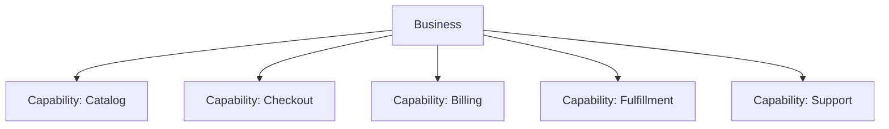
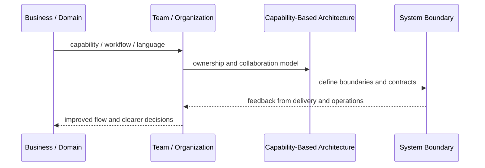
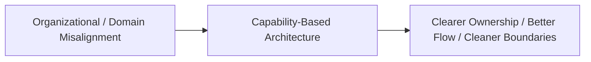

# Capability-Based Architecture

## Core Idea

Capability-Based Architecture organizes systems around business capabilities rather than technical layers or arbitrary applications.

---

## Problem It Solves

Architecture organized by technology or departments hides what the business actually needs the system to do.

---

## 3 Concrete Examples

### Example 1: Commerce Capabilities

Catalog, pricing, cart, checkout, payment, fulfillment, and returns are modeled as capabilities.

### Example 2: Healthcare Capabilities

Patient management, scheduling, billing, prescriptions, and lab results become capability boundaries.

### Example 3: SaaS Capabilities

Tenant management, licensing, billing, provisioning, support, and analytics are mapped as business capabilities.

---

## Architect Questions

- What capabilities does the business need?
- Which capabilities are core, supporting, or generic?
- Which systems implement each capability?
- Which teams own each capability?
- Which capabilities change often?
- Which capabilities should become modules, services, or shared platforms?

---

## Main Diagram



---

## Runtime / Systems Thinking Flow



---

## Implementation Shape

```txt
1. Identify the systems problem: unclear ownership, overloaded teams, confused language, duplicated capabilities, or legacy contamination.
2. Map the business domain, value streams, teams, and current system boundaries.
3. Identify mismatches between team structure, domain boundaries, and software architecture.
4. Define ownership boundaries and collaboration contracts.
5. Decide what changes: teams, modules, services, platform capabilities, shared services, or integration boundaries.
6. Add feedback loops: delivery lead time, handoff count, incident ownership, cognitive load, dependency wait time, and customer impact.
7. Keep the pattern strategic. Do not turn systems thinking into diagrams nobody uses.
```

---

## When to Use

- You need architecture aligned to business capabilities.
- Technical layers are hiding business ownership.
- Strategic planning or modernization requires capability mapping.

---

## When Not to Use

- Capabilities are vague labels with no ownership.
- The map is not connected to decisions.
- Technical constraints dominate and business boundaries are ignored.

---

## Common Smell That Suggests This Pattern

```txt
Delivery is slow not because engineers are weak,
but because ownership, language, team boundaries,
business capabilities, and software boundaries are misaligned.
```

---

## Common Mistakes

```txt
Drawing architecture without changing ownership.

Creating shared services that nobody truly owns.

Using DDD tactical patterns without understanding the domain.

Treating team topology as an org-chart rename.

Creating bounded contexts around technical layers instead of business language.

Letting legacy models leak into new systems.

Running workshops that produce sticky notes but no decisions.
```

---

## Best Visual Summary



## Final Meaning

Capability-Based Architecture is useful when it improves alignment between business reality, team ownership, and software boundaries. If it does not change decisions or ownership, it is just a diagram.
