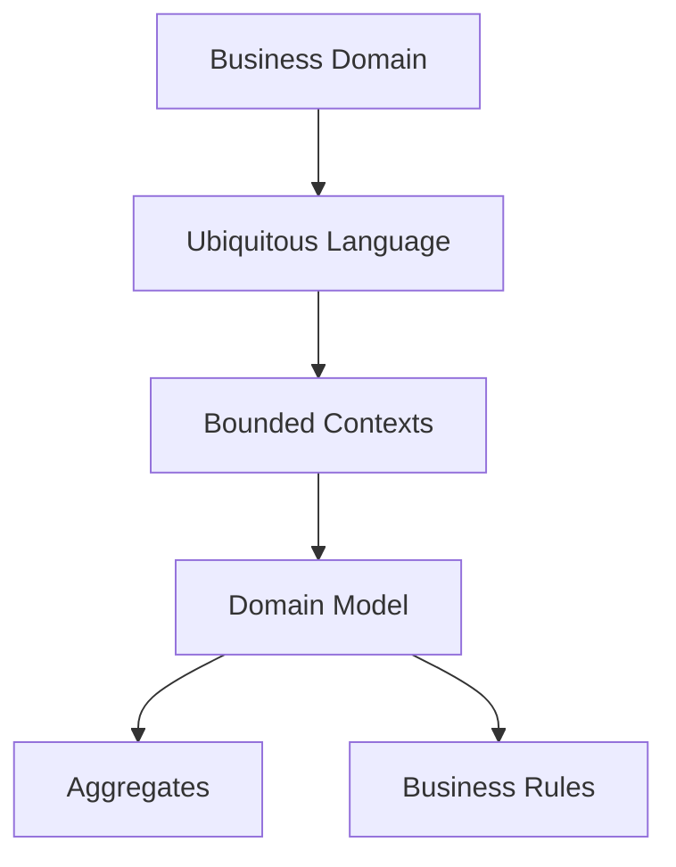
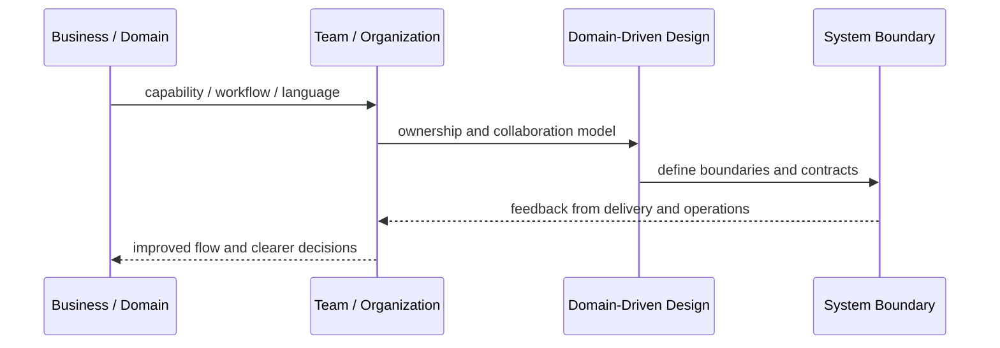
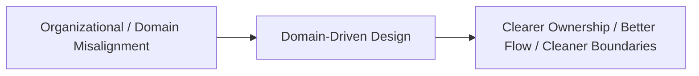

# Domain-Driven Design

## Core Idea

Domain-Driven Design focuses software design around the business domain, shared language, bounded contexts, aggregates, entities, value objects, and domain rules.

---

## Problem It Solves

Software becomes database-driven or technology-driven while business rules are scattered, misunderstood, and hard to evolve.

---

## 3 Concrete Examples

### Example 1: Banking Domain

Accounts, transfers, limits, holds, and ledger rules are modeled explicitly instead of hidden in transaction scripts.

### Example 2: Insurance Domain

Policies, claims, coverages, deductibles, and underwriting rules become explicit domain concepts.

### Example 3: Subscription Billing

Plans, subscriptions, invoices, renewals, credits, and proration rules are modeled as domain behavior.

---

## Architect Questions

- What is the core domain?
- What language do domain experts use?
- What bounded contexts exist?
- What aggregates protect invariants?
- What business rules are currently scattered?
- Which parts of the domain deserve rich modeling?

---

## Main Diagram



---

## Runtime / Systems Thinking Flow



---

## Implementation Shape

```txt
1. Identify the systems problem: unclear ownership, overloaded teams, confused language, duplicated capabilities, or legacy contamination.
2. Map the business domain, value streams, teams, and current system boundaries.
3. Identify mismatches between team structure, domain boundaries, and software architecture.
4. Define ownership boundaries and collaboration contracts.
5. Decide what changes: teams, modules, services, platform capabilities, shared services, or integration boundaries.
6. Add feedback loops: delivery lead time, handoff count, incident ownership, cognitive load, dependency wait time, and customer impact.
7. Keep the pattern strategic. Do not turn systems thinking into diagrams nobody uses.
```

---

## When to Use

- The business domain is complex.
- Business rules are central to system value.
- Domain experts and engineers need a shared model.

---

## When Not to Use

- The application is simple CRUD.
- No domain experts are available.
- The team applies tactical patterns without strategic understanding.

---

## Common Smell That Suggests This Pattern

```txt
Delivery is slow not because engineers are weak,
but because ownership, language, team boundaries,
business capabilities, and software boundaries are misaligned.
```

---

## Common Mistakes

```txt
Drawing architecture without changing ownership.

Creating shared services that nobody truly owns.

Using DDD tactical patterns without understanding the domain.

Treating team topology as an org-chart rename.

Creating bounded contexts around technical layers instead of business language.

Letting legacy models leak into new systems.

Running workshops that produce sticky notes but no decisions.
```

---

## Best Visual Summary



## Final Meaning

Domain-Driven Design is useful when it improves alignment between business reality, team ownership, and software boundaries. If it does not change decisions or ownership, it is just a diagram.
