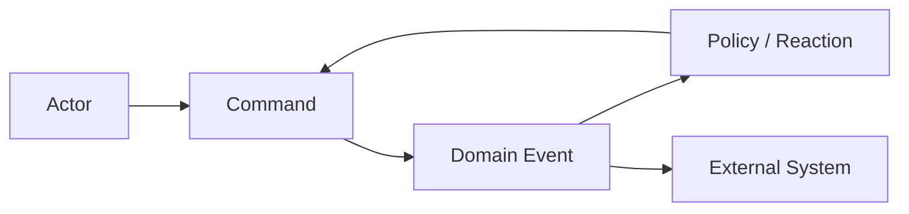
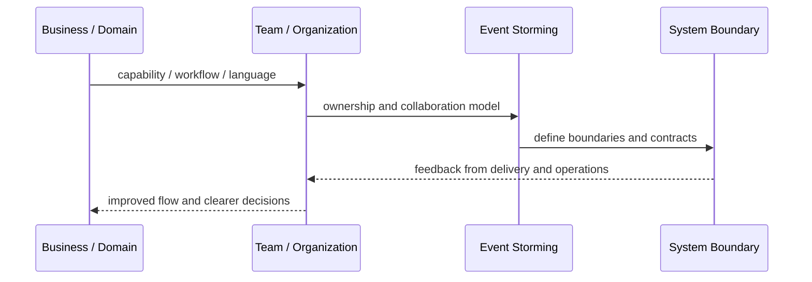
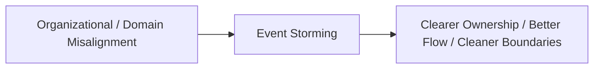

# Event Storming

## Core Idea

Event Storming is a collaborative modeling technique where domain experts and technologists map business events, commands, actors, policies, and systems.

---

## Problem It Solves

Teams lack a shared understanding of business workflows, domain events, rules, and boundaries.

---

## 3 Concrete Examples

### Example 1: Order Fulfillment Workshop

The team maps OrderPlaced, PaymentAuthorized, ItemsPicked, ShipmentCreated, and OrderDelivered events.

### Example 2: Claims Processing Discovery

Domain experts map claim submitted, document requested, claim approved, and payout issued.

### Example 3: SaaS Provisioning Flow

Teams map tenant registered, license activated, environment provisioned, and onboarding completed.

---

## Architect Questions

- What domain events happen in the business?
- What commands cause those events?
- Who performs each command?
- What policies or rules react to events?
- Where are pain points or external systems?
- What bounded contexts appear from the event map?

---

## Main Diagram



---

## Runtime / Systems Thinking Flow



---

## Implementation Shape

```txt
1. Identify the systems problem: unclear ownership, overloaded teams, confused language, duplicated capabilities, or legacy contamination.
2. Map the business domain, value streams, teams, and current system boundaries.
3. Identify mismatches between team structure, domain boundaries, and software architecture.
4. Define ownership boundaries and collaboration contracts.
5. Decide what changes: teams, modules, services, platform capabilities, shared services, or integration boundaries.
6. Add feedback loops: delivery lead time, handoff count, incident ownership, cognitive load, dependency wait time, and customer impact.
7. Keep the pattern strategic. Do not turn systems thinking into diagrams nobody uses.
```

---

## When to Use

- The team needs shared understanding of a workflow.
- Bounded contexts or domain events are unclear.
- Domain experts and developers need to collaborate visually.

---

## When Not to Use

- No domain experts attend.
- The workshop output is never used.
- The problem is already well understood and simple.

---

## Common Smell That Suggests This Pattern

```txt
Delivery is slow not because engineers are weak,
but because ownership, language, team boundaries,
business capabilities, and software boundaries are misaligned.
```

---

## Common Mistakes

```txt
Drawing architecture without changing ownership.

Creating shared services that nobody truly owns.

Using DDD tactical patterns without understanding the domain.

Treating team topology as an org-chart rename.

Creating bounded contexts around technical layers instead of business language.

Letting legacy models leak into new systems.

Running workshops that produce sticky notes but no decisions.
```

---

## Best Visual Summary



## Final Meaning

Event Storming is useful when it improves alignment between business reality, team ownership, and software boundaries. If it does not change decisions or ownership, it is just a diagram.
