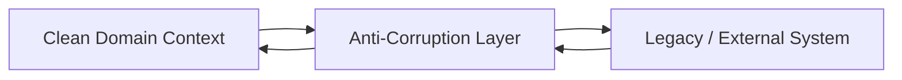
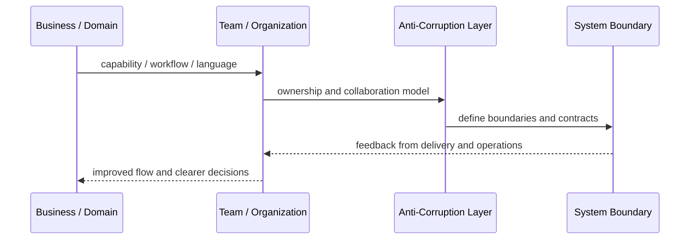
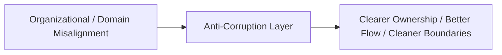

# Anti-Corruption Layer

## Core Idea

Anti-Corruption Layer protects a clean model from being polluted by another system's model, language, data shape, or assumptions.

---

## Problem It Solves

Legacy or external systems use concepts that do not match the new domain model, and directly adopting them would corrupt the new design.

---

## 3 Concrete Examples

### Example 1: ERP Integration

ERP product and inventory concepts are translated into clean catalog and warehouse concepts.

### Example 2: Legacy CRM

Old customer statuses and fields are mapped into the new customer domain language.

### Example 3: Payment Provider Boundary

Vendor-specific payment statuses are translated into internal payment states.

---

## Architect Questions

- What external model would corrupt our domain?
- What concepts need translation?
- Which fields or statuses do not map directly?
- Should translation be synchronous or event-driven?
- Who owns the mapping rules?
- How are external changes isolated?

---

## Main Diagram



---

## Runtime / Systems Thinking Flow



---

## Implementation Shape

```txt
1. Identify the systems problem: unclear ownership, overloaded teams, confused language, duplicated capabilities, or legacy contamination.
2. Map the business domain, value streams, teams, and current system boundaries.
3. Identify mismatches between team structure, domain boundaries, and software architecture.
4. Define ownership boundaries and collaboration contracts.
5. Decide what changes: teams, modules, services, platform capabilities, shared services, or integration boundaries.
6. Add feedback loops: delivery lead time, handoff count, incident ownership, cognitive load, dependency wait time, and customer impact.
7. Keep the pattern strategic. Do not turn systems thinking into diagrams nobody uses.
```

---

## When to Use

- A legacy/external model would pollute the new domain.
- Translation rules are needed at a boundary.
- The clean context must remain independent.

---

## When Not to Use

- The external model already matches the domain.
- A simple adapter is enough.
- The ACL becomes a dumping ground for unrelated logic.

---

## Common Smell That Suggests This Pattern

```txt
Delivery is slow not because engineers are weak,
but because ownership, language, team boundaries,
business capabilities, and software boundaries are misaligned.
```

---

## Common Mistakes

```txt
Drawing architecture without changing ownership.

Creating shared services that nobody truly owns.

Using DDD tactical patterns without understanding the domain.

Treating team topology as an org-chart rename.

Creating bounded contexts around technical layers instead of business language.

Letting legacy models leak into new systems.

Running workshops that produce sticky notes but no decisions.
```

---

## Best Visual Summary



## Final Meaning

Anti-Corruption Layer is useful when it improves alignment between business reality, team ownership, and software boundaries. If it does not change decisions or ownership, it is just a diagram.
