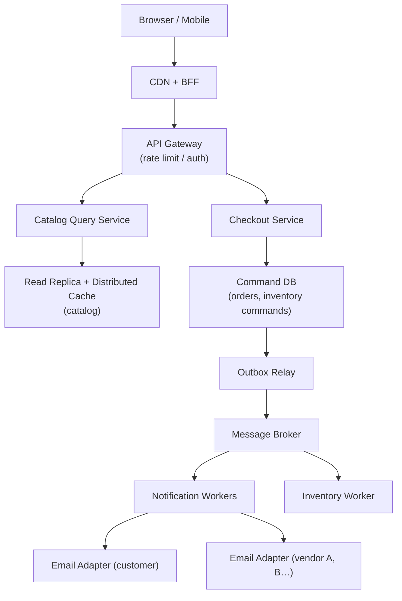

# Problem 1: Scaling E-Commerce with Customer & Vendor Notifications

## Business Problem
Build an e-commerce platform where thousands of users browse and checkout at once. When an order is placed:
- The **customer** gets an order confirmation email.
- Each **vendor** gets a fulfillment email for their line items.
- Product pages and cart must stay **fast** — users must not wait on email sending or heavy DB writes on the critical path.

## Hard Requirements
- Checkout API p95 **under 300 ms** (no synchronous email or SMTP on request path).
- Product catalog reads must scale without hammering the primary database.
- Inventory must not oversell during concurrent checkouts.
- Email delivery can be delayed seconds/minutes but must be **reliable** and **retryable**.
- Vendor and customer notifications are independent (one vendor SMTP failure must not block others).

## Why One Pattern Is Not Enough
| If you only use… | What breaks |
| --- | --- |
| Single monolith + one DB | Writes and reads compete; checkout slows under load |
| Sync email in controller | Checkout latency spikes; vendor timeout kills customer flow |
| Cache only | Stale inventory → overselling |
| Queue only | No transactional guarantee between order row and notification job |

You need **separation of command vs query**, **async messaging**, **transactional outbox**, and **resilience** together.

## Architecture Overview


## Pattern Mix
| Concern | Patterns | Role |
| --- | --- | --- |
| Fast reads | [CQRS](../Scalability_patterns/06-cqrs.md), [Read Replica](../Scalability_patterns/07-read-replica.md), [Cache-Aside](../Data_domain_patterns/18-cache-aside.md), [CDN](../Scalability_patterns/05-cdn.md) | Catalog/search off primary DB; cache hot SKUs |
| Fast writes on checkout | [Stateless Services](../Scalability_patterns/01-stateless-services.md), [CQRS](../Scalability_patterns/06-cqrs.md), [Queue-Based Load Leveling](../Scalability_patterns/09-queue-based-load-leveling.md) | Checkout only writes order + outbox; heavy work async |
| Reliable notifications | [Outbox Pattern](../Distributed_system_patterns/11-outbox-pattern.md), [Event Notification](../Messaging_Integration_patterns/10-event-notification.md), [Competing Consumers](../Messaging_Integration_patterns/08-competing-consumers.md), [Dead Letter Queue](../Messaging_Integration_patterns/07-dead-letter-queue.md) | Email never lost; failed sends retried or quarantined |
| Inventory accuracy | [Saga](../Distributed_system_patterns/10-saga.md), [Idempotency](../Distributed_system_patterns/20-idempotency.md), [Distributed Lock](../Distributed_system_patterns/21-distributed-lock.md) | Reserve → pay → confirm or compensate |
| Vendor-specific email | [Adapter](../Structural Patterns/Adapter.md) (one adapter per SMTP/webhook provider) | SendGrid, SES, vendor webhook — same interface |
| Resilience | [Circuit Breaker](../Resilience_Pattern/01-circuit-breaker.md), [Retry with Backoff](../Distributed_system_patterns/04-retry-with-backoff.md), [Bulkhead](../Resilience_Pattern/04-bulkhead.md) | Payment/email pools isolated |
| Security | [OAuth2](../Security_patterns/04-oauth2.md), [RBAC](../Security_patterns/02-rbac.md), [API Gateway](../Distributed_system_patterns/01-api-gateway.md) | Customer vs vendor vs admin scopes |

## Happy-Path Flow (Checkout — user waits only for this)
1. Customer submits cart → **Idempotency-Key** dedupes double-clicks.
2. **Checkout service** validates cart (reads from cache/replica, not primary).
3. **Saga step 1:** reserve inventory (short lock per SKU partition).
4. **Saga step 2:** charge payment ([Circuit Breaker](../Resilience_Pattern/01-circuit-breaker.md) on payment API).
5. In **one DB transaction:** insert `orders`, insert `outbox` rows (`OrderPlaced`, `VendorNotifyRequested` per vendor).
6. Return `202/200` with order id — **done for user** (typically under 300 ms).

## Async Flow (Notifications — user does not wait)
1. **Outbox relay** polls outbox → publishes to broker.
2. **Notification worker** consumes `OrderPlaced` → **Adapter** sends customer email.
3. **Per-vendor workers** consume `VendorNotifyRequested` → vendor-specific template + SMTP adapter.
4. Failures → **Retry with Backoff** → **DLQ** for manual replay.

## Data Strategy: No DB Delay on Read/Write Path
| Path | Strategy |
| --- | --- |
| Product browse | CDN + cache-aside + read replica |
| Cart read | Session cache + replica |
| Checkout write | Single command DB transaction (order + outbox only) |
| Email / analytics | Async consumers, separate connection pools (**Bulkhead**) |
| Vendor dashboards | [CQRS read model](../Data_domain_patterns/19-cqrs-read-model.md) built from events |

## Failure Scenarios
| Failure | Response |
| --- | --- |
| Payment succeeds, email fails | Order stays confirmed; outbox retry/DLQ — never rollback paid order for email |
| Inventory reserve fails | Fail fast before payment; return clear error |
| Vendor email down | DLQ + alert; customer email still sent on separate consumer |
| Cache stale on inventory | Reserve step hits authoritative inventory shard, not cache |

## TypeScript Sketch
```typescript
// Checkout: one transaction, async side effects
async function checkout(cmd: CheckoutCommand, idempotencyKey: string) {
  if (await idempotency.exists(idempotencyKey)) return idempotency.result(idempotencyKey);

  const reservation = await inventorySaga.reserve(cmd.lines); // lock + decrement
  try {
    await paymentBreaker.call(() => payments.charge(cmd.payment));
    const order = await db.transaction(async (tx) => {
      const o = await tx.orders.insert(buildOrder(cmd, reservation));
      await tx.outbox.insert({ type: 'OrderPlaced', payload: o });
      for (const v of vendorsFor(cmd.lines))
        await tx.outbox.insert({ type: 'VendorNotifyRequested', payload: { orderId: o.id, vendorId: v } });
      return o;
    });
    await idempotency.save(idempotencyKey, order);
    return order;
  } catch (e) {
    await inventorySaga.compensate(reservation);
    throw e;
  }
}

// Worker: customer vs vendor adapters
const emailAdapters: Record<string, EmailAdapter> = { sendgrid: sg, ses: ses, vendorWebhook: wh };
async function handleVendorNotify(msg: OutboxMessage) {
  const adapter = emailAdapters[msg.payload.channel] ?? emailAdapters.sendgrid;
  await withRetry(() => adapter.sendVendorFulfillment(msg.payload));
}
```

## Patterns Used (quick links)
[CQRS](../Scalability_patterns/06-cqrs.md) · [Read Replica](../Scalability_patterns/07-read-replica.md) · [Cache-Aside](../Data_domain_patterns/18-cache-aside.md) · [Outbox](../Distributed_system_patterns/11-outbox-pattern.md) · [Saga](../Distributed_system_patterns/10-saga.md) · [Idempotency](../Distributed_system_patterns/20-idempotency.md) · [Queue](../Messaging_Integration_patterns/02-queue.md) · [Circuit Breaker](../Resilience_Pattern/01-circuit-breaker.md) · [Adapter](../Structural Patterns/Adapter.md) · [API Gateway](../Distributed_system_patterns/01-api-gateway.md)
