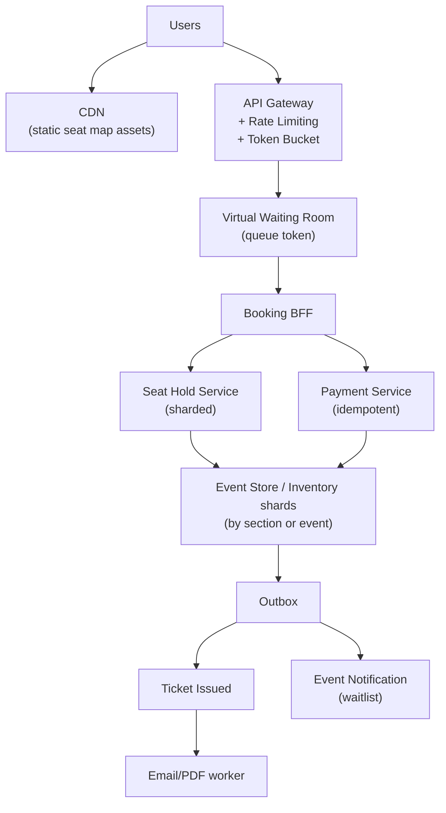
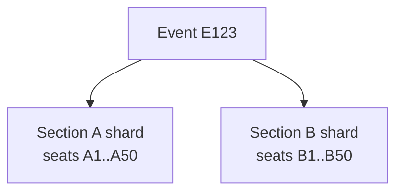

# Problem 2: High-Demand Event Ticketing (Ticketmaster-Style)

## Business Problem
Sell tickets to concerts and sports events where **demand spikes 100×** when sales open. Users must:
- Join a fair queue when the system is overloaded.
- Hold seats temporarily while paying.
- Never get double-charged or double-booked the same seat.
- See accurate seat maps under extreme concurrency.

## Hard Requirements
- **No double booking** of the same seat (hard invariant).
- Users in queue get **FIFO fairness** (or weighted fairness for members).
- Seat hold expires in **10 minutes** if unpaid.
- Payment and booking must be **idempotent** (refresh / double-submit safe).
- System stays up when 500k users hit “Buy” at 10:00:00 AM.

## Why One Pattern Is Not Enough
| If you only use… | What breaks |
| --- | --- |
| DB row lock on every browse | Seat map reads deadlock; site freezes |
| Single Redis lock globally | Throughput collapses; one seat at a time worldwide |
| Queue without hold expiry | Seats locked forever; inventory stuck |
| Sync payment in HTTP thread | Timeouts release seats while user was charged |

You need **admission control**, **partitioned inventory**, **short-lived holds**, **saga + idempotency**, and **event audit**.

## Architecture Overview


## Pattern Mix
| Concern | Patterns | Role |
| --- | --- | --- |
| Traffic spike | [Queue-Based Load Leveling](../Scalability_patterns/09-queue-based-load-leveling.md), [Rate Limiting](../Distributed_system_patterns/18-rate-limiting.md), [Token Bucket](../Distributed_system_patterns/22-token-bucket.md), [Load Shedding](../Resilience_Pattern/08-load-shedding.md) | Admit N users/sec; queue the rest |
| Seat inventory | [Sharding](../Scalability_patterns/03-sharding.md), [Partitioning](../Scalability_patterns/02-partitioning.md), [Distributed Lock](../Distributed_system_patterns/21-distributed-lock.md) | Lock per seat or row, not whole venue |
| Hold lifecycle | [Saga](../Distributed_system_patterns/10-saga.md), [Timeout](../Resilience_Pattern/03-timeout.md) | Hold → pay → confirm or release |
| Correctness | [Idempotency](../Distributed_system_patterns/20-idempotency.md), [Event Sourcing](../Data_domain_patterns/15-event-sourcing.md) | Audit trail; replay disputes |
| Fast seat map reads | [CQRS](../Scalability_patterns/06-cqrs.md), [Read Replica](../Scalability_patterns/07-read-replica.md), [CDN](../Scalability_patterns/05-cdn.md) | Map is read-heavy; writes are holds/solds |
| Notifications | [Outbox](../Distributed_system_patterns/11-outbox-pattern.md), [Event Notification](../Messaging_Integration_patterns/10-event-notification.md) | Ticket email async |
| Resilience | [Circuit Breaker](../Resilience_Pattern/01-circuit-breaker.md), [Bulkhead](../Resilience_Pattern/04-bulkhead.md), [Fail Fast](../Resilience_Pattern/05-fail-fast.md) | Payment pool separate from hold pool |
| Multi-region (optional) | [Active-Active](../Resilience_Pattern/14-active-active.md), [Quorum](../Distributed_system_patterns/26-quorum.md) | Hot events in multiple AZs |

## Happy-Path Flow
1. User passes **waiting room** → receives short-lived **queue token** ([Rate Limiting](../Distributed_system_patterns/18-rate-limiting.md)).
2. User selects seats → **Hold service** tries atomic hold on shard (`sectionId + seatId`).
3. Hold record TTL = 10 min; status = `HELD`.
4. User pays with **Idempotency-Key** → payment service ([Circuit Breaker](../Resilience_Pattern/01-circuit-breaker.md)).
5. **Saga completes:** mark seats `SOLD`, create ticket records, write **Outbox** `TicketIssued`.
6. Return ticket PDF link (or poll) — email sent async.

## Hold Expiry Flow (background)
1. Scheduler finds holds past TTL.
2. **Compensating action:** release seats back to `AVAILABLE`.
3. Append `SeatHoldExpired` event ([Event Sourcing](../Data_domain_patterns/15-event-sourcing.md)).

## Concurrency Model (seats)

Two users hitting the same seat → **one wins**, other gets “seat unavailable” immediately (**Fail Fast**).

## Failure Scenarios
| Failure | Response |
| --- | --- |
| Payment succeeds, confirm fails | Idempotent confirm retry; never sell seat twice |
| Payment fails | Release hold in saga compensate |
| User closes browser during pay | TTL releases seat automatically |
| Broker down after outbox write | Outbox relay retries; ticket email delayed not lost |
| Hot shard (floor seats) | Partition by section; scale shard replicas |

## TypeScript Sketch
```typescript
async function holdSeat(cmd: HoldSeatCommand, userId: string) {
  const key = `${cmd.eventId}:${cmd.sectionId}:${cmd.seatId}`;
  const ok = await inventoryShard.compareAndSet(key, 'AVAILABLE', {
    status: 'HELD', userId, expiresAt: Date.now() + 10 * 60_000,
  });
  if (!ok) throw new SeatUnavailableError(key);
  return { holdId: key, expiresAt: Date.now() + 10 * 60_000 };
}

async function purchase(holdId: string, payment: PaymentDto, idempotencyKey: string) {
  if (await idempotency.exists(idempotencyKey)) return idempotency.result(idempotencyKey);

  await paymentBreaker.call(() => payments.charge(payment));
  const ticket = await db.transaction(async (tx) => {
    await inventoryShard.set(holdId, 'SOLD');
    const t = await tx.tickets.insert({ holdId, userId: payment.userId });
    await tx.outbox.insert({ type: 'TicketIssued', payload: t });
    return t;
  });
  await idempotency.save(idempotencyKey, ticket);
  return ticket;
}

// Waiting room: token bucket per event
function admitUser(eventId: string): boolean {
  return buckets.get(eventId)?.tryConsume(1) ?? false;
}
```

## Patterns Used (quick links)
[Queue-Based Load Leveling](../Scalability_patterns/09-queue-based-load-leveling.md) · [Rate Limiting](../Distributed_system_patterns/18-rate-limiting.md) · [Sharding](../Scalability_patterns/03-sharding.md) · [Distributed Lock](../Distributed_system_patterns/21-distributed-lock.md) · [Saga](../Distributed_system_patterns/10-saga.md) · [Idempotency](../Distributed_system_patterns/20-idempotency.md) · [Event Sourcing](../Data_domain_patterns/15-event-sourcing.md) · [Outbox](../Distributed_system_patterns/11-outbox-pattern.md) · [Circuit Breaker](../Resilience_Pattern/01-circuit-breaker.md) · [CQRS](../Scalability_patterns/06-cqrs.md)
