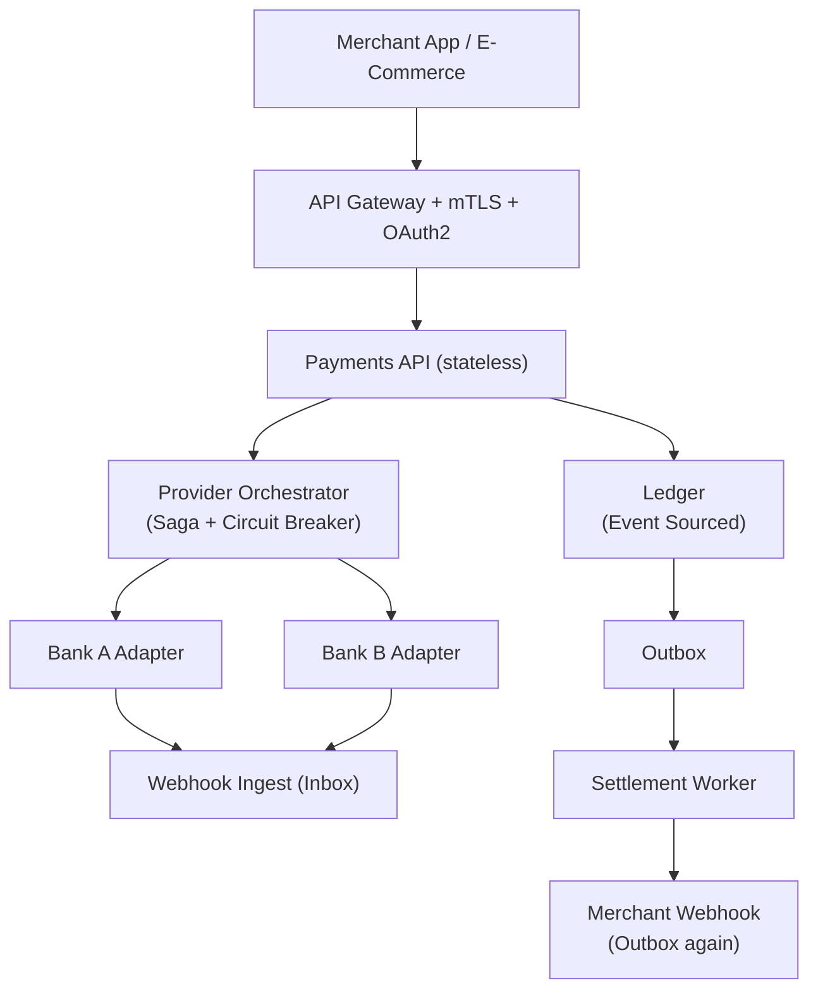

# Problem 3: Multi-Party Payment & Settlement Platform

## Business Problem
Build a platform (Stripe / PayPal–style) that moves money between **customers**, **merchants**, and **platform fees**. Merchants receive webhooks when funds settle. The system must survive provider outages, duplicate webhook delivery, partial failures across banks, and strict audit requirements.

## Hard Requirements
- **Exactly-once money effect** from the merchant’s perspective (idempotent charges/refunds).
- Webhooks from external banks may arrive **duplicate or out of order**.
- Ledger must be **auditable** — reconstruct balance at any past time.
- Provider API down → queue and retry without corrupting balances.
- PCI scope minimized — card data never stored in core ledger service.

## Why One Pattern Is Not Enough
| If you only use… | What breaks |
| --- | --- |
| CRUD on `balance` column | Lost updates; no audit trail |
| Sync call to bank in API | Timeouts double-charge or orphan payments |
| Webhook handler without inbox | Duplicate webhooks double-credit merchant |
| Retry without idempotency | Retry creates second charge |

You need **event sourcing / ledger**, **outbox + inbox**, **saga across providers**, **adapters**, and **strong idempotency**.

## Architecture Overview


## Pattern Mix
| Concern | Patterns | Role |
| --- | --- | --- |
| Audit & balances | [Event Sourcing](../Data_domain_patterns/15-event-sourcing.md), [CQRS](../Scalability_patterns/06-cqrs.md), [Materialized View](../Data_domain_patterns/16-materialized-view.md) | Ledger = events; balance = projection |
| External banks | [Adapter](../Structural Patterns/Adapter.md), [Anti-Corruption Layer](../Distributed_system_patterns/15-anti-corruption-layer.md) | Normalize provider-specific payloads |
| Reliable outbound | [Outbox Pattern](../Distributed_system_patterns/11-outbox-pattern.md), [Retry with Backoff](../Distributed_system_patterns/04-retry-with-backoff.md) | Merchant webhooks never lost |
| Reliable inbound | [Inbox Pattern](../Distributed_system_patterns/12-inbox-pattern.md), [Idempotency](../Distributed_system_patterns/20-idempotency.md) | Dedupe provider webhooks |
| Multi-step pay | [Saga](../Distributed_system_patterns/10-saga.md), [Compensating transactions](../Distributed_system_patterns/10-saga.md) | Authorize → capture → settle → fee split |
| Resilience | [Circuit Breaker](../Resilience_Pattern/01-circuit-breaker.md), [Bulkhead](../Resilience_Pattern/04-bulkhead.md), [Timeout](../Resilience_Pattern/03-timeout.md) | Per-provider pools |
| Security | [Mutual TLS](../Security_patterns/15-mutual-tls.md), [OAuth2](../Security_patterns/04-oauth2.md), [Secrets Vault](../Security_patterns/12-secrets-vault.md), [Envelope Encryption](../Security_patterns/13-envelope-encryption.md) | Keys and tokens protected |
| Observability | [Correlation Identifier](../Messaging_Integration_patterns/19-correlation-identifier.md), [Distributed Tracing](../DevOps_Delivery_patterns/08-distributed-tracing.md) | Trace payment across services |

## Happy-Path Flow (Charge)
1. Merchant calls `POST /charges` with **Idempotency-Key**.
2. Payments API appends `ChargeRequested` to ledger stream.
3. **Saga:** authorize at provider ([Adapter](../Structural Patterns/Adapter.md) + [Circuit Breaker](../Resilience_Pattern/01-circuit-breaker.md)).
4. On success append `ChargeAuthorized`, then `ChargeCaptured`.
5. **Outbox:** `MerchantWebhook: payment.succeeded` in same transaction as ledger append.
6. Return charge object from **read projection** (not by scanning full event log).

## Webhook Inbound Flow
1. Bank POSTs to `/webhooks/bank-a` (signature verified).
2. **Inbox:** store `webhookId`; if seen → 200 OK immediately.
3. Translate payload via **Anti-Corruption Layer** → domain event `SettlementConfirmed`.
4. Append to ledger; update merchant balance projection.
5. **Outbox:** notify merchant (`payout.completed`).

## Saga Failure (authorize OK, capture fails)
1. Append `CaptureFailed`.
2. Compensate: `VoidAuthorization` via provider adapter.
3. Append `ChargeVoided`; merchant sees failed charge, no settlement.

## Data Strategy
| Store | Contents |
| --- | --- |
| Event log | Immutable `ChargeRequested`, `Authorized`, `Captured`, `Refunded`… |
| Projections | Current balance, charge status API reads |
| Outbox | Pending merchant webhooks |
| Inbox | Processed provider webhook IDs |

## Failure Scenarios
| Failure | Response |
| --- | --- |
| Duplicate webhook | Inbox dedupe; no double credit |
| Provider timeout | Circuit opens; queue command; client gets `processing` |
| Outbox publish fail | Relay retries; merchant webhook delayed |
| Partial saga | Compensating void/refund steps |

## TypeScript Sketch
```typescript
async function createCharge(cmd: CreateCharge, idempotencyKey: string) {
  if (await idempotency.exists(idempotencyKey)) return idempotency.result(idempotencyKey);

  const chargeId = crypto.randomUUID();
  await ledger.append(chargeId, { type: 'ChargeRequested', ...cmd });

  try {
    const auth = await bankBreaker.call(() => bankAdapter.authorize(cmd));
    await ledger.append(chargeId, { type: 'ChargeAuthorized', authId: auth.id });

    const cap = await bankAdapter.capture(auth.id);
    await db.transaction(async (tx) => {
      await ledger.append(chargeId, { type: 'ChargeCaptured', captureId: cap.id });
      await tx.outbox.insert({ type: 'payment.succeeded', merchantId: cmd.merchantId, chargeId });
    });
  } catch (e) {
    await ledger.append(chargeId, { type: 'ChargeFailed', reason: String(e) });
    throw e;
  }

  const view = await projections.charge(chargeId);
  await idempotency.save(idempotencyKey, view);
  return view;
}

async function handleBankWebhook(headers: Headers, body: unknown) {
  const webhookId = headers.get('x-webhook-id')!;
  if (await inbox.seen(webhookId)) return;
  const event = bankAcl.toDomainEvent(body);
  await ledger.append(event.aggregateId, event);
  await inbox.mark(webhookId);
}
```

## Patterns Used (quick links)
[Event Sourcing](../Data_domain_patterns/15-event-sourcing.md) · [CQRS](../Scalability_patterns/06-cqrs.md) · [Saga](../Distributed_system_patterns/10-saga.md) · [Outbox](../Distributed_system_patterns/11-outbox-pattern.md) · [Inbox](../Distributed_system_patterns/12-inbox-pattern.md) · [Idempotency](../Distributed_system_patterns/20-idempotency.md) · [Adapter](../Structural Patterns/Adapter.md) · [Anti-Corruption Layer](../Distributed_system_patterns/15-anti-corruption-layer.md) · [Circuit Breaker](../Resilience_Pattern/01-circuit-breaker.md) · [Correlation Identifier](../Messaging_Integration_patterns/19-correlation-identifier.md)
