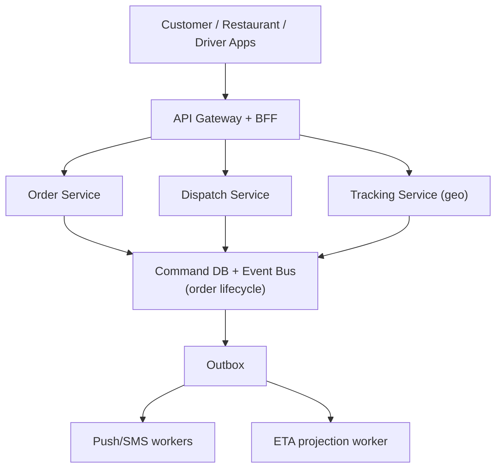

# Problem 4: Food Delivery Dispatch (Uber Eats–Style)

## Business Problem
Connect **customers**, **restaurants**, and **drivers** in one order lifecycle: place order → restaurant accepts → driver assigned → pickup → delivery → ratings. Each party needs real-time status updates (push/SMS). ETAs must update as the driver moves.

## Hard Requirements
- Order state visible to all parties within **seconds**.
- Driver assignment fair and idempotent (no double-assign same driver).
- Restaurant prep time + driver route feed ETA model.
- Cancel/refund saga if restaurant rejects or driver no-shows.
- Peak dinner rush without melting dispatch DB.

## Why One Pattern Is Not Enough
| If you only use… | What breaks |
| --- | --- |
| Polling REST every 2s | DB overload; stale ETAs |
| Single `orders.status` column | Lost history; dispute nightmares |
| Sync SMS in assign API | Dispatch slows; timeouts cascade |
| One monolith DB | Restaurant reads slow dispatch writes |

## Architecture Overview


## Pattern Mix
| Concern | Patterns | Role |
| --- | --- | --- |
| Lifecycle | [Saga](../Distributed_system_patterns/10-saga.md), [State Machine](../Data_domain_patterns/14-domain-model.md) | Place → accept → assign → deliver → complete |
| Real-time updates | [Event Notification](../Messaging_Integration_patterns/10-event-notification.md), [Pub/Sub](../Messaging_Integration_patterns/01-publish-subscribe.md), [Observer](../Frontend_patterns/08-observer.md) | Push to apps on state change |
| Dispatch reads | [CQRS](../Scalability_patterns/06-cqrs.md), [Geosharding / Data Locality](../Scalability_patterns/12-data-locality.md) | Match drivers near restaurant |
| Peak load | [Queue-Based Load Leveling](../Scalability_patterns/09-queue-based-load-leveling.md), [Competing Consumers](../Messaging_Integration_patterns/08-competing-consumers.md) | Burst orders buffered |
| Reliability | [Outbox](../Distributed_system_patterns/11-outbox-pattern.md), [Idempotency](../Distributed_system_patterns/20-idempotency.md), [Circuit Breaker](../Resilience_Pattern/01-circuit-breaker.md) | Notify after commit; map API isolated |
| Integrations | [Adapter](../Structural Patterns/Adapter.md) | Maps, SMS, payment providers |

## Happy-Path Flow
1. Customer places order → **Idempotency-Key** → saga starts.
2. `OrderPlaced` event → restaurant tablet notified.
3. Restaurant accepts → `OrderAccepted` → dispatch finds nearby drivers (geo index).
4. Driver accepts offer → **Distributed Lock** on driver id → `DriverAssigned`.
5. Pickup/delivery milestones append events; **ETA worker** recalculates from map **Adapter**.
6. Complete → payment capture + rating prompt (async).

## Failure Scenarios
| Failure | Response |
| --- | --- |
| No driver in 5 min | Escalate radius; compensate cancel if timeout |
| Restaurant rejects | Saga refund + notify customer |
| Push fails | Outbox retry; SMS fallback **Adapter** |
| Map API down | Circuit breaker; last-known ETA + buffer |

## TypeScript Sketch
```typescript
async function assignDriver(orderId: string, driverId: string) {
  const lock = await locks.acquire(`driver:${driverId}`, 30_000);
  try {
    await db.transaction(async (tx) => {
      await tx.orders.update(orderId, { status: 'DRIVER_ASSIGNED', driverId });
      await tx.outbox.insert({ type: 'DriverAssigned', orderId, driverId });
    });
  } finally {
    await lock.release();
  }
}

bus.on('DriverAssigned', async (e) => {
  await push.notify(e.driverId, 'New delivery');
  await push.notify(e.customerId, 'Driver on the way');
  await etaProjector.refresh(e.orderId);
});
```

## Patterns Used (quick links)
[Saga](../Distributed_system_patterns/10-saga.md) · [CQRS](../Scalability_patterns/06-cqrs.md) · [Outbox](../Distributed_system_patterns/11-outbox-pattern.md) · [Event Notification](../Messaging_Integration_patterns/10-event-notification.md) · [Pub/Sub](../Messaging_Integration_patterns/01-publish-subscribe.md) · [Data Locality](../Scalability_patterns/12-data-locality.md) · [Idempotency](../Distributed_system_patterns/20-idempotency.md) · [Adapter](../Structural Patterns/Adapter.md)
