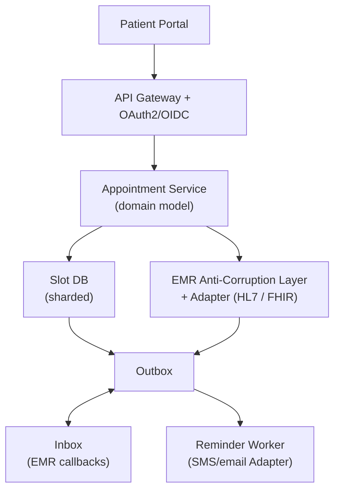

# Problem 5: Hospital Appointment Booking + EMR Integration

## Business Problem
Patients book clinician appointments online. Slots must sync with a **legacy EMR** (HL7/FHIR) without double-booking the same clinician. Confirmations, reminders, and cancellations must reach patients reliably while PHI stays protected.

## Hard Requirements
- **No double booking** of clinician time slots.
- EMR is source of truth for clinician calendar — your system adapts to it, not vice versa.
- Booking API fast for patient; EMR sync can be async with reconciliation.
- HIPAA-aligned: audit who accessed what; encrypt PHI at rest.
- Handle duplicate EMR webhook/admission events safely.

## Why One Pattern Is Not Enough
| If you only use… | What breaks |
| --- | --- |
| Direct EMR writes from UI | Legacy schema leaks into app; brittle |
| Cache slots only | EMR changes → ghost appointments |
| Sync HL7 in HTTP request | Timeouts; patient sees errors for slow EMR |
| Shared DB with EMR | Coupling; compliance nightmare |

## Architecture Overview


## Pattern Mix
| Concern | Patterns | Role |
| --- | --- | --- |
| Legacy integration | [Anti-Corruption Layer](../Distributed_system_patterns/15-anti-corruption-layer.md), [Adapter](../Structural Patterns/Adapter.md) | Translate EMR ↔ clean domain |
| Slot integrity | [Saga](../Distributed_system_patterns/10-saga.md), [Distributed Lock](../Distributed_system_patterns/21-distributed-lock.md), [Idempotency](../Distributed_system_patterns/20-idempotency.md) | Hold slot → confirm in EMR or release |
| Reliable sync | [Outbox](../Distributed_system_patterns/11-outbox-pattern.md), [Inbox](../Distributed_system_patterns/12-inbox-pattern.md) | At-least-once without duplicates |
| Reads | [CQRS](../Scalability_patterns/06-cqrs.md), [Read Replica](../Scalability_patterns/07-read-replica.md) | Patient browses availability fast |
| Security | [OAuth2](../Security_patterns/04-oauth2.md), [RBAC](../Security_patterns/02-rbac.md), [Envelope Encryption](../Security_patterns/13-envelope-encryption.md), [Defense in Depth](../Security_patterns/09-defense-in-depth.md) | PHI protected end-to-end |
| Resilience | [Circuit Breaker](../Resilience_Pattern/01-circuit-breaker.md), [Retry with Backoff](../Distributed_system_patterns/04-retry-with-backoff.md) | EMR outage → queue + patient message |

## Happy-Path Flow
1. Patient selects slot → local **hold** (TTL 15 min).
2. Saga: **ACL** maps to FHIR `Appointment` create on EMR **Adapter**.
3. EMR confirms → append `AppointmentConfirmed`; **Outbox** → reminder scheduled.
4. Patient gets instant UI confirm; SMS reminder async.

## Failure Scenarios
| Failure | Response |
| --- | --- |
| EMR rejects slot | Compensate hold; show alternate times |
| Duplicate EMR event | **Inbox** dedupe by message id |
| EMR down | Circuit open; queue booking; notify patient "pending confirm" |
| Reminder fails | DLQ + manual replay |

## TypeScript Sketch
```typescript
async function bookAppointment(cmd: BookCmd, idempotencyKey: string) {
  if (await idempotency.exists(idempotencyKey)) return idempotency.result(idempotencyKey);

  const hold = await slots.hold(cmd.clinicianId, cmd.startAt);
  try {
    const emrReq = emrAcl.toFhirAppointment(cmd);
    const emrRef = await emrBreaker.call(() => fhirAdapter.createAppointment(emrReq));
    const appt = await db.transaction(async (tx) => {
      const a = await tx.appointments.insert({ ...cmd, emrRef, status: 'CONFIRMED' });
      await tx.outbox.insert({ type: 'AppointmentConfirmed', payload: a });
      return a;
    });
    await idempotency.save(idempotencyKey, appt);
    return appt;
  } catch (e) {
    await slots.release(hold);
    throw e;
  }
}
```

## Patterns Used (quick links)
[Anti-Corruption Layer](../Distributed_system_patterns/15-anti-corruption-layer.md) · [Adapter](../Structural Patterns/Adapter.md) · [Saga](../Distributed_system_patterns/10-saga.md) · [Outbox](../Distributed_system_patterns/11-outbox-pattern.md) · [Inbox](../Distributed_system_patterns/12-inbox-pattern.md) · [Idempotency](../Distributed_system_patterns/20-idempotency.md) · [CQRS](../Scalability_patterns/06-cqrs.md) · [Envelope Encryption](../Security_patterns/13-envelope-encryption.md)
