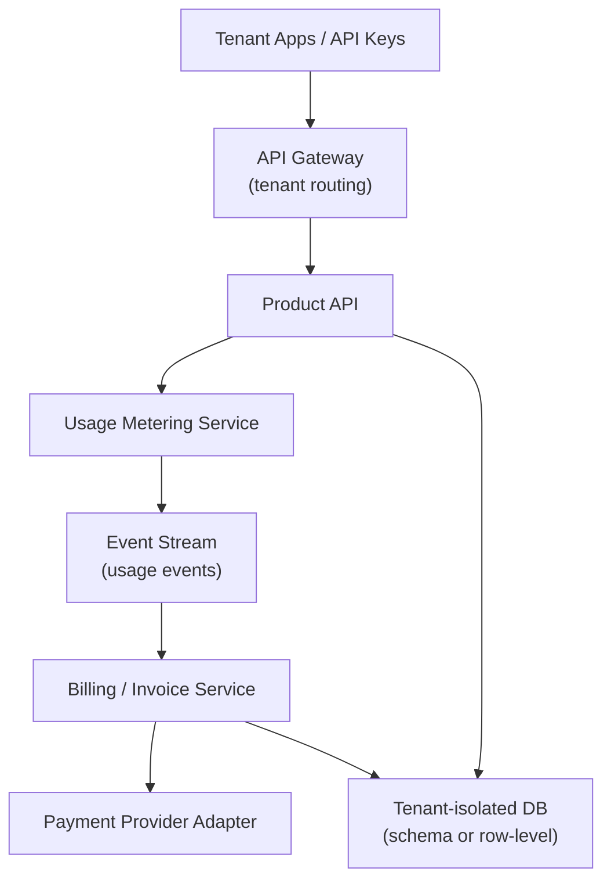

# Problem 6: Multi-Tenant SaaS with Usage Billing

## Business Problem
A B2B SaaS product (API analytics, DLM lab software, etc.) serves many **tenants** on one platform. Usage is metered (API calls, storage, test runs). At month-end, generate accurate invoices without cross-tenant data leaks or billing double-charges.

## Hard Requirements
- **Hard tenant isolation** (data, cache keys, queues).
- Usage events at high volume — must not slow tenant API requests.
- Billing idempotent per billing period + tenant.
- Invoice PDF/email async; disputes need event history.
- Scale tenants from 10 to 10,000 without redesign.

## Why One Pattern Is Not Enough
| If you only use… | What breaks |
| --- | --- |
| `tenant_id` column only | Hot tenant; accidental cross-tenant queries |
| Sync metering in API | Latency spikes |
| Nightly cron without events | Lost usage; can't explain invoice line |
| One DB per tenant always | Ops cost explodes at scale |

## Architecture Overview


## Pattern Mix
| Concern | Patterns | Role |
| --- | --- | --- |
| Isolation | [Multi-Tenant Partitioning](../Data_domain_patterns/21-multi-tenant-partitioning.md), [Database per Service](../Distributed_system_patterns/32-database-per-service.md) (large tenants) | Row/schema/cell isolation |
| Metering | [Event Streaming](../Messaging_Integration_patterns/09-event-streaming.md), [Queue](../Messaging_Integration_patterns/02-queue.md) | Fire-and-forget usage records |
| Billing reads | [CQRS](../Scalability_patterns/06-cqrs.md), [Materialized View](../Data_domain_patterns/16-materialized-view.md) | Dashboard + invoice from projections |
| Invoicing | [Saga](../Distributed_system_patterns/10-saga.md), [Idempotency](../Distributed_system_patterns/20-idempotency.md) | Close period → charge → receipt |
| Notifications | [Outbox](../Distributed_system_patterns/11-outbox-pattern.md) | Invoice email after commit |
| Security | [ABAC](../Security_patterns/03-abac.md), [JWT](../Security_patterns/08-jwt.md) | Tenant scoped in token |
| Scale | [Sharding](../Scalability_patterns/03-sharding.md), [Elastic Scaling](../Scalability_patterns/10-elastic-scaling.md) | Hot tenants partitioned |

## Happy-Path Flow
1. API request includes `tenantId` from JWT → app logic scoped.
2. Async publish `UsageRecorded` (non-blocking).
3. Stream aggregator rolls up hourly/daily per tenant + SKU.
4. Month-end job: **Idempotency-Key** `invoice:tenant:2026-05` → saga creates invoice.
5. Payment **Adapter** charges → **Outbox** sends PDF email.

## Failure Scenarios
| Failure | Response |
| --- | --- |
| Usage event lost | At-least-once stream + reconciliation job |
| Double invoice | Idempotency on billing period key |
| Payment fails | Saga marks `PAST_DUE`; retry policy |
| Tenant A spike | Shard/isolate; bulkhead connection pools |

## TypeScript Sketch
```typescript
async function recordUsage(tenantId: string, metric: string, qty: number) {
  await usageStream.publish({ tenantId, metric, qty, ts: Date.now() }); // no await on billing DB
}

async function closeBillingPeriod(tenantId: string, period: string) {
  const key = `invoice:${tenantId}:${period}`;
  if (await idempotency.exists(key)) return idempotency.result(key);

  const total = await billingView.sum(tenantId, period);
  await paymentAdapter.charge(tenantId, total);
  const inv = await db.transaction(async (tx) => {
    const i = await tx.invoices.insert({ tenantId, period, total });
    await tx.outbox.insert({ type: 'InvoiceReady', tenantId, invoiceId: i.id });
    return i;
  });
  await idempotency.save(key, inv);
  return inv;
}
```

## Patterns Used (quick links)
[Multi-Tenant Partitioning](../Data_domain_patterns/21-multi-tenant-partitioning.md) · [Event Streaming](../Messaging_Integration_patterns/09-event-streaming.md) · [CQRS](../Scalability_patterns/06-cqrs.md) · [Materialized View](../Data_domain_patterns/16-materialized-view.md) · [Saga](../Distributed_system_patterns/10-saga.md) · [Outbox](../Distributed_system_patterns/11-outbox-pattern.md) · [Idempotency](../Distributed_system_patterns/20-idempotency.md) · [ABAC](../Security_patterns/03-abac.md)
