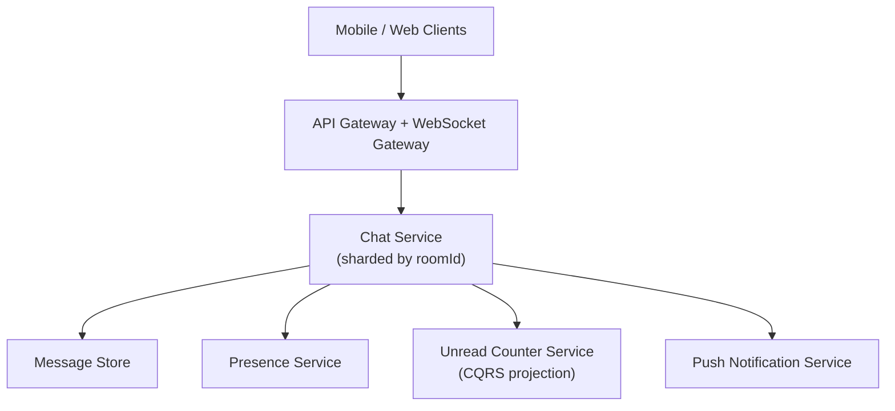

# Problem 7: Real-Time Chat + Notifications at Scale

## Business Problem
Build Slack/WhatsApp-scale messaging: millions of rooms, unread counts, typing indicators, push notifications when offline, and email digest fallback. Messages must arrive in order **per room**, not necessarily globally.

## Hard Requirements
- Send message p95 **under 100 ms** for online users.
- Per-room ordering preserved.
- Unread badges update without scanning all history.
- Push/email only when user offline (don't spam active sessions).
- Fan-out to 10k-member channels without O(n) blocking writes.

## Why One Pattern Is Not Enough
| If you only use… | What breaks |
| --- | --- |
| REST poll | Unusable; DB death |
| Single WebSocket server | No horizontal scale |
| One row per unread per user×room | Write amplification on big channels |
| Sync push in send path | Send latency spikes |

## Architecture Overview


## Pattern Mix
| Concern | Patterns | Role |
| --- | --- | --- |
| Real-time transport | [Reactor](../Concurrency_patterns/04-reactor.md), [Event Loop](../Concurrency_patterns/17-event-loop.md), [Pub/Sub](../Messaging_Integration_patterns/01-publish-subscribe.md) | WS + internal bus |
| Write path | [Sharding](../Scalability_patterns/03-sharding.md), [Partitioning](../Scalability_patterns/02-partitioning.md) | Room id → shard |
| Fan-out | [Competing Consumers](../Messaging_Integration_patterns/08-competing-consumers.md), [Observer](../Frontend_patterns/08-observer.md) | Large channel delivery |
| Unread counts | [CQRS](../Scalability_patterns/06-cqrs.md), [Materialized View](../Data_domain_patterns/16-materialized-view.md), [Cache-Aside](../Data_domain_patterns/18-cache-aside.md) | Increment counters async |
| Offline notify | [Outbox](../Distributed_system_patterns/11-outbox-pattern.md), [Event Notification](../Messaging_Integration_patterns/10-event-notification.md) | Push when not present |
| Resilience | [Backpressure](../Resilience_Pattern/09-backpressure.md), [Bulkhead](../Resilience_Pattern/04-bulkhead.md), [DLQ](../Messaging_Integration_patterns/07-dead-letter-queue.md) | Slow consumers don't kill chat |
| Scale | [Stateless Services](../Scalability_patterns/01-stateless-services.md), [Horizontal Scaling](../Cloud_infra_patterns/17-horizontal-scaling.md) | Add gateway pods |

## Happy-Path Flow
1. User sends message → append to room shard (monotonic seq).
2. Publish to room channel → all connected subscribers receive.
3. Async: increment unread counters for members (except sender).
4. Presence check: if recipient offline → **Outbox** `PushNotify`.
5. Client ACKs → mark delivered (optional read receipts).

## Large Channel Strategy
- Write once to log; **fan-out worker** delivers to online connection sets in batches.
- For 10k members: don't write 10k inbox rows synchronously — queue fan-out job.

## Failure Scenarios
| Failure | Response |
| --- | --- |
| Push provider down | DLQ; email digest fallback |
| WS node dies | Client reconnect; replay from last seq |
| Hot room | Dedicated shard + backpressure on fan-out |
| Duplicate send | Client message id dedupe |

## TypeScript Sketch
```typescript
async function sendMessage(roomId: string, userId: string, body: string, clientMsgId: string) {
  if (await dedupe.seen(clientMsgId)) return dedupe.result(clientMsgId);

  const msg = await messageLog.append(roomId, { userId, body, ts: Date.now() });
  pubsub.publish(`room:${roomId}`, msg);

  queue.enqueue('unread-fanout', { roomId, msgId: msg.id, senderId: userId });
  for (const uid of await presence.offlineMembers(roomId, userId))
    await outbox.insert({ type: 'PushNotify', userId: uid, roomId, preview: body.slice(0, 80) });

  await dedupe.save(clientMsgId, msg);
  return msg;
}
```

## Patterns Used (quick links)
[Pub/Sub](../Messaging_Integration_patterns/01-publish-subscribe.md) · [Reactor](../Concurrency_patterns/04-reactor.md) · [Sharding](../Scalability_patterns/03-sharding.md) · [CQRS](../Scalability_patterns/06-cqrs.md) · [Outbox](../Distributed_system_patterns/11-outbox-pattern.md) · [Backpressure](../Resilience_Pattern/09-backpressure.md) · [Cache-Aside](../Data_domain_patterns/18-cache-aside.md) · [Competing Consumers](../Messaging_Integration_patterns/08-competing-consumers.md)
