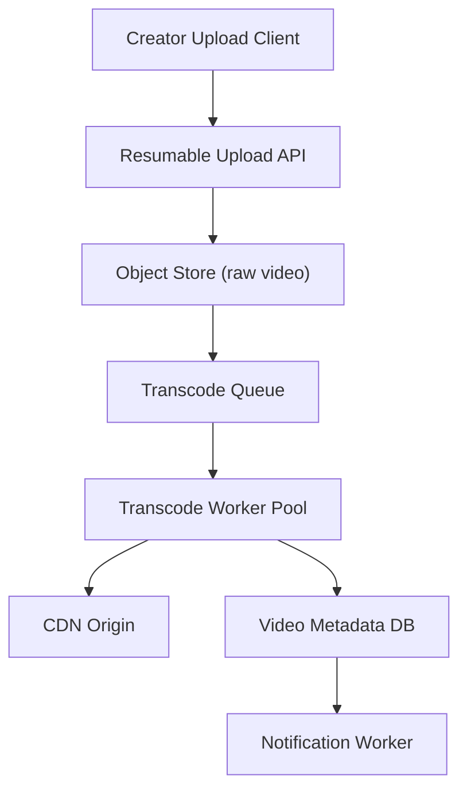

# Problem 8: Video Upload & Transcoding Pipeline

## Business Problem
Users upload large video files (courses, marketing, lab recordings). The platform must store originals, transcode to multiple formats (720p, 1080p, HLS), expose progress in the UI, and serve playback via CDN — without blocking the upload HTTP request on encoding.

## Hard Requirements
- Upload accepts multi-GB files without timing out API servers.
- Transcode steps: ingest → validate → extract metadata → encode variants → publish to CDN.
- Progress bar updates reliably (0–100%).
- Failed encode retries; poison jobs quarantined.
- Original + derivatives lifecycle (delete cascades).

## Why One Pattern Is Not Enough
| If you only use… | What breaks |
| --- | --- |
| Sync transcode in upload handler | Gateway timeout; no scale |
| Single worker queue | One slow 4K job blocks all |
| DB blob for video | DB melts; expensive |
| No claim check | Message broker chokes on huge payloads |

## Architecture Overview


## Pattern Mix
| Concern | Patterns | Role |
| --- | --- | --- |
| Large payloads | [Claim Check](../Messaging_Integration_patterns/21-claim-check.md) | Queue carries ref, not file bytes |
| Processing | [Pipeline](../Concurrency_patterns/07-pipeline.md), [Competing Consumers](../Messaging_Integration_patterns/08-competing-consumers.md), [Worker Queue](../Concurrency_patterns/03-worker-queue.md) | Stage per worker type |
| Upload path | [Stateless Services](../Scalability_patterns/01-stateless-services.md), [CDN](../Scalability_patterns/05-cdn.md) | Presigned URL; serve from edge |
| Status reads | [CQRS](../Scalability_patterns/06-cqrs.md), [Materialized View](../Data_domain_patterns/16-materialized-view.md) | `processing: 67%` projection |
| Reliability | [Retry with Backoff](../Distributed_system_patterns/04-retry-with-backoff.md), [DLQ](../Messaging_Integration_patterns/07-dead-letter-queue.md), [Checkpointing](../Resilience_Pattern/11-checkpointing.md) | Resume failed encodes |
| Orchestration | [Saga](../Distributed_system_patterns/10-saga.md) | All variants done → `READY` |

## Happy-Path Flow
1. Client requests presigned upload URL → uploads to object storage.
2. Upload complete webhook → insert `VideoAsset` + publish `TranscodeRequested` with **Claim Check** ref.
3. Pipeline workers run stages; each stage emits progress event.
4. **Projector** updates `%` for UI.
5. Final stage writes CDN keys → saga marks `READY` → notify user (Outbox).

## Failure Scenarios
| Failure | Response |
| --- | --- |
| Encode worker crash | Retry from **checkpoint** (last completed stage) |
| Corrupt upload | Fail fast at validate; delete orphan blob |
| CDN publish fail | DLQ; asset stays `FAILED` with reason |
| Hot queue | Scale encode workers; bulkhead GPU vs CPU pools |

## TypeScript Sketch
```typescript
async function onUploadComplete(assetId: string, storageKey: string) {
  const ref = await claimCheck.store({ bucket: 'raw', key: storageKey });
  await db.videos.update(assetId, { status: 'QUEUED' });
  await queue.send({ type: 'TranscodeRequested', assetId, claimCheck: ref });
}

const pipeline = [validate, probeMetadata, encode720, encode1080, packHls, publishCdn];
async function runJob(job: TranscodeJob) {
  let ctx = await claimCheck.load(job.claimCheck);
  for (const stage of pipeline) {
    ctx = await withRetry(() => stage(ctx));
    await progress.emit(job.assetId, stage.name, ctx.percent);
  }
  await db.videos.update(job.assetId, { status: 'READY', cdnUrl: ctx.cdnUrl });
}
```

## Patterns Used (quick links)
[Claim Check](../Messaging_Integration_patterns/21-claim-check.md) · [Pipeline](../Concurrency_patterns/07-pipeline.md) · [Competing Consumers](../Messaging_Integration_patterns/08-competing-consumers.md) · [CDN](../Scalability_patterns/05-cdn.md) · [CQRS](../Scalability_patterns/06-cqrs.md) · [Saga](../Distributed_system_patterns/10-saga.md) · [Checkpointing](../Resilience_Pattern/11-checkpointing.md) · [DLQ](../Messaging_Integration_patterns/07-dead-letter-queue.md)
