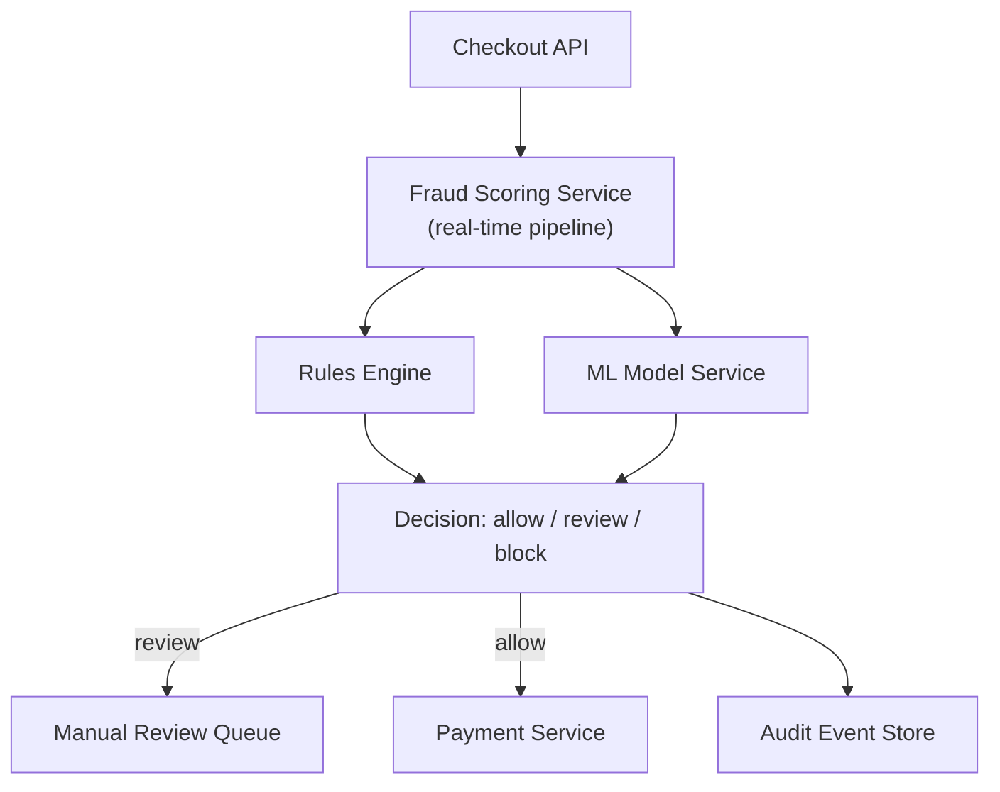

# Problem 9: Fraud Detection on Checkout

## Business Problem
An e-commerce or payments site must score each checkout for fraud **before** capturing payment: block stolen cards, flag suspicious velocity, allow good customers through fast. Analysts need to review edge cases without stopping all traffic.

## Hard Requirements
- Fraud decision in checkout path **under 150 ms** (p95) for `allow`/`deny`.
- `review` path async — user sees "pending verification".
- Model + rules must be updatable without redeploying checkout.
- False declines costly — log features for dispute analysis.
- Duplicate scoring idempotent per checkout attempt.

## Why One Pattern Is Not Enough
| If you only use… | What breaks |
| --- | --- |
| Sync call to slow ML API | Checkout abandonment |
| Rules only in app code | Ops can't tune; deploy for every rule |
| Block everything suspicious | Revenue loss; angry customers |
| No event log | Can't explain why order blocked |

## Architecture Overview


## Pattern Mix
| Concern | Patterns | Role |
| --- | --- | --- |
| Fast path | [Circuit Breaker](../Resilience_Pattern/01-circuit-breaker.md), [Timeout](../Resilience_Pattern/03-timeout.md), [Cache-Aside](../Data_domain_patterns/18-cache-aside.md) | Fail open/closed policy on ML timeout |
| Rules + ML | [Strategy via Adapter](../Structural Patterns/Adapter.md), [Pipe and Filter](../Architectural Patterns/08-pipe-and-filter.md) | Velocity → geo → device → model score |
| Review flow | [Human-in-the-Loop](../AI_Agentic_patterns/09-human-in-the-loop.md), [Queue](../Messaging_Integration_patterns/02-queue.md) | Analyst queue for REVIEW |
| Audit | [Event Streaming](../Messaging_Integration_patterns/09-event-streaming.md), [Event Sourcing](../Data_domain_patterns/15-event-sourcing.md) | Feature vector + decision logged |
| Checkout safety | [Idempotency](../Distributed_system_patterns/20-idempotency.md), [Saga](../Distributed_system_patterns/10-saga.md) | Score once per attempt; pay only if ALLOW |
| Security | [RBAC](../Security_patterns/02-rbac.md), [Policy Enforcement Point](../Security_patterns/16-policy-enforcement-point.md) | Analyst roles |

## Happy-Path Flow
1. Checkout receives **Idempotency-Key**.
2. **Fraud gateway** runs cheap rules (cached blocklists, velocity counters).
3. ML score with 100 ms timeout → combined decision.
4. `ALLOW` → payment saga continues.
5. `DENY` → fail fast with generic message (don't leak rules).
6. `REVIEW` → hold payment auth; enqueue case; email ops.

## Failure Scenarios
| Failure | Response |
| --- | --- |
| ML service down | Policy: fail-open vs fail-closed (business choice) |
| Analyst slow | SLA alert; auto-release or auto-deny after TTL |
| Rule deploy bad | Feature flags; rollback rules version |
| Replay attack | Idempotency + device fingerprint cache |

## TypeScript Sketch
```typescript
async function scoreCheckout(ctx: CheckoutContext, idempotencyKey: string) {
  if (await fraudCache.get(idempotencyKey)) return fraudCache.get(idempotencyKey);

  let decision: 'ALLOW' | 'DENY' | 'REVIEW' = 'ALLOW';
  if (rules.velocityExceeded(ctx)) decision = 'DENY';
  else if (rules.blocklisted(ctx)) decision = 'DENY';
  else {
    try {
      const score = await mlBreaker.call(() => ml.score(ctx), { timeoutMs: 100 });
      decision = score > 0.9 ? 'DENY' : score > 0.7 ? 'REVIEW' : 'ALLOW';
    } catch {
      decision = policy.onMlTimeout; // FAIL_OPEN or FAIL_CLOSED
    }
  }

  await fraudEvents.publish({ idempotencyKey, ctx, decision });
  if (decision === 'REVIEW') await reviewQueue.enqueue({ idempotencyKey, ctx });
  await fraudCache.set(idempotencyKey, decision, 3600);
  return decision;
}
```

## Patterns Used (quick links)
[Circuit Breaker](../Resilience_Pattern/01-circuit-breaker.md) · [Timeout](../Resilience_Pattern/03-timeout.md) · [Human-in-the-Loop](../AI_Agentic_patterns/09-human-in-the-loop.md) · [Event Streaming](../Messaging_Integration_patterns/09-event-streaming.md) · [Pipe and Filter](../Architectural Patterns/08-pipe-and-filter.md) · [Idempotency](../Distributed_system_patterns/20-idempotency.md) · [Cache-Aside](../Data_domain_patterns/18-cache-aside.md) · [Saga](../Distributed_system_patterns/10-saga.md)
