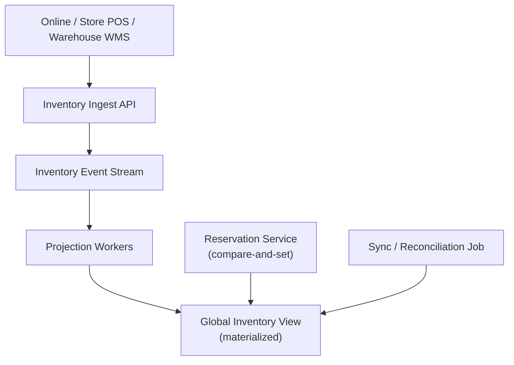

# Problem 10: Global Inventory Sync (Warehouse + Stores + Online)

## Business Problem
Retailers sell the same SKU in **warehouses**, **physical stores**, and **online**. A sale anywhere must update available-to-promise (ATP) everywhere quickly without overselling. Store pickup and ship-from-store add routing complexity.

## Hard Requirements
- ATP accurate within **seconds** (not batch nightly only).
- Reserve online → pickup at store B must lock store B stock.
- Warehouse bulk shipment doesn't zero out store display incorrectly.
- Partition by SKU/region; hot SKUs (launch day) must scale.
- Reconciliation job fixes drift from offline POS.

## Why One Pattern Is Not Enough
| If you only use… | What breaks |
| --- | --- |
| Single global inventory table | Hot row locks; regional latency |
| Nightly batch sync | Oversell all day |
| CRUD `quantity = quantity - 1` | Lost updates under concurrency |
| Eventless messaging | Can't rebuild ATP after bug |

## Architecture Overview


## Pattern Mix
| Concern | Patterns | Role |
| --- | --- | --- |
| Writes | [Event Sourcing](../Data_domain_patterns/15-event-sourcing.md), [Sharding](../Scalability_patterns/03-sharding.md), [Distributed Lock](../Distributed_system_patterns/21-distributed-lock.md) | `Reserved`, `Released`, `Sold` events |
| Propagation | [Event-Carried State Transfer](../Messaging_Integration_patterns/11-event-carried-state-transfer.md), [Pub/Sub](../Messaging_Integration_patterns/01-publish-subscribe.md) | Full ATP snapshot in event |
| Reads | [CQRS](../Scalability_patterns/06-cqrs.md), [Cache-Aside](../Data_domain_patterns/18-cache-aside.md), [Read Replica](../Scalability_patterns/07-read-replica.md) | Product page reads projection |
| Cross-location saga | [Saga](../Distributed_system_patterns/10-saga.md) | Ship-from-store: reserve store → ship → confirm |
| Offline POS | [Inbox](../Distributed_system_patterns/12-inbox-pattern.md), [Idempotency](../Distributed_system_patterns/20-idempotency.md) | Dedupe delayed store sales |
| Drift fix | [Reconciliation batch](../DevOps_Delivery_patterns/06-observability.md) + event replay | Compare physical count vs projection |
| Resilience | [Bulkhead](../Resilience_Pattern/04-bulkhead.md), [Circuit Breaker](../Resilience_Pattern/01-circuit-breaker.md) | WMS integration isolated |

## Happy-Path Flow
1. Online customer reserves 1 unit SKU X at Store 12 for pickup.
2. Command: append `InventoryReserved` { sku, location:12, qty:1, reservationId }.
3. Projector updates ATP for Store 12 and global online pickup view.
4. **Event-Carried State Transfer** broadcasts ATP delta to edge caches.
5. Customer completes pay → `InventorySold`; else TTL → `InventoryReleased`.

## Ship-from-Store Saga
1. Online order routed to nearest store with ATP.
2. Reserve at store → notify store POS (**Outbox**).
3. Store picks → ship label → `Shipped` event.
4. Failure to pick in 2h → compensate release + reroute.

## Failure Scenarios
| Failure | Response |
| --- | --- |
| Duplicate POS sale | Inbox id on transaction id |
| Projection lag | Checkout reads version; reject if stale |
| WMS outage | Queue commands; show conservative ATP |
| Hot SKU | Shard by SKU; cache with short TTL |

## TypeScript Sketch
```typescript
async function reservePickup(sku: string, storeId: string, qty: number, reservationId: string) {
  const shard = inventoryShards.forSku(sku);
  const available = await shard.projection.atp(sku, storeId);
  if (available < qty) throw new OutOfStockError();

  await shard.append({
    type: 'InventoryReserved',
    sku, storeId, qty, reservationId, expiresAt: Date.now() + 30 * 60_000,
  });

  bus.publish('InventoryChanged', {
    sku, storeId,
    atp: available - qty,
    version: shard.projection.version(sku, storeId),
  });
}

async function completeSale(reservationId: string) {
  await shard.append({ type: 'InventorySold', reservationId });
}
```

## Patterns Used (quick links)
[Event Sourcing](../Data_domain_patterns/15-event-sourcing.md) · [Event-Carried State Transfer](../Messaging_Integration_patterns/11-event-carried-state-transfer.md) · [CQRS](../Scalability_patterns/06-cqrs.md) · [Sharding](../Scalability_patterns/03-sharding.md) · [Saga](../Distributed_system_patterns/10-saga.md) · [Cache-Aside](../Data_domain_patterns/18-cache-aside.md) · [Inbox](../Distributed_system_patterns/12-inbox-pattern.md) · [Idempotency](../Distributed_system_patterns/20-idempotency.md)
