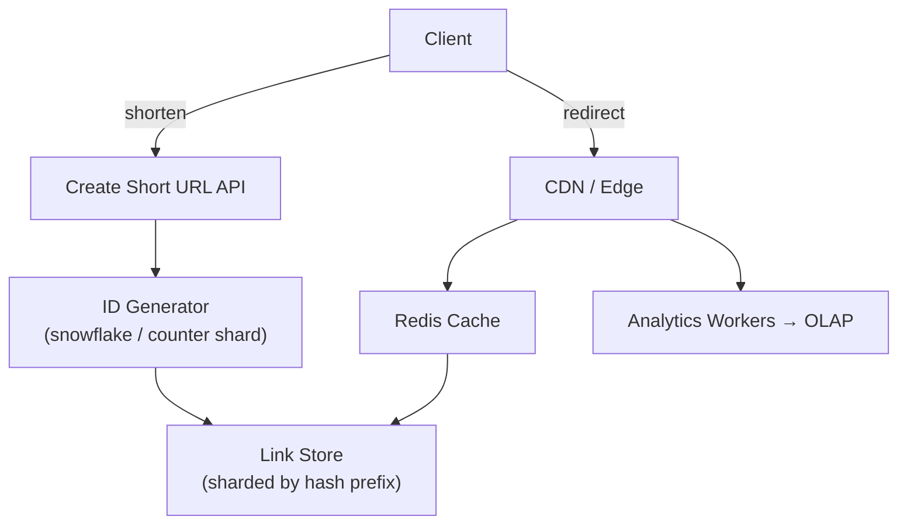

# Problem 11: Bitly (URL Shortener)

## Business Problem
Users paste long URLs and get short links (`bit.ly/abc123`) that redirect in milliseconds. The service must:
- Generate unique short codes at massive scale.
- Redirect with **low latency** globally.
- Track click analytics without slowing redirects.
- Handle custom aliases and link expiration.

## Hard Requirements
- Redirect p99 **< 50 ms** (read-heavy).
- **Billions** of links; **millions** of redirects/sec on viral links.
- Short codes must be **unique** and collision-safe.
- Analytics must not block the redirect path.
- Abuse: spam/malware links need blocking and rate limits.

## Why One Pattern Is Not Enough
| If you only use… | What breaks |
| --- | --- |
| Single Postgres row per redirect | DB becomes bottleneck; global latency suffers |
| Sync analytics write on redirect | Redirect latency spikes; analytics DB overload |
| Random ID without sharding | Hot partitions on popular links |
| No cache | Every redirect hits DB |

You need **hashing/encoding**, **sharded storage**, **CDN + cache**, **async analytics**, and **rate limiting**.

## Architecture Overview


## Pattern Mix
| Concern | Patterns | Role |
| --- | --- | --- |
| ID generation | [Sharding](../Scalability_patterns/03-sharding.md), [Snowflake-style IDs](../Distributed_system_patterns/) | Unique short codes without central bottleneck |
| Fast reads | [CDN](../Scalability_patterns/05-cdn.md), [Cache-Aside](../Scalability_patterns/04-cache-aside.md), [Read Replica](../Scalability_patterns/07-read-replica.md) | Hot links served from edge |
| Writes | [CQRS](../Scalability_patterns/06-cqrs.md) | Create path separate from redirect path |
| Analytics | [Event Notification](../Messaging_Integration_patterns/10-event-notification.md), [Queue-Based Load Leveling](../Scalability_patterns/09-queue-based-load-leveling.md) | Fire-and-forget click stream |
| Abuse | [Rate Limiting](../Distributed_system_patterns/18-rate-limiting.md), [Token Bucket](../Distributed_system_patterns/22-token-bucket.md) | Per-IP and per-API-key limits |
| Consistency | [Idempotency](../Distributed_system_patterns/20-idempotency.md) | Custom alias create is retry-safe |

## Happy-Path Flow
1. User POST `/shorten` with long URL → hash or encode counter → store mapping.
2. Return `https://bit.ly/{code}`.
3. User clicks → edge cache hit → **302** to long URL (< 10 ms).
4. Async: emit `LinkClicked` with timestamp, referrer, geo → aggregate hourly.

## Failure Scenarios
- **Cache miss storm:** Redis + DB; stale-while-revalidate for top 1% links.
- **Counter shard down:** Failover to backup shard; pre-allocated ID blocks.
- **Malicious URL:** Blocklist check at create; scan queue for new domains.

## TypeScript Sketch
```typescript
async function redirect(code: string): Promise<string | null> {
  const cached = await redis.get(`url:${code}`);
  if (cached) { void analytics.emit({ code, ts: Date.now() }); return cached; }
  const row = await linkDb.findByCode(code);
  if (!row) return null;
  await redis.setex(`url:${code}`, 3600, row.longUrl);
  void analytics.emit({ code, ts: Date.now() });
  return row.longUrl;
}
```

## Patterns Used
[CDN](../Scalability_patterns/05-cdn.md) · [Cache-Aside](../Scalability_patterns/04-cache-aside.md) · [Sharding](../Scalability_patterns/03-sharding.md) · [CQRS](../Scalability_patterns/06-cqrs.md) · [Rate Limiting](../Distributed_system_patterns/18-rate-limiting.md)
