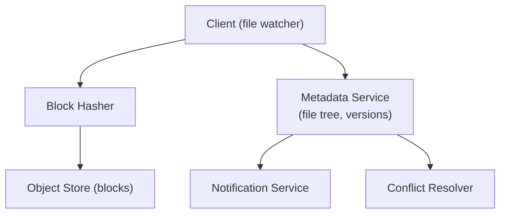

# Problem 12: Dropbox (File Sync & Storage)

## Business Problem
Users store files in the cloud and sync across devices. The system must:
- Upload/download large files reliably on flaky networks.
- Detect changes via **block-level deduplication** (only sync deltas).
- Resolve conflicts when two devices edit offline.
- Share folders with permissions and versioning.

## Hard Requirements
- **Chunked upload** with resume after disconnect.
- **Content-addressable blocks** (hash = ID) for dedup across users.
- Sync metadata in **seconds**; transfer only changed blocks.
- End-to-end encryption option for enterprise.
- Petabytes stored; millions of concurrent sync clients.

## Why One Pattern Is Not Enough
| If you only use… | What breaks |
| --- | --- |
| Full file upload every change | Bandwidth and cost explode |
| Single metadata DB | Hot folders; lock contention |
| Last-write-wins only | Silent data loss on conflict |
| Sync server polling every second | Battery drain; server overload |

You need **content hashing**, **delta sync**, **event-driven notifications**, **conflict policies**, and **object storage**.

## Architecture Overview


## Pattern Mix
| Concern | Patterns | Role |
| --- | --- | --- |
| Large files | [Chunked Transfer](../Scalability_patterns/), [Pipeline](../Concurrency_patterns/07-pipeline.md) | Parallel block upload |
| Dedup | [Content-Addressable Storage](../Data_domain_patterns/) | Same block stored once |
| Metadata | [Sharding](../Scalability_patterns/03-sharding.md), [Event Sourcing](../Data_domain_patterns/15-event-sourcing.md) | Per-user namespace; audit trail |
| Sync | [Pub/Sub](../Messaging_Integration_patterns/08-pub-sub.md), [WebSocket](../Frontend_patterns/) | Push changes to online clients |
| Conflicts | [Saga](../Distributed_system_patterns/10-saga.md), [CRDT](../Distributed_system_patterns/) (optional) | Merge or branch copies |
| Resilience | [Retry with Backoff](../Resilience_Pattern/02-retry.md), [Circuit Breaker](../Resilience_Pattern/01-circuit-breaker.md) | Upload retries; isolate storage |
| Security | [Encryption at Rest](../Security_patterns/), [RBAC](../Security_patterns/) | Share links and ACLs |

## Happy-Path Flow
1. Client detects file change → split into 4 MB blocks → hash each block.
2. Query server: which block hashes are missing? Upload only those.
3. Commit new file version in metadata DB (parent folder, block list, revision).
4. Notify subscribers via **Pub/Sub** → peers pull new block list and fetch blocks.

## Failure Scenarios
- **Partial upload:** Commit only after all blocks confirmed; garbage-collect orphans.
- **Split-brain edit:** Create `conflict_copy` file; user resolves in UI.
- **Storage outage:** Queue commits locally; sync when [Circuit Breaker](../Resilience_Pattern/01-circuit-breaker.md) closes.

## TypeScript Sketch
```typescript
async function syncFile(userId: string, path: string, blocks: Block[]) {
  const hashes = blocks.map(b => b.hash);
  const missing = await storage.filterMissing(hashes);
  await Promise.all(missing.map(h => storage.putBlock(blocks.find(b => b.hash === h)!)));
  await metadata.commitVersion({ userId, path, blockHashes: hashes, rev: Date.now() });
  await notify.publish(`user:${userId}`, { type: 'FILE_UPDATED', path });
}
```

## Patterns Used
[Sharding](../Scalability_patterns/03-sharding.md) · [Pub/Sub](../Messaging_Integration_patterns/08-pub-sub.md) · [Event Sourcing](../Data_domain_patterns/15-event-sourcing.md) · [Pipeline](../Concurrency_patterns/07-pipeline.md) · [Retry](../Resilience_Pattern/02-retry.md)
