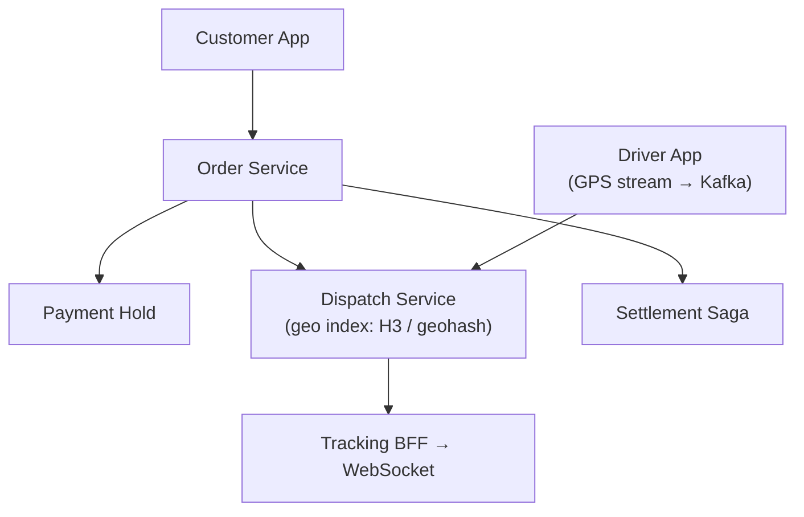

# Problem 13: Local Delivery Service (DoorDash / Instacart-Style)

## Business Problem
Connect customers, local stores, and couriers for same-day delivery within a city. Users order groceries or meals; the platform assigns a nearby driver, tracks ETA, and handles payment splits.

## Hard Requirements
- Match driver to order in **< 30 seconds** in dense urban areas.
- Live **GPS tracking** and ETA updates every few seconds.
- Handle **peak dinner rush** (10× normal orders).
- Support multi-stop batches and driver re-assignment.
- Accurate fees: delivery, tip, store payout, platform commission.

## Why One Pattern Is Not Enough
| If you only use… | What breaks |
| --- | --- |
| Nearest-driver SQL query | Too slow at scale; no real-time location |
| Single dispatch queue globally | Wrong city assignments; latency |
| Sync status in HTTP | Driver app battery drain; stale ETAs |
| No saga on cancel | Driver en route but order refunded |

You need **geospatial indexing**, **event-driven dispatch**, **WebSockets**, **saga for lifecycle**, and **CQRS for tracking**.

## Architecture Overview


## Pattern Mix
| Concern | Patterns | Role |
| --- | --- | --- |
| Matching | [Geospatial Partitioning](../Scalability_patterns/02-partitioning.md), [Event-Driven](../Architectural_patterns/) | Find drivers in delivery radius |
| Peak load | [Queue-Based Load Leveling](../Scalability_patterns/09-queue-based-load-leveling.md), [Load Shedding](../Resilience_Pattern/08-load-shedding.md) | Buffer dispatch during rush |
| Live tracking | [Pub/Sub](../Messaging_Integration_patterns/08-pub-sub.md), [CQRS](../Scalability_patterns/06-cqrs.md) | Write GPS; read optimized trail |
| Lifecycle | [Saga](../Distributed_system_patterns/10-saga.md), [Outbox](../Distributed_system_patterns/11-outbox-pattern.md) | Order → assign → pickup → deliver → pay |
| Notifications | [Event Notification](../Messaging_Integration_patterns/10-event-notification.md) | Push on status change |
| Resilience | [Timeout](../Resilience_Pattern/03-timeout.md), [Bulkhead](../Resilience_Pattern/04-bulkhead.md) | Separate dispatch from payments |
| Fairness | [Rate Limiting](../Distributed_system_patterns/18-rate-limiting.md) | Prevent dispatch gaming |

## Happy-Path Flow
1. Customer places order → payment **authorized** (not captured).
2. Dispatch queries geo index for available drivers within 3 km.
3. Offer sent to top N drivers; first accept wins ([Distributed Lock](../Distributed_system_patterns/21-distributed-lock.md) on order).
4. Driver streams location → ETA recalculated → customer WebSocket updates.
5. Delivery confirmed → **Saga** captures payment, pays store and driver.

## Failure Scenarios
- **No driver:** Expand radius; surge pricing; cancel with full refund saga.
- **Driver cancels mid-route:** Re-dispatch; compensate customer.
- **Store out of stock:** Partial refund branch in saga.

## TypeScript Sketch
```typescript
async function dispatch(orderId: string, lat: number, lng: number) {
  const drivers = await geoIndex.withinKm(lat, lng, 3, { status: 'AVAILABLE' });
  for (const d of drivers.slice(0, 5)) {
    const accepted = await offer.send(d.id, orderId, { ttlSec: 30 });
    if (accepted) {
      await orders.assign(orderId, d.id);
      return;
    }
  }
  await queue.enqueue('dispatch-retry', { orderId, lat, lng, attempt: 1 });
}
```

## Patterns Used
[Saga](../Distributed_system_patterns/10-saga.md) · [Pub/Sub](../Messaging_Integration_patterns/08-pub-sub.md) · [CQRS](../Scalability_patterns/06-cqrs.md) · [Queue-Based Load Leveling](../Scalability_patterns/09-queue-based-load-leveling.md) · [Distributed Lock](../Distributed_system_patterns/21-distributed-lock.md)
