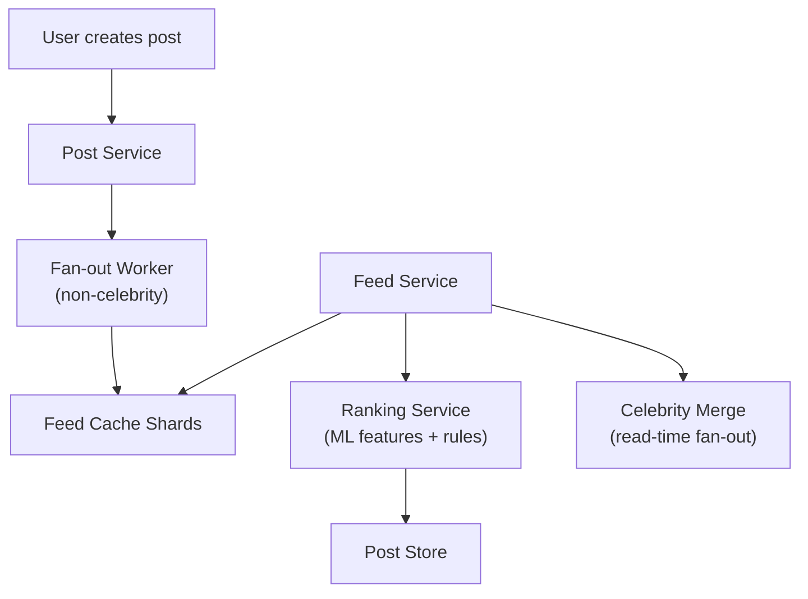

# Problem 15: Facebook News Feed

## Business Problem
Show each user a personalized, ranked stream of posts from friends, pages, and groups. The feed must feel fresh, load in **< 200 ms**, and scale to billions of users posting and scrolling continuously.

## Hard Requirements
- **Fan-out on write** or **fan-out on read** (or hybrid) for follow graph.
- Rank by relevance, recency, engagement signals — not just chronological.
- Handle celebrities with **millions of followers** without write storms.
- Real-time injection of new posts from close friends.
- Consistent unread state and "seen" markers.

## Why One Pattern Is Not Enough
| If you only use… | What breaks |
| --- | --- |
| Fan-out on write for everyone | Celebrity post = millions of writes instantly |
| Fan-out on read only | Home load latency unacceptable |
| Single ranking model | Stale feed; no personalization |
| No cache | Every scroll hits ranking service |

You need **hybrid fan-out**, **feed caches**, **ranking pipeline**, **sharded social graph**, and **materialized feeds**.

## Architecture Overview


## Pattern Mix
| Concern | Patterns | Role |
| --- | --- | --- |
| Graph | [Sharding](../Scalability_patterns/03-sharding.md), [Graph Partitioning](../Scalability_patterns/02-partitioning.md) | Follow edges by user ID |
| Fan-out | [Queue-Based Load Leveling](../Scalability_patterns/09-queue-based-load-leveling.md), [Event Notification](../Messaging_Integration_patterns/10-event-notification.md) | Async push to follower feeds |
| Read path | [Cache-Aside](../Scalability_patterns/04-cache-aside.md), [CQRS](../Scalability_patterns/06-cqrs.md) | Precomputed feed + on-read merge |
| Ranking | [Pipeline](../Concurrency_patterns/07-pipeline.md), [Feature Store](../Data_domain_patterns/) | Score posts in stages |
| Hot users | [Load Shedding](../Resilience_Pattern/08-load-shedding.md), hybrid fan-out | Celebrities read-merge only |
| Consistency | [Eventual Consistency](../Distributed_system_patterns/12-eventual-consistency.md) | Accept seconds delay for distant friends |

## Happy-Path Flow
1. User A posts → stored in Post DB → event `PostCreated`.
2. Fan-out worker: for each follower (cap 5k precompute), push post ID to their feed cache shard.
3. User B opens app → fetch cached feed IDs → rank → hydrate post bodies from Post store.
4. Merge in celebrity posts from last 24h (read-time fan-out for high fan-in accounts).

## Failure Scenarios
- **Fan-out backlog:** Degrade to read-time for non-close friends; prioritize mutual connections.
- **Ranking timeout:** Return cached chronological slice; refresh rank async.
- **Stale cache:** TTL + invalidation on new post from close friend list.

## TypeScript Sketch
```typescript
async function getFeed(userId: string, cursor?: string) {
  const cachedIds = await feedCache.getSlice(userId, cursor, 50);
  const celebrityIds = await celebrityMerge.recentForUser(userId);
  const allIds = [...new Set([...cachedIds, ...celebrityIds])];
  const ranked = await ranker.score(userId, allIds);
  const posts = await postStore.batchGet(ranked.slice(0, 30).map(r => r.postId));
  return { posts, nextCursor: ranked[29]?.cursor };
}
```

## Patterns Used
[CQRS](../Scalability_patterns/06-cqrs.md) · [Cache-Aside](../Scalability_patterns/04-cache-aside.md) · [Queue-Based Load Leveling](../Scalability_patterns/09-queue-based-load-leveling.md) · [Sharding](../Scalability_patterns/03-sharding.md) · [Pipeline](../Concurrency_patterns/07-pipeline.md)
