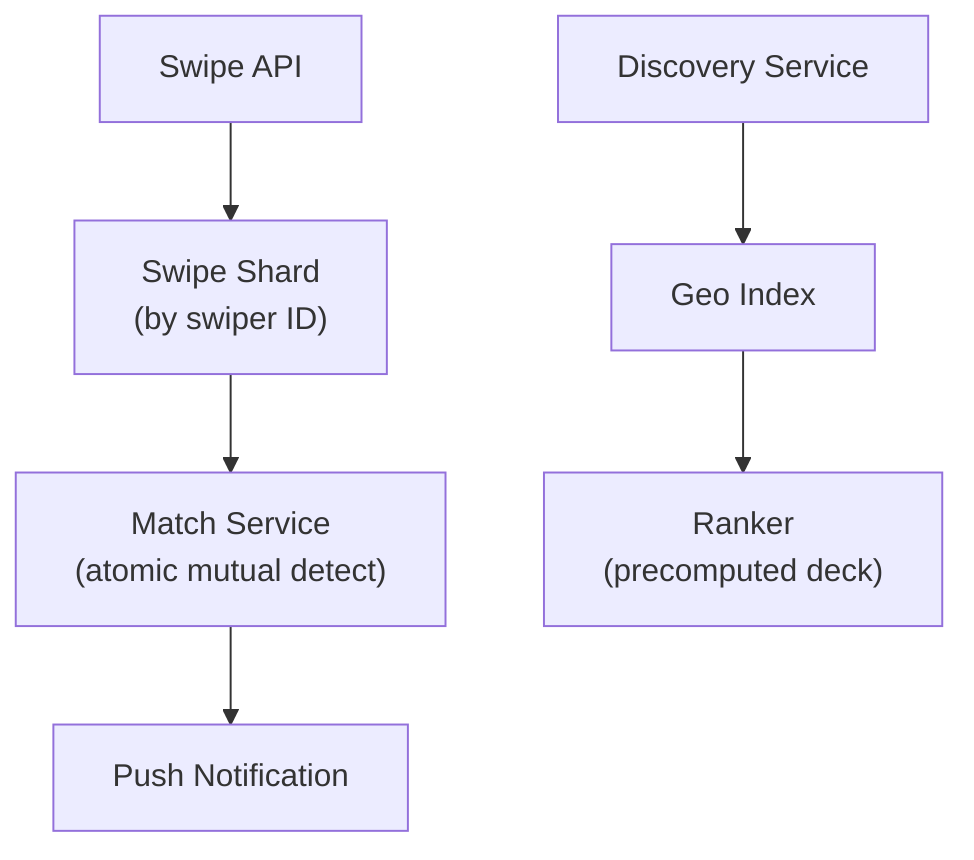

# Problem 16: Tinder (Match & Discovery)

## Business Problem
Users swipe on nearby profiles; mutual right-swipes create a **match** and open chat. The app must show relevant people quickly, prevent duplicate matches, and scale swipe volume globally with low latency.

## Hard Requirements
- Show candidates within **radius + preferences** in **< 100 ms**.
- **Mutual swipe** detection must be exact (no missed matches).
- Exclude already-seen and blocked users.
- Support millions of swipes/sec during peak hours.
- Optional: boost, super-like, passport (location change).

## Why One Pattern Is Not Enough
| If you only use… | What breaks |
| --- | --- |
| Full table scan for nearby users | Latency and cost impossible |
| Sync match check on every swipe | Hot keys on popular users |
| Single Redis for all swipes | Memory and single-point failure |
| No idempotency | Double-swipe creates duplicate matches |

You need **geospatial indexes**, **sharded swipe storage**, **atomic match detection**, **recommendation ranking**, and **caching**.

## Architecture Overview


## Pattern Mix
| Concern | Patterns | Role |
| --- | --- | --- |
| Location | [Geospatial Sharding](../Scalability_patterns/03-sharding.md), [Cache-Aside](../Scalability_patterns/04-cache-aside.md) | Candidates by cell |
| Swipe writes | [Partitioning](../Scalability_patterns/02-partitioning.md), [Idempotency](../Distributed_system_patterns/20-idempotency.md) | Shard by swiper ID |
| Match | [Distributed Lock](../Distributed_system_patterns/21-distributed-lock.md), compare-and-set | Exactly-once match creation |
| Notifications | [Event Notification](../Messaging_Integration_patterns/10-event-notification.md), [Pub/Sub](../Messaging_Integration_patterns/08-pub-sub.md) | Real-time match popup |
| Deck building | [Pipeline](../Concurrency_patterns/07-pipeline.md), [Batching](../Scalability_patterns/) | Precompute 100 candidates |
| Abuse | [Rate Limiting](../Distributed_system_patterns/18-rate-limiting.md) | Swipe velocity limits |

## Happy-Path Flow
1. User opens app → Discovery returns prebuilt deck from geo + prefs cache.
2. User swipes right on B → write `A→B: LIKE` idempotently.
3. Match service checks `B→A: LIKE` in same transaction/lock scope.
4. If mutual → insert Match row → publish `MatchCreated` → both get push + chat channel.

## Failure Scenarios
- **Race on simultaneous swipes:** Canonical lock key `min(A,B):max(A,B)`.
- **Geo index stale:** Refresh deck on location change event.
- **Notification delay:** Match exists in DB; client polls match endpoint as fallback.

## TypeScript Sketch
```typescript
async function swipe(from: string, to: string, dir: 'LEFT' | 'RIGHT') {
  await swipeStore.putIdempotent(from, to, dir);
  if (dir !== 'RIGHT') return null;
  const [a, b] = from < to ? [from, to] : [to, from];
  return lock.with(`match:${a}:${b}`, async () => {
    const reverse = await swipeStore.get(to, from);
    if (reverse?.dir !== 'RIGHT') return null;
    return matchStore.create(a, b);
  });
}
```

## Patterns Used
[Sharding](../Scalability_patterns/03-sharding.md) · [Idempotency](../Distributed_system_patterns/20-idempotency.md) · [Distributed Lock](../Distributed_system_patterns/21-distributed-lock.md) · [Pub/Sub](../Messaging_Integration_patterns/08-pub-sub.md) · [Rate Limiting](../Distributed_system_patterns/18-rate-limiting.md)
