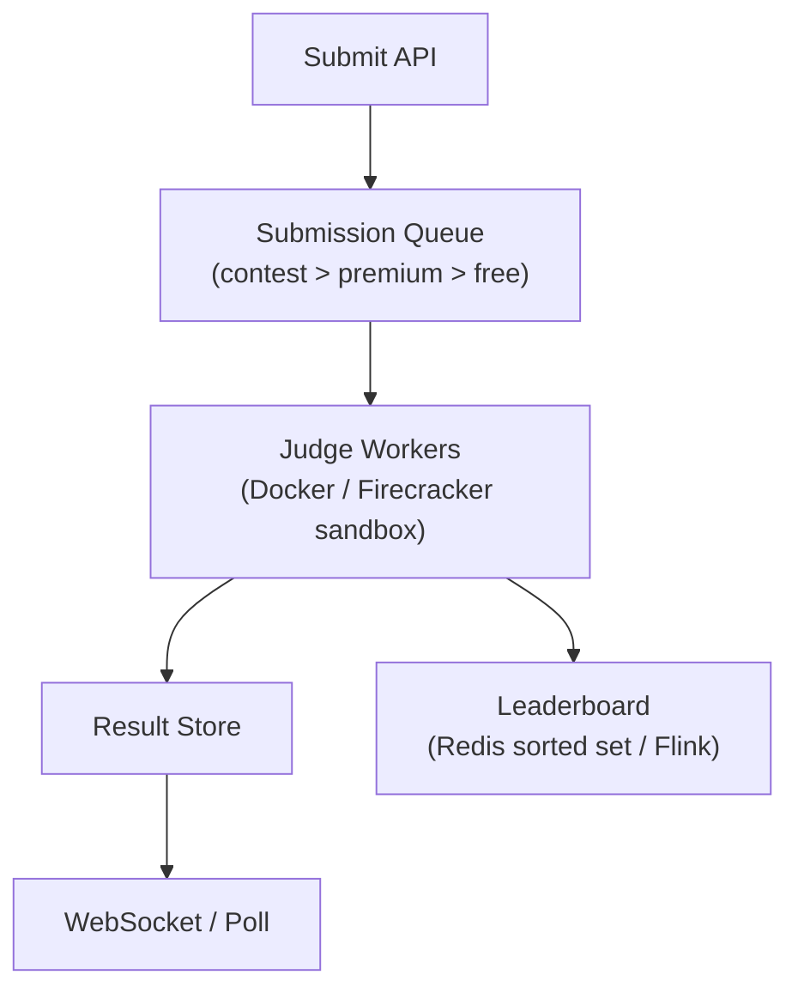

# Problem 17: LeetCode (Coding Practice Platform)

## Business Problem
Developers submit code solutions to algorithm problems; the system compiles, runs against hidden test cases, and returns pass/fail with runtime/memory stats. Also serves problem catalog, contests, leaderboards, and discussion.

## Hard Requirements
- **Sandboxed execution** — untrusted user code must not escape.
- Judge **millions of submissions/day** with fair queueing.
- Return results in **seconds** for easy problems; minutes acceptable for contests.
- Accurate time/memory limits per language.
- Leaderboards and contest rankings updated in near real-time.

## Why One Pattern Is Not Enough
| If you only use… | What breaks |
| --- | --- |
| Run code in API process | Security disaster; crashes take down site |
| Single worker queue | Contest spikes cause hour-long waits |
| Sync judge in HTTP | Timeouts; no scale |
| One DB for submissions + problems | Write contention on hot contests |

You need **worker pools**, **sandbox isolation**, **async job queue**, **result caching**, and **read replicas** for catalog.

## Architecture Overview


## Pattern Mix
| Concern | Patterns | Role |
| --- | --- | --- |
| Execution | [Bulkhead](../Resilience_Pattern/04-bulkhead.md), [Worker Pool](../Concurrency_patterns/) | Isolate judge from web tier |
| Queue | [Queue-Based Load Leveling](../Scalability_patterns/09-queue-based-load-leveling.md), [Priority Queue](../Concurrency_patterns/) | Contest fairness |
| Security | [Sandbox](../Security_patterns/), [Timeout](../Resilience_Pattern/03-timeout.md) | Kill runaway code |
| Scale reads | [Read Replica](../Scalability_patterns/07-read-replica.md), [CDN](../Scalability_patterns/05-cdn.md) | Problem statements static |
| Leaderboard | [CQRS](../Scalability_patterns/06-cqrs.md), [Event Streaming](../Messaging_Integration_patterns/) | Write submissions; read ranks |
| Idempotency | [Idempotency](../Distributed_system_patterns/20-idempotency.md) | Retry submit same payload |

## Happy-Path Flow
1. User submits Python solution → stored → job ID returned.
2. Worker pulls job → compile → run each test case in sandbox with limits.
3. All pass → `Accepted` + runtime; any fail → `Wrong Answer` + first failing case (hidden in prod).
4. Event `SubmissionAccepted` updates user stats and contest board.

## Failure Scenarios
- **Worker OOM:** Kill container; mark `Runtime Error`; don't retry user fault.
- **Queue backlog:** Show estimated wait; scale workers via [Auto Scaling](../Cloud_infra_patterns/).
- **Sandbox escape attempt:** Block user; alert security pipeline.

## TypeScript Sketch
```typescript
async function submit(userId: string, problemId: string, code: string, lang: string) {
  const id = await submissions.create({ userId, problemId, code, lang, status: 'PENDING' });
  await judgeQueue.enqueue({ submissionId: id, priority: await tier.priority(userId) });
  return { submissionId: id, pollUrl: `/submissions/${id}` };
}
```

## Patterns Used
[Queue-Based Load Leveling](../Scalability_patterns/09-queue-based-load-leveling.md) · [Bulkhead](../Resilience_Pattern/04-bulkhead.md) · [Timeout](../Resilience_Pattern/03-timeout.md) · [CQRS](../Scalability_patterns/06-cqrs.md) · [Idempotency](../Distributed_system_patterns/20-idempotency.md)
