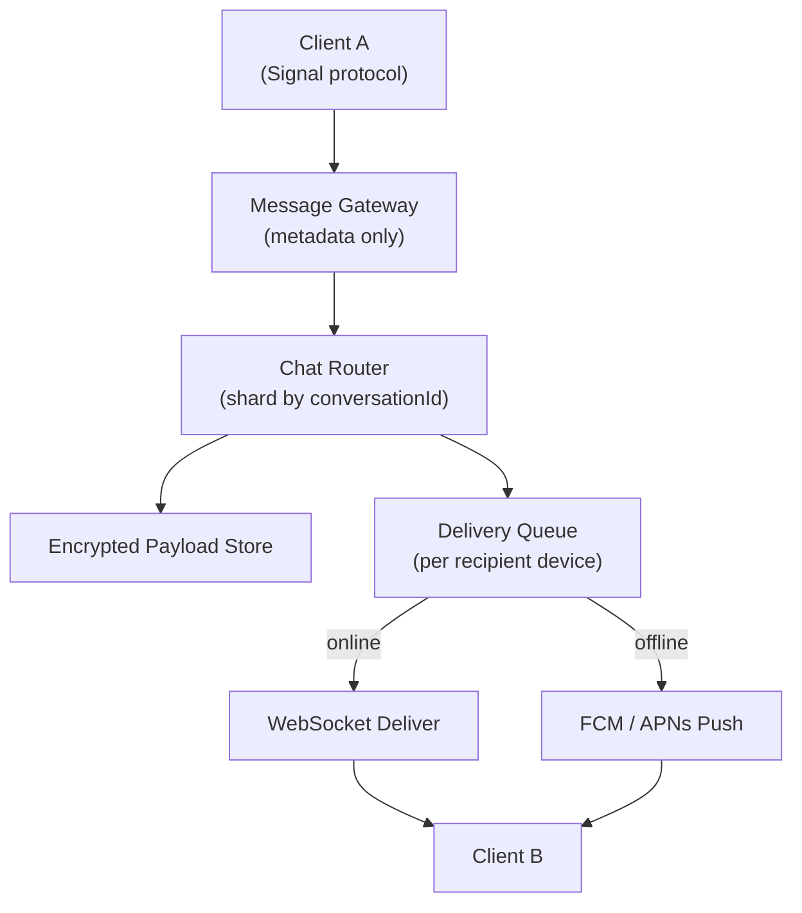

# Problem 18: WhatsApp (Messaging at Scale)

## Business Problem
Billions of users send text, voice, images, and video with **end-to-end encryption**. Messages must deliver in seconds, sync across phone/web/desktop, and support groups up to hundreds of members with reliable offline delivery.

## Hard Requirements
- **E2E encryption** — server cannot read message content.
- **At-least-once delivery** with client-side dedup; show single check / double check / read receipts.
- **Offline users** receive messages when back online (store-and-forward).
- **Multi-device sync** — same account on phone + laptop.
- Low latency globally; **99.9%+** message delivery success.

## Why One Pattern Is Not Enough
| If you only use… | What breaks |
| --- | --- |
| Central chat DB with plaintext | Privacy violation; compliance failure |
| HTTP polling only | Battery drain; delayed delivery |
| Single message queue | Hot groups overload one partition |
| No presence service | Wrong routing; wasted push attempts |

You need **long-lived connections**, **sharded chat queues**, **encrypted blob storage**, **presence**, and **push fallback**.

## Architecture Overview


## Pattern Mix
| Concern | Patterns | Role |
| --- | --- | --- |
| Transport | [WebSocket](../Frontend_patterns/), [Connection Pool](../Scalability_patterns/) | Persistent sessions |
| Routing | [Sharding](../Scalability_patterns/03-sharding.md), [Pub/Sub](../Messaging_Integration_patterns/08-pub-sub.md) | Partition by chat ID |
| Offline | [Store-and-Forward](../Messaging_Integration_patterns/), [Queue](../Scalability_patterns/09-queue-based-load-leveling.md) | Per-device inbox |
| Encryption | [E2E Encryption](../Security_patterns/) | Keys on client; server stores ciphertext |
| Presence | [Cache-Aside](../Scalability_patterns/04-cache-aside.md), [Heartbeat](../Distributed_system_patterns/) | Online/offline/last seen |
| Multi-device | [Fan-out](../Scalability_patterns/) | Encrypt per device session |
| Resilience | [Retry](../Resilience_Pattern/02-retry.md), [Circuit Breaker](../Resilience_Pattern/01-circuit-breaker.md) | Push provider failures |

## Happy-Path Flow
1. Alice encrypts for Bob's devices → sends ciphertext + envelope to gateway.
2. Router places in Bob's device queues (phone + desktop if registered).
3. Bob's phone online → WebSocket push → decrypt → display → send delivery ACK.
4. Bob reads → read receipt encrypted back to Alice's devices.

## Failure Scenarios
- **Device offline 30 days:** TTL on server queue; client syncs from backup if enabled.
- **Group fan-out:** Sequential encrypt per member device batch; async worker for 500-member groups.
- **Push failure:** Message stays queued; retry with exponential backoff.

## TypeScript Sketch
```typescript
async function routeMessage(envelope: { chatId: string; toUserId: string; blobId: string }) {
  const devices = await devices.listActive(envelope.toUserId);
  for (const d of devices) {
    await inbox.enqueue(d.id, envelope);
    if (await presence.isOnline(d.id)) {
      await ws.send(d.id, { type: 'NEW_MSG', blobId: envelope.blobId });
    } else {
      await push.notify(d.id, { type: 'MESSAGE', chatId: envelope.chatId });
    }
  }
}
```

## Patterns Used
[Sharding](../Scalability_patterns/03-sharding.md) · [Pub/Sub](../Messaging_Integration_patterns/08-pub-sub.md) · [Queue-Based Load Leveling](../Scalability_patterns/09-queue-based-load-leveling.md) · [Cache-Aside](../Scalability_patterns/04-cache-aside.md) · [Retry](../Resilience_Pattern/02-retry.md)

**See also:** [Problem 7 — Real-Time Chat + Notifications](./07-realtime-chat-notifications.md) for generic chat architecture.
