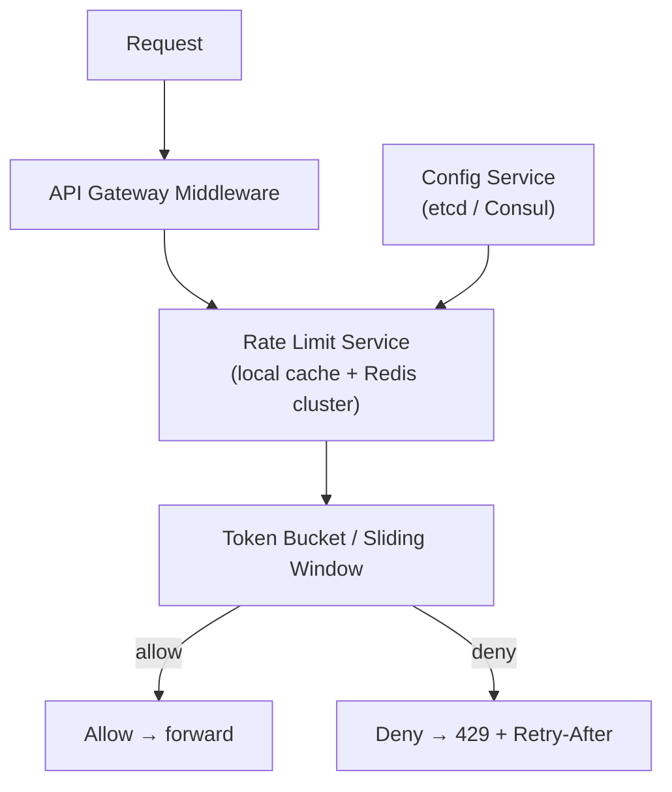

# Problem 19: Rate Limiter (API Gateway)

## Business Problem
Protect backend services by enforcing limits: **100 req/min per API key**, **10 login attempts per IP per hour**, burst allowance for paid tiers. Must work across **many stateless gateway nodes** with minimal latency overhead.

## Hard Requirements
- Decision in **< 1 ms** on hot path.
- **Distributed consistency** — user cannot 10× limit by hitting different nodes.
- Support **fixed window**, **sliding window**, and **token bucket** policies.
- Return standard `429 Too Many Requests` with `Retry-After`.
- Configurable per route, tenant, and API key.

## Why One Pattern Is Not Enough
| If you only use… | What breaks |
| --- | --- |
| In-memory counter per node | Limits multiplied by node count |
| DB increment every request | Latency and DB meltdown |
| Fixed window only | 2× burst at window boundaries |
| No fallback when Redis down | Either open floodgate or total outage |

You need **centralized counter store**, **atomic increment**, **token bucket math**, and **graceful degradation policy**.

## Architecture Overview


## Pattern Mix
| Concern | Patterns | Role |
| --- | --- | --- |
| Core algo | [Token Bucket](../Distributed_system_patterns/22-token-bucket.md), [Rate Limiting](../Distributed_system_patterns/18-rate-limiting.md), [Leaky Bucket](../Distributed_system_patterns/) | Smooth bursts |
| Storage | [Redis](../Scalability_patterns/04-cache-aside.md), atomic Lua scripts | INCR + EXPIRE atomically |
| Performance | [Local Cache](../Scalability_patterns/04-cache-aside.md) | Short TTL mirror of hot keys |
| Multi-tenant | [Sharding](../Scalability_patterns/03-sharding.md) | Key = `tenant:route:clientId` |
| Resilience | [Fail Open vs Fail Closed](../Resilience_Pattern/05-fail-fast.md), [Circuit Breaker](../Resilience_Pattern/01-circuit-breaker.md) | Policy when store unavailable |
| Observability | [Metrics Monitoring](./38-metrics-monitoring.md) | Track deny rate, latency |

## Happy-Path Flow
1. Request arrives with API key `k`.
2. Middleware calls `allow(k, route, cost=1)`.
3. Redis Lua: refill tokens per elapsed time; if tokens ≥ cost, decrement and return OK.
4. Attach headers: `X-RateLimit-Remaining`, `X-RateLimit-Reset`.

## Failure Scenarios
- **Redis partition:** Fail-open for non-critical routes; fail-closed for auth endpoints.
- **Clock skew:** Use Redis TIME; avoid wall clock on each node.
- **Hot key (shared NAT):** Combine IP + API key; cap per-key not per-IP for B2B.

## TypeScript Sketch
```typescript
async function allow(key: string, limit: number, windowSec: number): Promise<boolean> {
  const now = Math.floor(Date.now() / 1000);
  const windowKey = `rl:${key}:${Math.floor(now / windowSec)}`;
  const count = await redis.incr(windowKey);
  if (count === 1) await redis.expire(windowKey, windowSec);
  return count <= limit;
}
```

## Patterns Used
[Rate Limiting](../Distributed_system_patterns/18-rate-limiting.md) · [Token Bucket](../Distributed_system_patterns/22-token-bucket.md) · [Cache-Aside](../Scalability_patterns/04-cache-aside.md) · [Circuit Breaker](../Resilience_Pattern/01-circuit-breaker.md)
