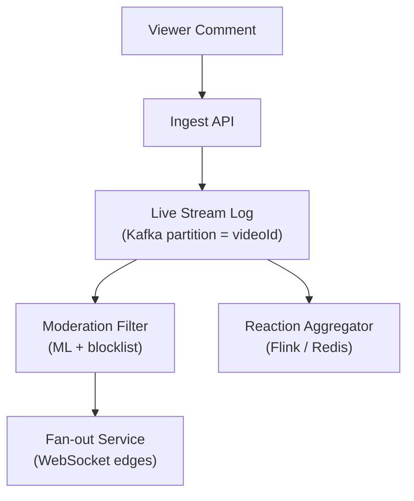

# Problem 20: Facebook Live Comments

## Business Problem
During a live video, millions of viewers post comments that appear on stream in **near real-time**. The broadcaster and audience see a scrolling feed; moderation must filter spam and toxic content without lagging the stream.

## Hard Requirements
- Comment visible to viewers in **< 500 ms** p99 during viral streams.
- Support **500k+ concurrent viewers** on one stream.
- Moderation pipeline (auto + human) can hide comments retroactively.
- Heart/reaction counts update frequently without overloading DB.
- Partition by `liveVideoId` — one hot stream must not slow others.

## Why One Pattern Is Not Enough
| If you only use… | What breaks |
| --- | --- |
| Write every comment to SQL | DB write ceiling hit in seconds |
| Poll HTTP every second | 500k RPS just for polling |
| No moderation queue | Toxic content on screen before removal |
| Global single WebSocket hub | Cannot scale one viral event |

You need **WebSocket fan-out**, **append-only comment log**, **stream processing**, **aggregation for reactions**, and **moderation pipeline**.

## Architecture Overview


## Pattern Mix
| Concern | Patterns | Role |
| --- | --- | --- |
| Ingest | [Partitioning](../Scalability_patterns/02-partitioning.md), [Queue-Based Load Leveling](../Scalability_patterns/09-queue-based-load-leveling.md) | One Kafka partition per hot stream |
| Delivery | [Pub/Sub](../Messaging_Integration_patterns/08-pub-sub.md), [Fan-out](../Scalability_patterns/) | Push to edge WebSocket servers |
| Moderation | [Pipeline](../Concurrency_patterns/07-pipeline.md), [Circuit Breaker](../Resilience_Pattern/01-circuit-breaker.md) | Async scan; default allow with fast blocklist |
| Reactions | [Aggregation](../Data_domain_patterns/), [CQRS](../Scalability_patterns/06-cqrs.md) | Counter separate from comment writes |
| Scale | [Load Shedding](../Resilience_Pattern/08-load-shedding.md) | Sample comments for low-priority viewers |
| Storage | [Event Sourcing](../Data_domain_patterns/15-event-sourcing.md) | Replay feed; audit moderation |

## Happy-Path Flow
1. User posts comment on live video V → append event to partition `V`.
2. Fast path: blocklist check → if clean, fan-out to WebSocket subscribers within 200 ms.
3. Slow path: ML toxicity score → if high, send `commentHidden` correction event.
4. Reactions batched every 500 ms → broadcast `{ hearts: 125043 }`.

## Failure Scenarios
- **Fan-out lag:** Show "comments delayed" banner; prioritize broadcaster's view.
- **Moderation ML down:** Blocklist-only mode; increase human review queue.
- **WebSocket edge overload:** Assign viewers to nearest edge; shed oldest connections.

## TypeScript Sketch
```typescript
async function publishComment(videoId: string, userId: string, text: string) {
  const event = { videoId, userId, text, ts: Date.now(), id: uuid() };
  if (await blocklist.isBlocked(text)) return { status: 'REJECTED' };
  await streamLog.append(videoId, event);
  await fanout.broadcast(`live:${videoId}`, event);
  void moderation.scoreAsync(event.id, text);
  return { status: 'LIVE', id: event.id };
}
```

## Patterns Used
[Pub/Sub](../Messaging_Integration_patterns/08-pub-sub.md) · [Partitioning](../Scalability_patterns/02-partitioning.md) · [Pipeline](../Concurrency_patterns/07-pipeline.md) · [CQRS](../Scalability_patterns/06-cqrs.md) · [Load Shedding](../Resilience_Pattern/08-load-shedding.md)
