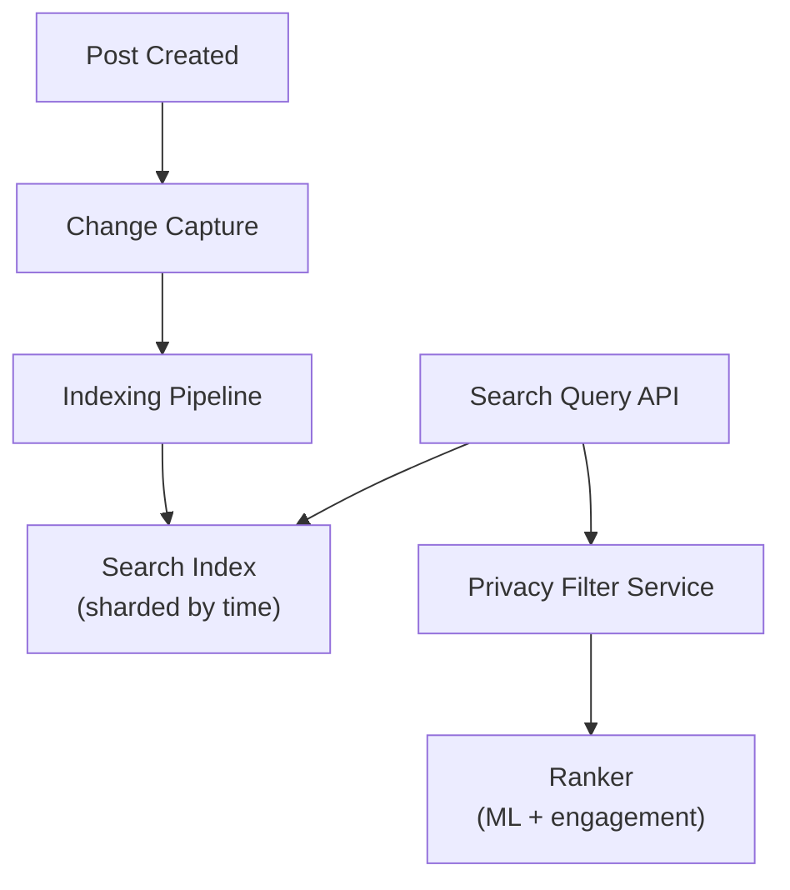

# Problem 21: Facebook Post Search

## Business Problem
Users search billions of posts by keyword, hashtag, author, and date. Results must rank by relevance and recency, respect privacy (only searchable content user can see), and return in **< 300 ms**.

## Hard Requirements
- Full-text search across **petabytes** of post text and metadata.
- **Privacy filter** applied at query time (friends-only, group membership).
- Near-real-time indexing — new posts searchable within **seconds**.
- Support autocomplete, trending queries, and spell correction.
- Rank by social signals (engagement, author affinity).

## Why One Pattern Is Not Enough
| If you only use… | What breaks |
| --- | --- |
| SQL LIKE | Unusable latency and no ranking |
| Single Elasticsearch cluster | Hot shards; no privacy join at scale |
| Index everything globally | Leaks private posts if filter wrong |
| Batch index hourly | Stale results; poor UX |

You need **inverted index**, **sharded search cluster**, **permission filter**, **streaming index pipeline**, and **two-phase ranking**.

## Architecture Overview


## Pattern Mix
| Concern | Patterns | Role |
| --- | --- | --- |
| Index | [CQRS](../Scalability_patterns/06-cqrs.md), [Event Streaming](../Messaging_Integration_patterns/) | Write DB ≠ search index |
| Sharding | [Sharding](../Scalability_patterns/03-sharding.md), [Time Partitioning](../Scalability_patterns/02-partitioning.md) | Rolling indices by month |
| Privacy | [Authorization](../Security_patterns/), post-filter | Intersect results with visibility graph |
| Freshness | [Near-Real-Time Index](../Data_domain_patterns/) | Refresh interval seconds |
| Ranking | [Pipeline](../Concurrency_patterns/07-pipeline.md), [Feature Store](../Data_domain_patterns/) | Retrieve then rank |
| Cache | [Cache-Aside](../Scalability_patterns/04-cache-aside.md) | Popular queries and trending |

## Happy-Path Flow
1. User posts → OLTP store → CDC event → indexer tokenizes and upserts doc with `visibility`, `authorId`, `engagement`.
2. User searches "summer BBQ" → parse → ES returns top 500 candidate IDs.
3. Privacy service filters to posts viewer may see (friend, public, group member).
4. Ranker re-scores top 100 → return 20 with snippets.

## Failure Scenarios
- **Index lag:** Show banner; fall back to recent posts from followed users only.
- **Privacy service timeout:** Fail closed — return fewer results rather than leak.
- **Hot query:** Cache result for 30 s; rate limit aggressive scrapers.

## TypeScript Sketch
```typescript
async function search(viewerId: string, q: string, cursor?: string) {
  const candidates = await searchIndex.query(q, { size: 500, cursor });
  const visible = await privacy.filter(viewerId, candidates.map(c => c.postId));
  const ranked = await ranker.score(viewerId, visible);
  return { hits: ranked.slice(0, 20), nextCursor: ranked[19]?.cursor };
}
```

## Patterns Used
[CQRS](../Scalability_patterns/06-cqrs.md) · [Sharding](../Scalability_patterns/03-sharding.md) · [Pipeline](../Concurrency_patterns/07-pipeline.md) · [Cache-Aside](../Scalability_patterns/04-cache-aside.md) · [Event Streaming](../Messaging_Integration_patterns/)
