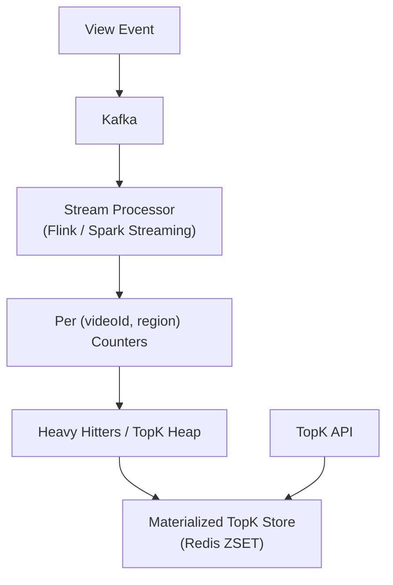

# Problem 22: YouTube Top K (Trending / Most Viewed)

## Business Problem
Continuously compute **Top K** videos — most viewed in last hour, trending in a country, or top creators this week. Results power home page badges and charts; must update frequently despite **billions of view events per day**.

## Hard Requirements
- Ingest **massive view event stream** without losing counts.
- Approximate or exact Top K per **category × region × time window**.
- Query Top 10 in **< 50 ms** for UI widgets.
- Handle **viral spikes** (single video 10M views/hour).
- Sliding windows: last 1h, 24h, 7d with different K values.

## Why One Pattern Is Not Enough
| If you only use… | What breaks |
| --- | --- |
| SQL GROUP BY on raw views | Cannot keep up with ingest |
| Recompute full sort every minute | CPU explosion |
| Exact global sort in memory | Memory bound; single machine limit |
| No approximation for long tail | Waste resources on rank 10,000+ |

You need **stream aggregation**, **count-min sketch or heavy hitters**, **time-windowed counters**, **Redis sorted sets**, and **periodic compaction**.

## Architecture Overview


## Pattern Mix
| Concern | Patterns | Role |
| --- | --- | --- |
| Ingest | [Event Streaming](../Messaging_Integration_patterns/), [Partitioning](../Scalability_patterns/02-partitioning.md) | Partition by videoId hash |
| Aggregation | [Map-Reduce](../Scalability_patterns/), [Stream Processing](../Data_domain_patterns/) | Distributed count |
| Top K algo | [Heap / Count-Min Sketch](../Data_domain_patterns/), [Approximation](../Scalability_patterns/) | O(log K) updates |
| Storage | [Cache-Aside](../Scalability_patterns/04-cache-aside.md), [CQRS](../Scalability_patterns/06-cqrs.md) | Precomputed reads |
| Windows | [Sliding Window](../Distributed_system_patterns/) | TTL keys per hour bucket |
| Hot video | [Sharding](../Scalability_patterns/03-sharding.md) | Isolate counter shard for viral ID |

## Happy-Path Flow
1. Each view emits `{ videoId, region, ts }` to Kafka.
2. Processor increments `views:US:2025060514` hash field `videoId`.
3. Local Top-K heap tracks top 100 per region-hour; flush to Redis ZSET every 10 s.
4. API `GET /trending?region=US&window=1h` reads ZSET `trending:US:1h`.

## Failure Scenarios
- **Processor lag:** Serve slightly stale list (30 s old); catch up with scaled consumers.
- **Counter skew:** Combine partial aggregates in second-stage reducer.
- **Tie-breaking:** Secondary sort by recency or engagement rate.

## TypeScript Sketch
```typescript
async function recordView(videoId: string, region: string) {
  const bucket = hourBucket(Date.now());
  await redis.hincrby(`views:${region}:${bucket}`, videoId, 1);
  await redis.zincrby(`trending:${region}:1h`, 1, videoId);
  await redis.expire(`trending:${region}:1h`, 7200);
}

async function getTopK(region: string, k: number) {
  return redis.zrevrange(`trending:${region}:1h`, 0, k - 1, 'WITHSCORES');
}
```

## Patterns Used
[Event Streaming](../Messaging_Integration_patterns/) · [CQRS](../Scalability_patterns/06-cqrs.md) · [Partitioning](../Scalability_patterns/02-partitioning.md) · [Cache-Aside](../Scalability_patterns/04-cache-aside.md) · [Sharding](../Scalability_patterns/03-sharding.md)
