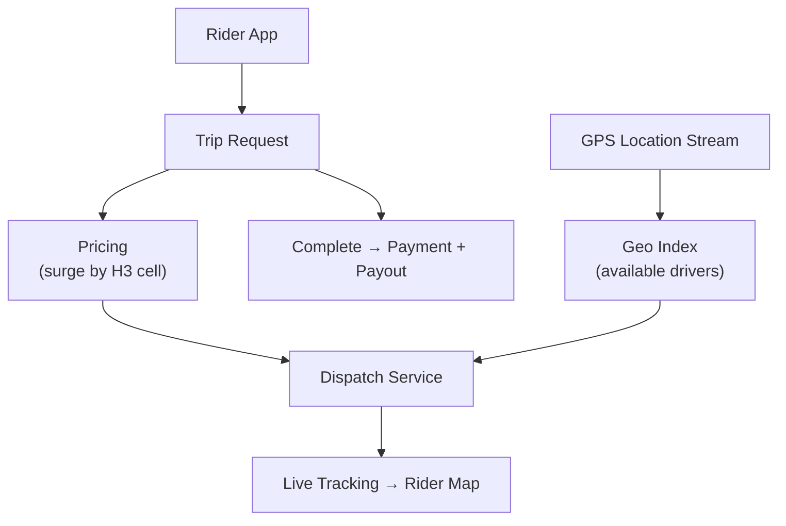

# Problem 23: Uber (Ride Hailing)

## Business Problem
Riders request trips; the platform matches nearby drivers, calculates dynamic pricing, tracks the ride live, and processes payment. Must work in hundreds of cities with wildly different supply/demand patterns.

## Hard Requirements
- Match rider to driver in **< 15 seconds** in urban cores.
- **Surge pricing** reflects real-time supply/demand per geo cell.
- Live ETA and route updates during trip.
- Trip state machine: requested → matched → arrived → in_progress → completed.
- Payment, driver payout, and receipts with dispute support.

## Why One Pattern Is Not Enough
| If you only use… | What breaks |
| --- | --- |
| Brute-force nearest driver query | Cannot scale; ignores traffic |
| Central dispatch brain | Single point of failure; regional latency |
| Static pricing | Supply exhaustion or driver churn |
| Sync payment at trip end | Timeouts strand trip in wrong state |

You need **geospatial dispatch**, **supply/demand aggregation**, **saga trip lifecycle**, **WebSocket tracking**, and **idempotent payments**.

## Architecture Overview


## Pattern Mix
| Concern | Patterns | Role |
| --- | --- | --- |
| Matching | [Geospatial Index](../Scalability_patterns/03-sharding.md), [Event-Driven](../Architectural_patterns/) | H3/geohash cells |
| Surge | [Stream Aggregation](../Data_domain_patterns/), [CQRS](../Scalability_patterns/06-cqrs.md) | Demand/supply counters per cell |
| Trip lifecycle | [Saga](../Distributed_system_patterns/10-saga.md), [State Machine](../Data_domain_patterns/) | Compensate on cancel |
| Tracking | [Pub/Sub](../Messaging_Integration_patterns/08-pub-sub.md) | GPS events to rider |
| Payments | [Idempotency](../Distributed_system_patterns/20-idempotency.md), [Outbox](../Distributed_system_patterns/11-outbox-pattern.md) | Exactly-once charge |
| Peak | [Queue-Based Load Leveling](../Scalability_patterns/09-queue-based-load-leveling.md), [Load Shedding](../Resilience_Pattern/08-load-shedding.md) | New Year's Eve demand |
| Safety | [Circuit Breaker](../Resilience_Pattern/01-circuit-breaker.md) | Isolate maps/pricing providers |

## Happy-Path Flow
1. Rider requests trip → surge multiplier computed for pickup cell.
2. Dispatch finds drivers within 5 km sorted by ETA → sequential offers (30 s timeout each).
3. Driver accepts → trip `MATCHED` → rider notified via push/WebSocket.
4. Trip completes → saga captures fare (base × surge + tolls) → pay driver → email receipt.

## Failure Scenarios
- **No drivers:** Increase surge; expand radius; suggest scheduled ride.
- **Rider cancel mid-match:** Release driver; partial cancel fee via saga branch.
- **Payment fails:** Trip marked `PAYMENT_PENDING`; retry + support workflow.

## TypeScript Sketch
```typescript
async function requestTrip(riderId: string, pickup: LatLng, dropoff: LatLng) {
  const cell = h3.latLngToCell(pickup.lat, pickup.lng, 9);
  const surge = await pricing.surgeForCell(cell);
  const tripId = await trips.create({ riderId, pickup, dropoff, surge, status: 'REQUESTED' });
  await dispatch.offerDrivers(tripId, pickup, { radiusKm: 5, maxOffers: 8 });
  return { tripId, surge };
}
```

## Patterns Used
[Saga](../Distributed_system_patterns/10-saga.md) · [Pub/Sub](../Messaging_Integration_patterns/08-pub-sub.md) · [CQRS](../Scalability_patterns/06-cqrs.md) · [Idempotency](../Distributed_system_patterns/20-idempotency.md) · [Queue-Based Load Leveling](../Scalability_patterns/09-queue-based-load-leveling.md)

**See also:** [Problem 4 — Food Delivery Dispatch](./04-food-delivery-dispatch.md) for similar dispatch patterns.
