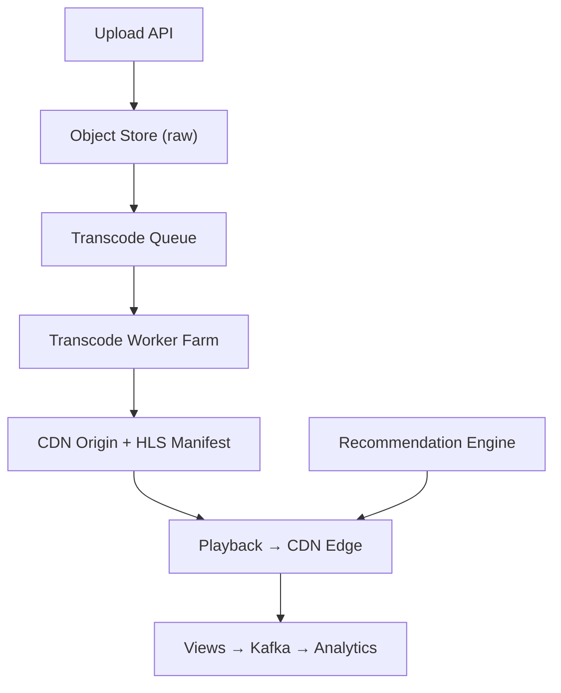

# Problem 24: YouTube (Video Platform)

## Business Problem
Users upload videos; the platform transcodes to multiple resolutions, stores on CDN, serves billions of hours of streaming, and supports search, recommendations, comments, and monetization (ads).

## Hard Requirements
- Upload **multi-GB files** reliably with resume.
- Transcode to 360p–4K + adaptive bitrate (HLS/DASH).
- Start playback in **< 2 seconds** via CDN edge.
- Recommendation feed personalized per user.
- View counts and analytics at massive scale.

## Why One Pattern Is Not Enough
| If you only use… | What breaks |
| --- | --- |
| Single transcoder | Upload backlog of hours |
| Origin-only delivery | Bandwidth cost and buffering |
| Sync transcode before publish | Creator waits hours |
| One DB for metadata + blobs | Wrong tool; scale limits |

You need **object storage**, **async transcoding pipeline**, **CDN**, **metadata sharding**, **recommendation ML pipeline**, and **event-driven view counting**.

## Architecture Overview


## Pattern Mix
| Concern | Patterns | Role |
| --- | --- | --- |
| Upload | [Chunked Transfer](../Scalability_patterns/), [Pipeline](../Concurrency_patterns/07-pipeline.md) | Multipart to S3 |
| Transcode | [Queue-Based Load Leveling](../Scalability_patterns/09-queue-based-load-leveling.md), [Worker Pool](../Concurrency_patterns/) | Priority by creator tier |
| Delivery | [CDN](../Scalability_patterns/05-cdn.md), [Cache-Aside](../Scalability_patterns/04-cache-aside.md) | Edge caching segments |
| Metadata | [Sharding](../Scalability_patterns/03-sharding.md), [CQRS](../Scalability_patterns/06-cqrs.md) | Video ID sharded |
| Views | [Event Streaming](../Messaging_Integration_patterns/) | See [YouTube Top K](./22-youtube-top-k.md) |
| Recs | [Pipeline](../Concurrency_patterns/07-pipeline.md), [Feature Store](../Data_domain_patterns/) | Candidate generation + rank |
| Resilience | [Bulkhead](../Resilience_Pattern/04-bulkhead.md) | Transcode pool ≠ API pool |

## Happy-Path Flow
1. Creator uploads chunks → assemble raw file → `VideoUploaded` event.
2. Transcode workers produce renditions + thumbnail → update status `READY`.
3. Viewer requests watch page → CDN serves manifest → adaptive streaming.
4. Each quartile watched emits analytics event (privacy-compliant).

## Failure Scenarios
- **Transcode failure:** Retry with different codec profile; notify creator.
- **CDN miss on viral video:** Pre-warm top N trending to additional POPs.
- **Copyright claim:** Takedown saga removes CDN keys + search index.

## TypeScript Sketch
```typescript
async function onUploadComplete(videoId: string, rawKey: string) {
  await videos.updateStatus(videoId, 'PROCESSING');
  for (const profile of ['360p', '720p', '1080p']) {
    await transcodeQueue.enqueue({ videoId, rawKey, profile });
  }
}
```

## Patterns Used
[CDN](../Scalability_patterns/05-cdn.md) · [Pipeline](../Concurrency_patterns/07-pipeline.md) · [Queue-Based Load Leveling](../Scalability_patterns/09-queue-based-load-leveling.md) · [Sharding](../Scalability_patterns/03-sharding.md) · [CQRS](../Scalability_patterns/06-cqrs.md)

**See also:** [Problem 8 — Video Upload & Transcoding Pipeline](./08-video-upload-transcoding-pipeline.md)
