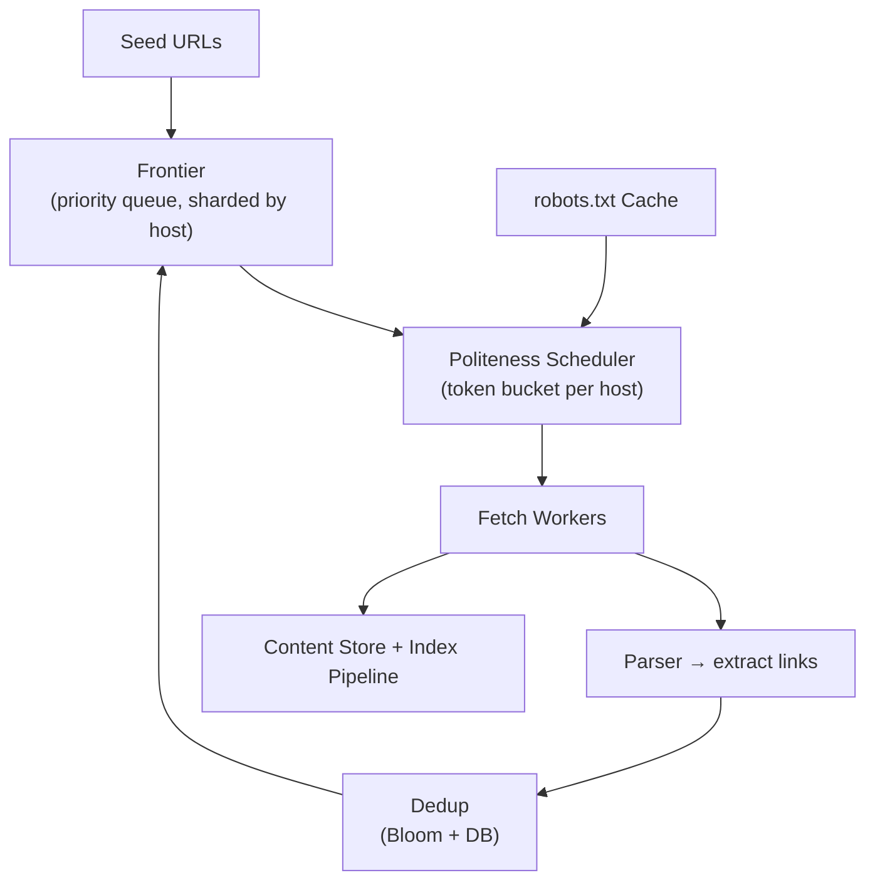

# Problem 25: Web Crawler

## Business Problem
Systematically discover and fetch web pages, respect `robots.txt` and rate limits, deduplicate URLs, extract links, and feed an index for search or analytics. Must crawl **billions of pages** without overloading target sites or your own infrastructure.

## Hard Requirements
- **Politeness:** max N requests/sec per host.
- **Duplicate detection** — same URL canonical form, content hash dedup.
- **Priority queue** — fresh/important pages first.
- **Fault tolerance** — retries, dead letter for permanent failures.
- Distributed workers across data centers.

## Why One Pattern Is Not Enough
| If you only use… | What breaks |
| --- | --- |
| BFS in one process | Memory and throughput ceiling |
| No per-host rate limit | IP banned; legal/ethical issues |
| URL string equality only | Crawl `http/a` and `http/a/` twice |
| Sync fetch in scheduler | Workers idle; poor utilization |

You need **frontier queue**, **URL normalization**, **Bloom filter dedup**, **politeness scheduler**, and **worker pool pipeline**.

## Architecture Overview


## Pattern Mix
| Concern | Patterns | Role |
| --- | --- | --- |
| Frontier | [Priority Queue](../Concurrency_patterns/), [Partitioning](../Scalability_patterns/02-partitioning.md) | Shard by hostname |
| Politeness | [Token Bucket](../Distributed_system_patterns/22-token-bucket.md), [Rate Limiting](../Distributed_system_patterns/18-rate-limiting.md) | Per-host delay |
| Dedup | [Bloom Filter](../Scalability_patterns/), [Idempotency](../Distributed_system_patterns/20-idempotency.md) | Seen URL set |
| Pipeline | [Producer-Consumer](../Concurrency_patterns/01-producer-consumer.md), [Pipeline](../Concurrency_patterns/07-pipeline.md) | Fetch → parse → store |
| Failures | [Retry](../Resilience_Pattern/02-retry.md), [Dead Letter Queue](../Messaging_Integration_patterns/) | 5xx retry; 404 drop |
| Scale | [Worker Pool](../Concurrency_patterns/), [Queue-Based Load Leveling](../Scalability_patterns/09-queue-based-load-leveling.md) | Horizontal workers |

## Happy-Path Flow
1. Scheduler pops URL from frontier for `example.com` (respects 1 req/s token).
2. Worker fetches page → stores raw HTML → parser extracts outbound links.
3. Each link normalized → Bloom filter check → if new, enqueue with priority (PageRank, freshness).
4. Indexer consumes stored pages → inverted index update.

## Failure Scenarios
- **Host down:** Exponential backoff; deprioritize host temporarily.
- **Infinite crawl trap:** Max depth + duplicate content hash skip.
- **robots.txt disallow:** Cache robots; never enqueue disallowed paths.

## TypeScript Sketch
```typescript
async function scheduleUrl(rawUrl: string, priority: number) {
  const url = normalize(rawUrl);
  if (await dedup.probablySeen(url)) return;
  const host = new URL(url).host;
  if (!(await robots.allowed(host, url))) return;
  await frontier.enqueue({ url, host, priority });
}

async function fetchLoop() {
  const job = await frontier.dePopPolitely(); // waits for host token
  const html = await http.get(job.url);
  await store.put(job.url, html);
  for (const link of parseLinks(html)) await scheduleUrl(link, job.priority - 1);
}
```

## Patterns Used
[Producer-Consumer](../Concurrency_patterns/01-producer-consumer.md) · [Pipeline](../Concurrency_patterns/07-pipeline.md) · [Token Bucket](../Distributed_system_patterns/22-token-bucket.md) · [Queue-Based Load Leveling](../Scalability_patterns/09-queue-based-load-leveling.md) · [Retry](../Resilience_Pattern/02-retry.md)
