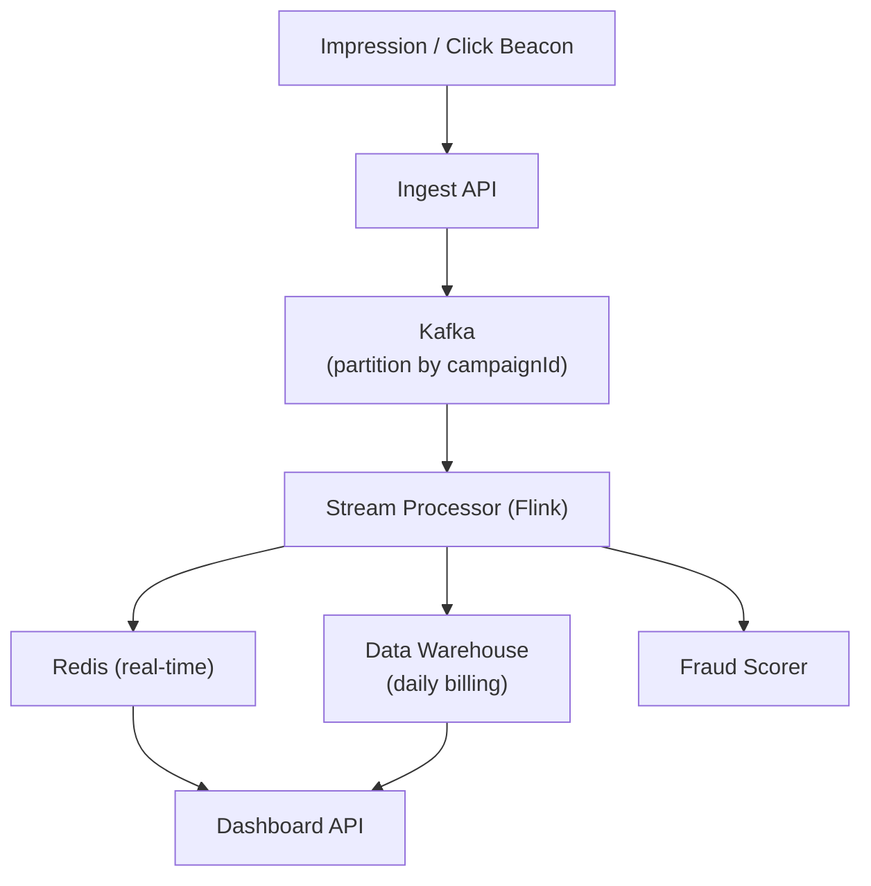

# Problem 26: Ad Click Aggregator

## Business Problem
Track billions of ad **impressions** and **clicks** from display networks, aggregate counts per campaign/ad/creative/publisher, and expose real-time dashboards and billing data to advertisers.

## Hard Requirements
- Ingest **1M+ events/sec** with at-least-once delivery.
- **Idempotent counting** — duplicate clicks must not double-bill.
- Near-real-time aggregates (minute-level) + daily billing rollups.
- Fraud detection: bot clicks filtered before billing.
- Query campaign stats in **< 500 ms**.

## Why One Pattern Is Not Enough
| If you only use… | What breaks |
| --- | --- |
| INSERT per click in SQL | DB dies immediately |
| Batch only (hourly) | Advertisers see stale dashboards |
| Count duplicates | Overbilling; trust loss |
| Single Kafka consumer | Cannot process peak Super Bowl traffic |

You need **event streaming**, **stream aggregation**, **idempotent event IDs**, **lambda architecture** (speed + batch layer), and **OLAP store**.

## Architecture Overview


## Pattern Mix
| Concern | Patterns | Role |
| --- | --- | --- |
| Ingest | [Event Streaming](../Messaging_Integration_patterns/), [Partitioning](../Scalability_patterns/02-partitioning.md) | Scale with partitions |
| Dedup | [Idempotency](../Distributed_system_patterns/20-idempotency.md) | `eventId` unique constraint |
| Aggregation | [Map-Reduce](../Scalability_patterns/), [CQRS](../Scalability_patterns/06-cqrs.md) | Write events; read aggregates |
| Real-time | [Cache-Aside](../Scalability_patterns/04-cache-aside.md), sliding windows | Minute counters |
| Batch | [Batch Processing](../Data_domain_patterns/) | Reconcile with stream layer |
| Fraud | [Pipeline](../Concurrency_patterns/07-pipeline.md) | IP velocity, device fingerprint |
| Resilience | [Queue-Based Load Leveling](../Scalability_patterns/09-queue-based-load-leveling.md) | Buffer spikes |

## Happy-Path Flow
1. User clicks ad → beacon `GET /click?cid=...&eid=uuid` → append to Kafka.
2. Processor checks `eid` dedup store → if new, increment `clicks:campaign:minute`.
3. Dashboard reads Redis for last 60 min + warehouse for historical.
4. Nightly job reconciles stream totals vs batch; adjust billing if drift.

## Failure Scenarios
- **Duplicate beacon (retry):** Idempotent on `eid`; return 204 anyway.
- **Processor lag:** Dashboard shows "data delayed"; scale consumers.
- **Fraud burst:** Circuit-break billing export until manual review.

## TypeScript Sketch
```typescript
async function recordClick(event: { eventId: string; campaignId: string; ts: number }) {
  const isNew = await dedup.setNx(`click:${event.eventId}`, '1', 86400);
  if (!isNew) return;
  const bucket = minuteBucket(event.ts);
  await redis.hincrby(`clicks:${event.campaignId}:${bucket}`, 'count', 1);
  await kafka.produce('clicks-raw', event);
}
```

## Patterns Used
[Event Streaming](../Messaging_Integration_patterns/) · [Idempotency](../Distributed_system_patterns/20-idempotency.md) · [CQRS](../Scalability_patterns/06-cqrs.md) · [Pipeline](../Concurrency_patterns/07-pipeline.md) · [Partitioning](../Scalability_patterns/02-partitioning.md)
