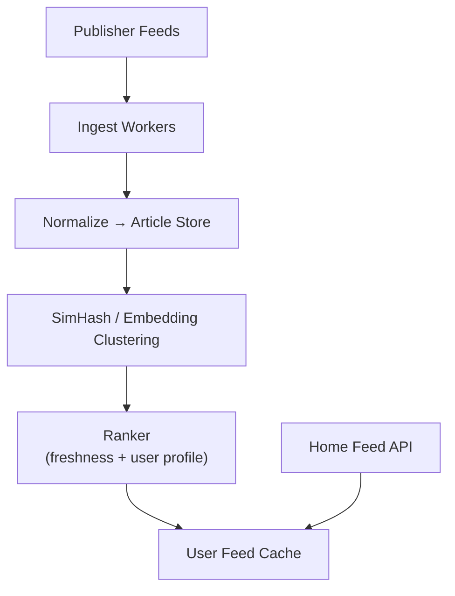

# Problem 27: News Aggregator (Google News / Flipboard)

## Business Problem
Collect articles from thousands of publishers, cluster duplicate stories, rank by freshness and user interests, and deliver a personalized news feed on web and mobile.

## Hard Requirements
- Ingest **100k+ new articles/day** via RSS, APIs, and crawlers.
- **Deduplicate** same story from multiple sources (cluster by similarity).
- Personalize by topic, location, and reading history.
- Serve feed in **< 200 ms**; breaking news within **minutes** of publish.
- Respect publisher paywalls and attribution.

## Why One Pattern Is Not Enough
| If you only use… | What breaks |
| --- | --- |
| Show every RSS item raw | 20 copies of same headline |
| Crawl all publishers synchronously | Slow; misses breaking news |
| One ranking model globally | Irrelevant local news |
| No cache on home feed | Recompute rank every refresh |

You need **ingestion pipeline**, **story clustering**, **recommendation ranker**, **feed cache**, and **publisher rate limits**.

## Architecture Overview


## Pattern Mix
| Concern | Patterns | Role |
| --- | --- | --- |
| Ingest | [Pipeline](../Concurrency_patterns/07-pipeline.md), [Scheduler](../Distributed_system_patterns/) | Poll feeds on interval |
| Dedup | [SimHash / Clustering](../Data_domain_patterns/) | One card per story |
| Personalization | [Feature Store](../Data_domain_patterns/), [CQRS](../Scalability_patterns/06-cqrs.md) | User interest vector |
| Feed | [Cache-Aside](../Scalability_patterns/04-cache-aside.md), fan-out | Precompute top N per user segment |
| Breaking | [Pub/Sub](../Messaging_Integration_patterns/08-pub-sub.md), priority queue | Push urgent clusters |
| Scale | [Sharding](../Scalability_patterns/03-sharding.md) | Articles by publish date |
| Crawler | See [Web Crawler](./25-web-crawler.md) | Fetch full text when allowed |

## Happy-Path Flow
1. RSS poll finds new URL → fetch article → extract title, body, entities.
2. Embedding compared to recent clusters → assign `storyClusterId` or create new.
3. Ranker scores cluster for user U → merge into feed cache if score > threshold.
4. User opens app → read cached feed IDs → hydrate headlines + thumbnails.

## Failure Scenarios
- **Publisher feed down:** Backoff; use last known etag; alert content ops.
- **Clustering false merge:** Human editor split tool; feedback loop to model.
- **Stale personalization:** Explore/exploit mix injects diverse topics.

## TypeScript Sketch
```typescript
async function ingestArticle(raw: RawArticle) {
  const article = normalize(raw);
  const clusterId = await clustering.findOrCreate(article.embedding);
  await articles.save({ ...article, clusterId });
  await feedUpdater.onNewCluster(clusterId, article.publishedAt);
}
```

## Patterns Used
[Pipeline](../Concurrency_patterns/07-pipeline.md) · [CQRS](../Scalability_patterns/06-cqrs.md) · [Cache-Aside](../Scalability_patterns/04-cache-aside.md) · [Pub/Sub](../Messaging_Integration_patterns/08-pub-sub.md) · [Sharding](../Scalability_patterns/03-sharding.md)
