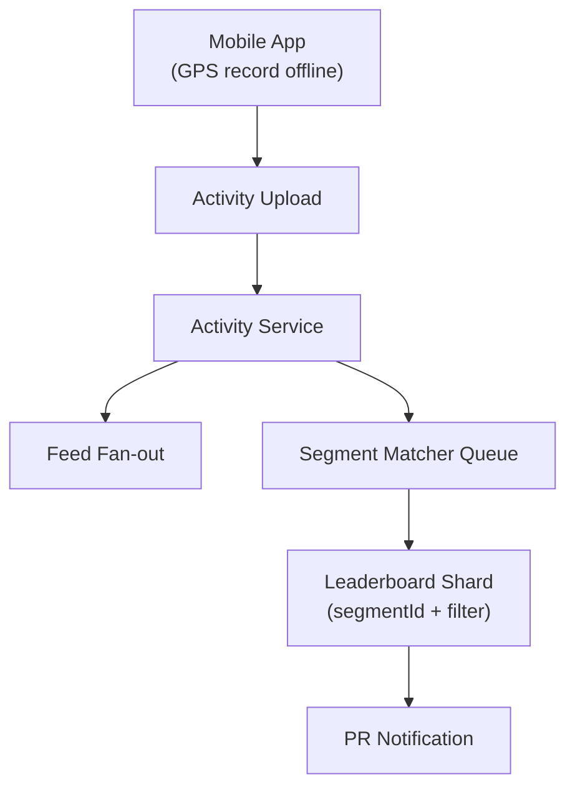

# Problem 29: Strava (Fitness Activity Tracking)

## Business Problem
Athletes record GPS activities (runs, rides), analyze performance, compete on **segments** (specific road sections), and share a social feed. Mobile apps must record offline and sync when connectivity returns.

## Hard Requirements
- Record GPS points every second; upload **after** activity completes or in chunks.
- **Segment matching** — did user beat leaderboard on "Main St Climb"?
- Leaderboards: fastest time per segment (filtered by gender/age/followers).
- Social feed of friends' activities with kudos and comments.
- Privacy zones hide start/end near home.

## Why One Pattern Is Not Enough
| If you only use… | What breaks |
| --- | --- |
| Upload all GPS raw to API synchronously | Battery and data drain |
| Segment match on every GPS point live | CPU impossible on device |
| Global segment leaderboard in one table | Hot segment write contention |
| No offline queue | Lost activities in tunnels |

You need **client-side buffering**, **post-activity segment matching**, **sharded leaderboards**, **feed fan-out**, and **map tile CDN**.

## Architecture Overview


## Pattern Mix
| Concern | Patterns | Role |
| --- | --- | --- |
| Offline | [Store-and-Forward](../Messaging_Integration_patterns/), client queue | Sync when online |
| Segments | [Geospatial](../Scalability_patterns/), [Pipeline](../Concurrency_patterns/07-pipeline.md) | Match after upload |
| Leaderboards | [Sharding](../Scalability_patterns/03-sharding.md), [Redis Sorted Set](../Scalability_patterns/04-cache-aside.md) | Top times per segment |
| Feed | [Fan-out](../Scalability_patterns/), [CQRS](../Scalability_patterns/06-cqrs.md) | Activity writes; feed reads |
| Maps | [CDN](../Scalability_patterns/05-cdn.md) | Tile delivery |
| Privacy | [Data Masking](../Security_patterns/) | Hide home location radius |

## Happy-Path Flow
1. Runner finishes → app uploads activity JSON + polyline (chunked if large).
2. Activity persisted → followers get feed entries via async fan-out.
3. Segment worker map-matches polyline → finds segments A, B → compare elapsed times.
4. New PR on segment B → update leaderboard ZSET → push notification.

## Failure Scenarios
- **Upload retry:** Idempotent on `activityClientId`.
- **Segment matcher backlog:** Delay PR notification; show "processing".
- **Cheating (vehicle):** Velocity anomaly detector flags review.

## TypeScript Sketch
```typescript
async function onActivityUploaded(activity: Activity) {
  await activities.save(activity);
  await feedFanout.toFollowers(activity.athleteId, activity.id);
  await segmentQueue.enqueue({ activityId: activity.id, polyline: activity.polyline });
}

async function matchSegments(activityId: string, polyline: string) {
  const hits = await segmentMatcher.match(polyline);
  for (const h of hits) {
    if (await leaderboard.isPersonalBest(h.segmentId, activityId, h.elapsedSec)) {
      await notify.athlete(activityId, `PR on ${h.segmentName}!`);
    }
  }
}
```

## Patterns Used
[Queue-Based Load Leveling](../Scalability_patterns/09-queue-based-load-leveling.md) · [Sharding](../Scalability_patterns/03-sharding.md) · [CQRS](../Scalability_patterns/06-cqrs.md) · [Pipeline](../Concurrency_patterns/07-pipeline.md) · [CDN](../Scalability_patterns/05-cdn.md)
