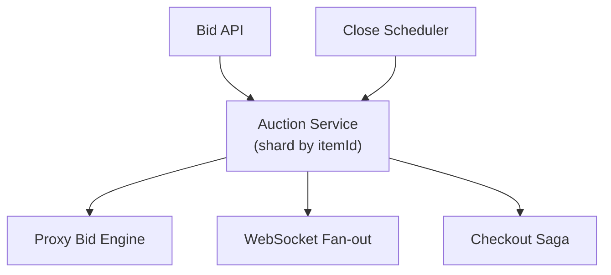

# Problem 30: Online Auction (eBay-Style)

## Business Problem
Sellers list items; buyers place bids before a deadline. Highest bidder wins when the auction closes. System must handle **sniping** (last-second bids), proxy/max bids, and payment after win.

## Hard Requirements
- **Strong consistency** on current high bid — no two winners.
- Accept bids until exact **end time** (with optional anti-snipe extension).
- **Proxy bidding:** user sets max; system auto-increments minimum steps.
- Show near-real-time current price to all watchers.
- Idempotent bid submission (double-click safe).

## Why One Pattern Is Not Enough
| If you only use… | What breaks |
| --- | --- |
| Optimistic lock only | Lost updates under snipe storm |
| Pessimistic lock whole auction table | Contention kills throughput |
| Poll for price updates | Thousands of RPS per hot item |
| No proxy bid logic | UX poor; manual rebid wars |

You need **atomic bid compare-and-set**, **auction shard per item**, **WebSocket price feed**, **scheduled close**, and **saga for checkout**.

## Architecture Overview


## Pattern Mix
| Concern | Patterns | Role |
| --- | --- | --- |
| Bidding | [Distributed Lock](../Distributed_system_patterns/21-distributed-lock.md), compare-and-set | One winner per item |
| Real-time | [Pub/Sub](../Messaging_Integration_patterns/08-pub-sub.md), WebSocket | Live price to viewers |
| Close | [Scheduler](../Distributed_system_patterns/), [Saga](../Distributed_system_patterns/10-saga.md) | End auction → charge winner |
| Proxy | [State Machine](../Data_domain_patterns/) | Max bid vs current price |
| Anti-snipe | [Event Timer](../Distributed_system_patterns/) | Extend 2 min if bid in last 30 s |
| Audit | [Event Sourcing](../Data_domain_patterns/15-event-sourcing.md) | Dispute resolution |
| Idempotency | [Idempotency](../Distributed_system_patterns/20-idempotency.md) | Same bid token once |

## Happy-Path Flow
1. User sets max bid $100 → stored as proxy; current price may jump to outbid rival + increment.
2. Rival bids → proxy engine auto-responds until max exhausted.
3. Auction ends → winner locked → payment saga (authorize → capture or second-chance offer).
4. All bidders see final price via WebSocket `AuctionClosed`.

## Failure Scenarios
- **Bid lost in network:** Client retries with Idempotency-Key; server returns same result.
- **Winner payment fails:** Offer to second-highest (configurable policy).
- **Clock skew at close:** Server authoritative `endsAt`; reject late bids.

## TypeScript Sketch
```typescript
async function placeBid(itemId: string, userId: string, amount: number, idempotencyKey: string) {
  return lock.with(`auction:${itemId}`, async () => {
    const auction = await store.get(itemId);
    if (Date.now() >= auction.endsAt) throw new Error('AUCTION_CLOSED');
    if (amount < auction.currentPrice + auction.minIncrement) throw new Error('BID_TOO_LOW');
    await store.updateHighBid(itemId, userId, amount);
    await pubsub.publish(`auction:${itemId}`, { currentPrice: amount, leader: userId });
    return { accepted: true, currentPrice: amount };
  });
}
```

## Patterns Used
[Distributed Lock](../Distributed_system_patterns/21-distributed-lock.md) · [Event Sourcing](../Data_domain_patterns/15-event-sourcing.md) · [Saga](../Distributed_system_patterns/10-saga.md) · [Pub/Sub](../Messaging_Integration_patterns/08-pub-sub.md) · [Idempotency](../Distributed_system_patterns/20-idempotency.md)
