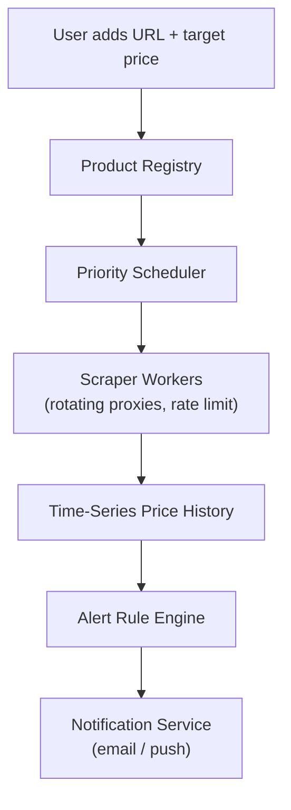

# Problem 31: Price Tracking Service (CamelCamelCamel-Style)

## Business Problem
Users track product prices on Amazon and other retailers. The system polls or receives price updates, stores history, and **alerts** when price drops below a target.

## Hard Requirements
- Monitor **millions of URLs** without getting blocked.
- Store **price history** for charts (years of data).
- Send alert within **minutes** of target price hit.
- Respect retailer **rate limits** and robots policies.
- Handle product page changes (404, redirect, variant SKU).

## Why One Pattern Is Not Enough
| If you only use… | What breaks |
| --- | --- |
| Poll every URL every hour | IP banned; cannot scale |
| Single cron job | Misses flash sales |
| Email on every tiny change | Alert fatigue |
| No dedup on alerts | User gets 50 emails for one drop |

You need **priority scheduler**, **polite crawling**, **time-series storage**, **alert dedup**, and **change detection**.

## Architecture Overview


## Pattern Mix
| Concern | Patterns | Role |
| --- | --- | --- |
| Scheduling | [Priority Queue](../Concurrency_patterns/), [Job Scheduler](./36-job-scheduler.md) | Smart poll intervals |
| Crawling | [Token Bucket](../Distributed_system_patterns/22-token-bucket.md), [Retry](../Resilience_Pattern/02-retry.md) | Politeness per domain |
| History | [Time-Series DB](../Data_domain_patterns/), [Partitioning](../Scalability_patterns/02-partitioning.md) | Partition by month |
| Alerts | [Event Notification](../Messaging_Integration_patterns/10-event-notification.md), [Idempotency](../Distributed_system_patterns/20-idempotency.md) | One alert per threshold cross |
| Scale | [Worker Pool](../Concurrency_patterns/), [Queue-Based Load Leveling](../Scalability_patterns/09-queue-based-load-leveling.md) | Horizontal scrapers |
| Parsing | [Circuit Breaker](../Resilience_Pattern/01-circuit-breaker.md) | DOM change breaks parser |

## Happy-Path Flow
1. User tracks `productId` with alert at $49.99.
2. Scheduler enqueues scrape job (higher priority as price approaches target).
3. Scraper extracts current price $48.50 → append point to history.
4. Rule engine: price ≤ target → emit `PriceAlert` once → email user.

## Failure Scenarios
- **Scrape failure (CAPTCHA):** Backoff; notify user "tracking paused".
- **Wrong variant price:** Match ASIN/SKU; validate title hash.
- **Flash sale 5 min:** Dynamic priority boost for items with recent volatility.

## TypeScript Sketch
```typescript
async function onPriceScraped(productId: string, price: number, ts: number) {
  await history.append(productId, { price, ts });
  const rules = await alerts.listForProduct(productId);
  for (const r of rules) {
    if (price <= r.target && !(await dedup.recentlyAlerted(r.id))) {
      await notify.send(r.userId, { productId, price, target: r.target });
      await dedup.markAlerted(r.id, 86400);
    }
  }
}
```

## Patterns Used
[Job Scheduler](./36-job-scheduler.md) · [Token Bucket](../Distributed_system_patterns/22-token-bucket.md) · [Event Notification](../Messaging_Integration_patterns/10-event-notification.md) · [Queue-Based Load Leveling](../Scalability_patterns/09-queue-based-load-leveling.md) · [Partitioning](../Scalability_patterns/02-partitioning.md)
