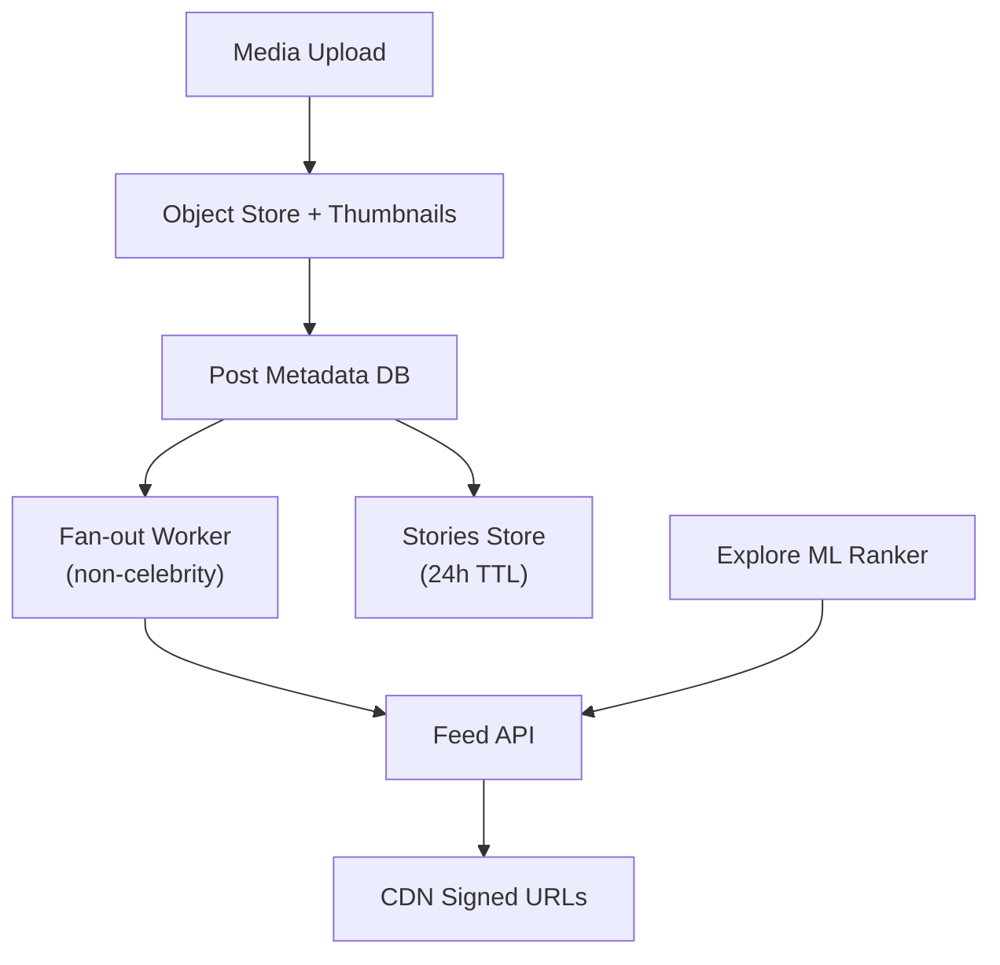

# Problem 32: Instagram (Photo Sharing & Stories)

## Business Problem
Users upload photos and short videos, apply filters, share to followers, browse a **feed**, post **Stories** (24h TTL), and explore discovery tab. Heavy media workload with social graph on top.

## Hard Requirements
- Upload and serve images/video via **CDN** globally.
- Feed generation for followers (similar to FB feed but media-centric).
- Stories expire after **24 hours** with efficient TTL cleanup.
- Likes, comments, DMs with notification fan-out.
- Explore/discover via ML ranking on engagement.

## Why One Pattern Is Not Enough
| If you only use… | What breaks |
| --- | --- |
| Store images in DB | Storage and latency impossible |
| Fan-out every post to all followers sync | Celebrity post melts system |
| No TTL on Stories | Storage cost grows forever |
| Single media size | Mobile bandwidth waste |

You need **object storage + CDN**, **hybrid feed fan-out**, **TTL lifecycle**, **media transcoding pipeline**, and **notification graph**.

## Architecture Overview


## Pattern Mix
| Concern | Patterns | Role |
| --- | --- | --- |
| Media | [CDN](../Scalability_patterns/05-cdn.md), [Pipeline](../Concurrency_patterns/07-pipeline.md) | Multi-resolution images |
| Feed | [CQRS](../Scalability_patterns/06-cqrs.md), [Cache-Aside](../Scalability_patterns/04-cache-aside.md) | See [FB News Feed](./15-fb-news-feed.md) |
| Stories | [TTL / Expiration](../Data_domain_patterns/), scheduled purge | Auto-delete blobs + metadata |
| Graph | [Sharding](../Scalability_patterns/03-sharding.md) | Follow edges by user |
| Notifications | [Event Notification](../Messaging_Integration_patterns/10-event-notification.md) | Like/comment push |
| DMs | [Sharding](../Scalability_patterns/03-sharding.md), [Pub/Sub](../Messaging_Integration_patterns/08-pub-sub.md) | Similar to WhatsApp lite |

## Happy-Path Flow
1. User posts photo → upload to S3 → async thumbnails → post record created.
2. Fan-out post ID to follower feed caches (skip if follower count > 1M).
3. Follower opens feed → ranked post IDs → CDN URLs for images.
4. Story posted → TTL key set 86400 s → cron deletes expired media.

## Failure Scenarios
- **Transcode delay:** Show placeholder blur hash until ready.
- **CDN origin overload on viral post:** Pre-warm; multiple edge POPs.
- **Story purge lag:** Hide from API immediately; async delete blobs.

## TypeScript Sketch
```typescript
async function createPost(userId: string, mediaKey: string, caption: string) {
  const postId = await posts.create({ userId, mediaKey, caption });
  await mediaPipeline.enqueue({ postId, mediaKey, variants: ['thumb', 'feed', 'full'] });
  if (await graph.followerCount(userId) < 1_000_000) {
    await fanout.toFollowers(userId, postId);
  }
  return postId;
}
```

## Patterns Used
[CDN](../Scalability_patterns/05-cdn.md) · [CQRS](../Scalability_patterns/06-cqrs.md) · [Pipeline](../Concurrency_patterns/07-pipeline.md) · [Cache-Aside](../Scalability_patterns/04-cache-aside.md) · [Sharding](../Scalability_patterns/03-sharding.md)
