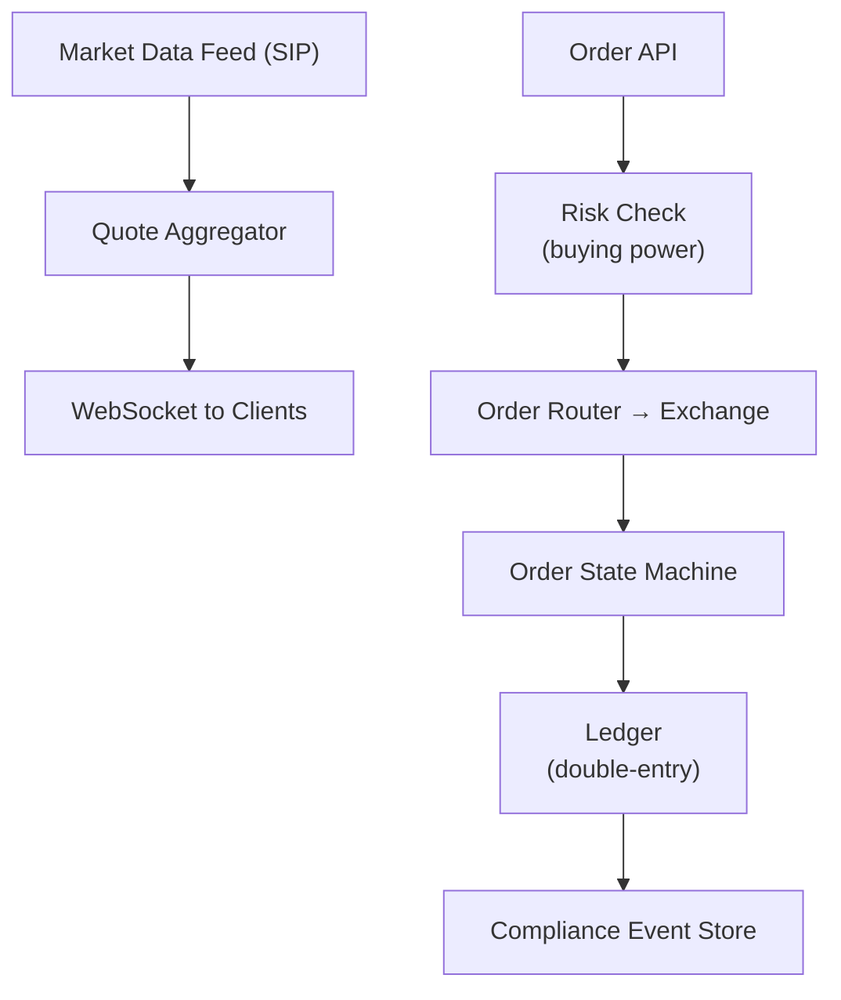

# Problem 33: Robinhood (Stock Trading Platform)

## Business Problem
Retail users buy and sell stocks and options in real time with commission-free trades. The app shows **live quotes**, portfolio value, and instant order confirmation while meeting financial regulations.

## Hard Requirements
- **Order execution** with audit trail; no duplicate trades.
- Display quotes with **sub-second** refresh during market hours.
- Prevent negative balance / margin violations before submit.
- Settlement and regulatory reporting (FIFO, wash sales).
- 99.99% availability during market open; halt trading on volatility breakers.

## Why One Pattern Is Not Enough
| If you only use… | What breaks |
| --- | --- |
| Poll REST for every symbol | Cannot scale to watchlists of 50 symbols × 10M users |
| DB as source of truth for quotes | Stale prices; wrong portfolio value |
| Sync order to exchange in HTTP | Timeouts cause unknown state |
| No idempotency | Double order on retry |

You need **market data streaming**, **order state machine**, **ledger accounting**, **risk pre-check**, and **idempotent order IDs**.

## Architecture Overview


## Pattern Mix
| Concern | Patterns | Role |
| --- | --- | --- |
| Quotes | [Pub/Sub](../Messaging_Integration_patterns/08-pub-sub.md), WebSocket fan-out | Push ticks to subscribers |
| Orders | [Saga](../Distributed_system_patterns/10-saga.md), [State Machine](../Data_domain_patterns/) | Match + settle lifecycle |
| Correctness | [Idempotency](../Distributed_system_patterns/20-idempotency.md), [Event Sourcing](../Data_domain_patterns/15-event-sourcing.md) | Regulatory audit |
| Risk | [Fail Fast](../Resilience_Pattern/05-fail-fast.md), pre-trade checks | Block insufficient funds |
| Ledger | [Double-Entry](../Data_domain_patterns/) | Cash + holdings consistency |
| Resilience | [Circuit Breaker](../Resilience_Pattern/01-circuit-breaker.md) | Exchange outage handling |
| Peak | [Bulkhead](../Resilience_Pattern/04-bulkhead.md) | Separate read quotes from write orders |

## Happy-Path Flow
1. Client subscribes WebSocket `AAPL` → receives tick updates from shared stream.
2. User submits market buy 10 shares → risk validates buying power → order `PENDING`.
3. Router sends to exchange → fill confirmation → saga updates ledger and position.
4. Client receives fill event → portfolio UI updates.

## Failure Scenarios
- **Unknown order state after timeout:** Reconcile with exchange id; idempotent clientOrderId.
- **Partial fill:** State machine handles remaining qty.
- **Market halt:** Reject new orders; show banner from config service.

## TypeScript Sketch
```typescript
async function placeOrder(userId: string, symbol: string, qty: number, clientOrderId: string) {
  const existing = await orders.findByClientId(clientOrderId);
  if (existing) return existing;
  const buyingPower = await ledger.buyingPower(userId);
  const estCost = qty * (await quotes.last(symbol));
  if (estCost > buyingPower) throw new Error('INSUFFICIENT_FUNDS');
  return orders.submit({ userId, symbol, qty, clientOrderId, status: 'PENDING' });
}
```

## Patterns Used
[Saga](../Distributed_system_patterns/10-saga.md) · [Event Sourcing](../Data_domain_patterns/15-event-sourcing.md) · [Idempotency](../Distributed_system_patterns/20-idempotency.md) · [Pub/Sub](../Messaging_Integration_patterns/08-pub-sub.md) · [Circuit Breaker](../Resilience_Pattern/01-circuit-breaker.md)
