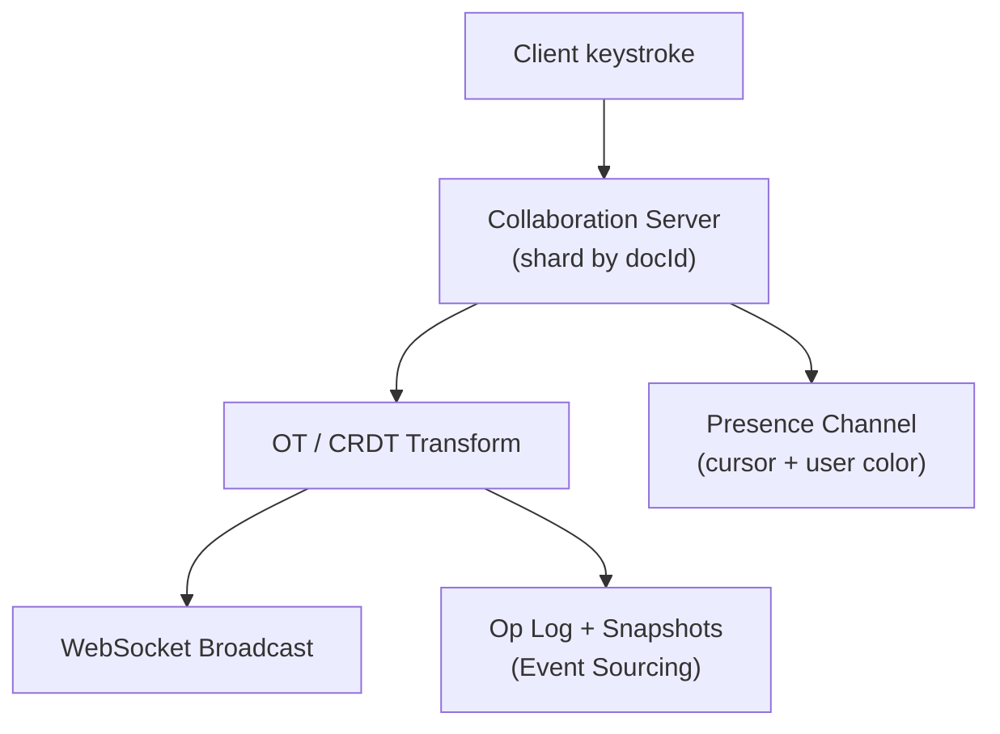

# Problem 34: Google Docs (Collaborative Editing)

## Business Problem
Multiple users edit the same document simultaneously with **character-level live sync**, cursor presence, comments, and version history. Conflicts must merge without losing edits; offline edits sync when reconnected.

## Hard Requirements
- **Real-time collaboration** — edits appear in **< 100 ms** for collaborators.
- **Offline support** — edit on plane; merge on reconnect.
- Version history and named revisions.
- Permissions: view, comment, edit, share link.
- Documents from paragraphs to large spreadsheets.

## Why One Pattern Is Not Enough
| If you only use… | What breaks |
| --- | --- |
| Last-write-wins on whole doc | Lost paragraphs from concurrent editors |
| Lock document while one user edits | Defeats collaboration purpose |
| HTTP poll for changes | Unusable latency and load |
| Central server serializes every keystroke globally | Single bottleneck |

You need **OT or CRDT**, **WebSocket sync**, **operational transform server**, **persistence snapshots**, and **presence service**.

## Architecture Overview


## Pattern Mix
| Concern | Patterns | Role |
| --- | --- | --- |
| Sync | [CRDT / OT](../Distributed_system_patterns/), WebSocket | Conflict-free merge |
| Sharding | [Sharding](../Scalability_patterns/03-sharding.md) | One doc = one collaboration shard |
| Persistence | [Event Sourcing](../Data_domain_patterns/15-event-sourcing.md) | Op log + snapshots |
| Offline | [Store-and-Forward](../Messaging_Integration_patterns/) | Queue ops locally; replay |
| Presence | [Pub/Sub](../Messaging_Integration_patterns/08-pub-sub.md), [Cache](../Scalability_patterns/04-cache-aside.md) | Who's viewing |
| Permissions | [RBAC](../Security_patterns/) | Share link tokens |
| Scale | [Bulkhead](../Resilience_Pattern/04-bulkhead.md) | Hot doc isolated |

## Happy-Path Flow
1. Alice inserts "hello" at pos 5 → op sent to doc server → transformed against Bob's pending op.
2. Server assigns revision 42 → broadcasts to Bob's client → Bob applies op locally.
3. Every 100 ops or 30 s → snapshot persisted; op log compacted.
4. New collaborator joins → fetch snapshot + ops since revision.

## Failure Scenarios
- **Client reconnect with gap:** Request ops from last known revision.
- **Server crash mid-op:** At-least-once delivery; client dedup by opId.
- **Malicious op:** Validate against schema; authZ on docId.

## TypeScript Sketch
```typescript
type Op = { opId: string; rev: number; type: 'insert' | 'delete'; pos: number; text?: string };

async function applyOp(docId: string, op: Op, clientRev: number) {
  const transformed = await ot.transform(docId, op, clientRev);
  const rev = await opLog.append(docId, transformed);
  await ws.broadcast(`doc:${docId}`, { ...transformed, rev });
  return rev;
}
```

## Patterns Used
[Event Sourcing](../Data_domain_patterns/15-event-sourcing.md) · [Sharding](../Scalability_patterns/03-sharding.md) · [Pub/Sub](../Messaging_Integration_patterns/08-pub-sub.md) · [CRDT](../Distributed_system_patterns/) · [RBAC](../Security_patterns/)

**See also:** [Dropbox](./12-dropbox-file-sync.md) for file-level sync (different conflict model).
