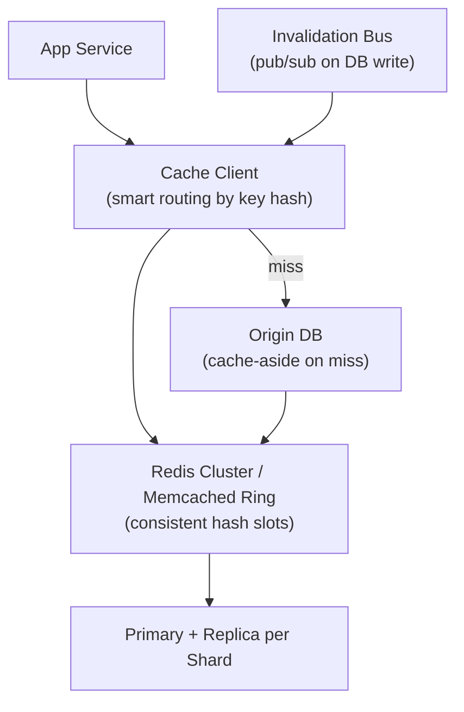

# Problem 35: Distributed Cache (Redis Cluster / Memcached)

## Business Problem
Provide a **shared in-memory cache** layer used by hundreds of microservices for session data, hot database rows, rate limit counters, and computed aggregates. Must scale horizontally with **high availability** and predictable latency.

## Hard Requirements
- **Sub-millisecond** reads for hot keys at p99.
- **Horizontal scale** — add nodes without full restart.
- **Replication** for fault tolerance; tolerate node failure without mass cache miss storm.
- **Consistent hashing** so key redistribution is minimal on topology change.
- Optional: TTL, eviction (LRU), pub/sub for invalidation.

## Why One Pattern Is Not Enough
| If you only use… | What breaks |
| --- | --- |
| Single Redis instance | Memory ceiling; SPOF |
| Client-side round-robin | Wrong node for key; cache miss always |
| No invalidation strategy | Stale reads forever |
| Sync replication only | Write latency; availability tradeoff |

You need **consistent hashing**, **replication**, **cache-aside pattern**, **stampede protection**, and **cluster-aware client**.

## Architecture Overview


## Pattern Mix
| Concern | Patterns | Role |
| --- | --- | --- |
| Routing | [Consistent Hashing](../Distributed_system_patterns/), [Sharding](../Scalability_patterns/03-sharding.md) | Key → shard mapping |
| App usage | [Cache-Aside](../Scalability_patterns/04-cache-aside.md), [Read-Through](../Scalability_patterns/) | App manages load |
| Invalidation | [Pub/Sub](../Messaging_Integration_patterns/08-pub-sub.md), TTL | Coherent enough |
| Stampede | [Distributed Lock](../Distributed_system_patterns/21-distributed-lock.md), single-flight | One rebuild on miss |
| HA | [Replication](../Distributed_system_patterns/), [Quorum](../Distributed_system_patterns/26-quorum.md) | Failover |
| Eviction | LRU / LFU policies | Memory bound |

## Happy-Path Flow
1. App `GET user:123` → client hashes key → shard 7 primary.
2. Hit → return value < 1 ms.
3. Miss → acquire lock `lock:user:123` → load from DB → SET with TTL → release lock.
4. On user update → DB commit → publish `invalidate:user:123` → all nodes delete key.

## Failure Scenarios
- **Node failure:** Replica promoted; brief subset of keys unavailable → origin fallback.
- **Split brain:** Use consensus (Redis Cluster voting) or external orchestrator.
- **Hot key:** Local in-process cache in app; or read replicas for that key.

## TypeScript Sketch
```typescript
async function cacheAside<T>(key: string, loader: () => Promise<T>, ttlSec: number): Promise<T> {
  const hit = await redis.get(key);
  if (hit) return JSON.parse(hit);
  return lock.with(`lock:${key}`, async () => {
    const again = await redis.get(key);
    if (again) return JSON.parse(again);
    const value = await loader();
    await redis.setex(key, ttlSec, JSON.stringify(value));
    return value;
  });
}
```

## Patterns Used
[Cache-Aside](../Scalability_patterns/04-cache-aside.md) · [Consistent Hashing](../Distributed_system_patterns/) · [Sharding](../Scalability_patterns/03-sharding.md) · [Pub/Sub](../Messaging_Integration_patterns/08-pub-sub.md) · [Distributed Lock](../Distributed_system_patterns/21-distributed-lock.md)
