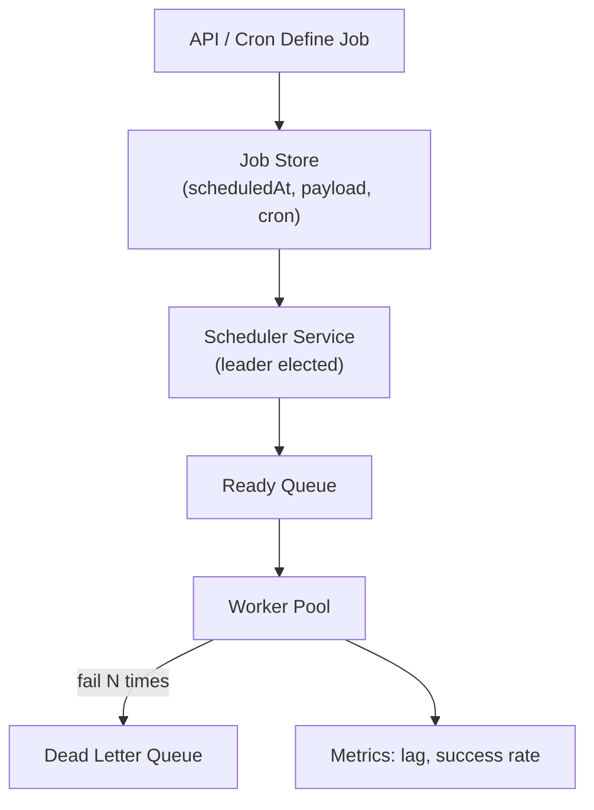

# Problem 36: Job Scheduler (Cron at Scale)

## Business Problem
Run **millions of scheduled jobs**: nightly reports, subscription renewals, hold expirations, data cleanup. Jobs must fire on time (± few seconds), survive worker crashes, and not double-run on distributed workers.

## Hard Requirements
- Schedule one-off and **recurring** jobs (cron expressions).
- **Exactly-once execution** (or at-least-once with idempotent handlers).
- Priority queues for urgent vs background work.
- Horizontal workers; no single scheduler bottleneck.
- Visibility: job status, retries, dead letter queue.

## Why One Pattern Is Not Enough
| If you only use… | What breaks |
| --- | --- |
| crontab on one server | SPOF; cannot scale workers |
| Poll DB every second for due jobs | DB load; missed precision |
| At-least-once without idempotency | Double charge, double email |
| No lease/lock on job | Two workers run same job |

You need **time-wheel or delay queue**, **leader election or sharding**, **worker lease**, **retry policy**, and **idempotent job handlers**.

## Architecture Overview


## Pattern Mix
| Concern | Patterns | Role |
| --- | --- | --- |
| Timing | [Delay Queue](../Messaging_Integration_patterns/), time wheel | Efficient due-job scan |
| Coordination | [Leader Election](../Distributed_system_patterns/), [Distributed Lock](../Distributed_system_patterns/21-distributed-lock.md) | One scheduler brain |
| Execution | [Worker Pool](../Concurrency_patterns/), [Queue-Based Load Leveling](../Scalability_patterns/09-queue-based-load-leveling.md) | Scale workers |
| Correctness | [Idempotency](../Distributed_system_patterns/20-idempotency.md), lease token | No duplicate side effects |
| Retries | [Retry with Backoff](../Resilience_Pattern/02-retry.md), [Dead Letter Queue](../Messaging_Integration_patterns/) | Poison pill isolation |
| Observability | [Metrics Monitoring](./38-metrics-monitoring.md) | Alert on scheduler lag |

## Happy-Path Flow
1. App schedules `expireHold(orderId)` at `now + 10min` with unique job ID.
2. At due time scheduler enqueues to Redis/SQS ready queue.
3. Worker picks job → sets lease 60 s → runs handler → releases hold → marks COMPLETE.
4. Recurring job `0 0 * * *` creates next instance after success.

## Failure Scenarios
- **Worker dies mid-job:** Lease expires → job requeued (handler must be idempotent).
- **Scheduler leader dies:** Follower elected; scan missed window.
- **Thundering herd at midnight:** Jitter cron fire times ± random seconds.

## TypeScript Sketch
```typescript
async function runWorker() {
  const job = await queue.dequeue();
  const leased = await store.acquireLease(job.id, workerId, 60_000);
  if (!leased) return;
  try {
    await handlers[job.type](job.payload);
    await store.complete(job.id);
  } catch (e) {
    await store.fail(job.id, { retry: job.attempts < 5 });
  }
}
```

## Patterns Used
[Leader Election](../Distributed_system_patterns/) · [Distributed Lock](../Distributed_system_patterns/21-distributed-lock.md) · [Idempotency](../Distributed_system_patterns/20-idempotency.md) · [Retry](../Resilience_Pattern/02-retry.md) · [Queue-Based Load Leveling](../Scalability_patterns/09-queue-based-load-leveling.md)
