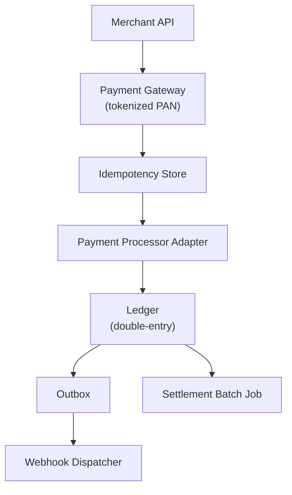

# Problem 37: Payment System (Stripe / PayPal-Style)

## Business Problem
Accept payments from customers, route funds to merchants/platforms, handle refunds, disputes, and multi-currency settlement — with **PCI compliance**, webhooks, and an immutable financial audit trail.

## Hard Requirements
- **Exactly-once money movement** (idempotent charges).
- Support cards, wallets, bank transfers; 3DS and fraud checks.
- **Webhook delivery** to merchants (payment succeeded, failed, disputed).
- Ledger for reconciliation; daily settlement batches.
- 99.99% availability; never double-charge on retry.

## Why One Pattern Is Not Enough
| If you only use… | What breaks |
| --- | --- |
| Direct charge API without idempotency | Double charge on network retry |
| Single monolith ledger table | Contention; no audit granularity |
| Sync webhook in payment thread | Merchant timeout blocks payment flow |
| No saga for multi-party split | Partial payout failures corrupt state |

You need **idempotency keys**, **double-entry ledger**, **outbox webhooks**, **payment saga**, and **PCI tokenization boundary**.

## Architecture Overview


## Pattern Mix
| Concern | Patterns | Role |
| --- | --- | --- |
| Idempotency | [Idempotency](../Distributed_system_patterns/20-idempotency.md) | Same key → same charge |
| Multi-step | [Saga](../Distributed_system_patterns/10-saga.md) | Auth → capture → split → payout |
| Webhooks | [Outbox](../Distributed_system_patterns/11-outbox-pattern.md), [Retry](../Resilience_Pattern/02-retry.md) | Reliable merchant notify |
| Ledger | [Event Sourcing](../Data_domain_patterns/15-event-sourcing.md), double-entry | Reconciliation |
| Security | [Tokenization](../Security_patterns/), PCI scope isolation | Card data vault |
| External | [Circuit Breaker](../Resilience_Pattern/01-circuit-breaker.md), [Timeout](../Resilience_Pattern/03-timeout.md) | Processor outages |
| Fraud | See [Fraud Detection](./09-fraud-detection-on-checkout.md) | Pre-auth scoring |

## Happy-Path Flow
1. Merchant POST `/charges` with `Idempotency-Key: abc` and payment method token.
2. Gateway checks idempotency store → if new, authorize with processor.
3. Capture → write ledger entries → insert Outbox `charge.succeeded`.
4. Webhook worker delivers signed payload to merchant URL with retries.

## Failure Scenarios
- **Capture succeeds; webhook fails:** Outbox retries; merchant polls API as backup.
- **Partial split payout:** Saga compensates or marks manual review.
- **Processor timeout:** Return 202 + poll URL; never assume failure without reconcile.

## TypeScript Sketch
```typescript
async function createCharge(req: ChargeRequest, idempotencyKey: string) {
  const cached = await idempotency.get(idempotencyKey);
  if (cached) return cached;
  const auth = await processor.authorize(req.paymentMethod, req.amount);
  const charge = await ledger.recordCharge({ ...req, authId: auth.id });
  await outbox.enqueue({ type: 'charge.succeeded', chargeId: charge.id });
  await idempotency.set(idempotencyKey, charge);
  return charge;
}
```

## Patterns Used
[Idempotency](../Distributed_system_patterns/20-idempotency.md) · [Saga](../Distributed_system_patterns/10-saga.md) · [Outbox](../Distributed_system_patterns/11-outbox-pattern.md) · [Event Sourcing](../Data_domain_patterns/15-event-sourcing.md) · [Circuit Breaker](../Resilience_Pattern/01-circuit-breaker.md)

**See also:** [Problem 3 — Multi-Party Payment & Settlement Platform](./03-payment-settlement-platform.md)
