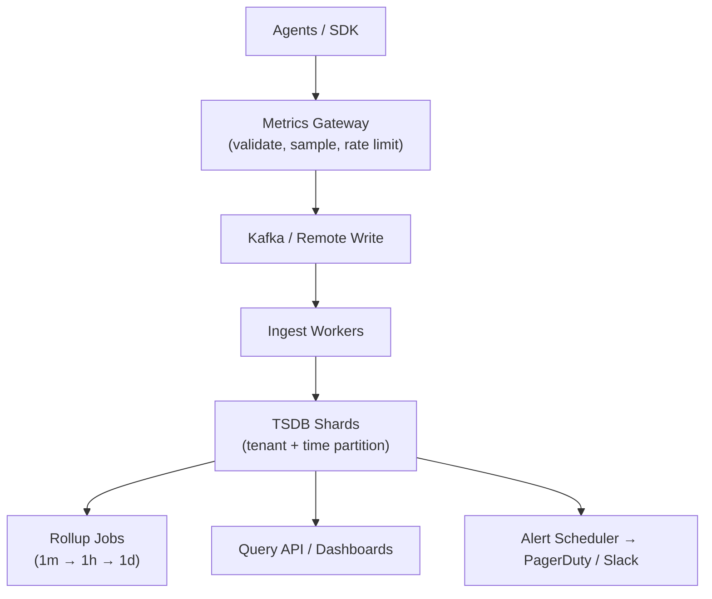

# Problem 38: Metrics Monitoring (Datadog / Prometheus-Style)

## Business Problem
Collect **metrics, logs, and traces** from thousands of services and hosts. Store time-series data, evaluate alert rules, and power dashboards for SRE teams. Must ingest **millions of data points per second** and query recent data fast.

## Hard Requirements
- **Pull or push** metrics (Prometheus scrape vs StatsD push).
- Retention tiers: hot (15 days high-res) → warm → cold archive.
- **Alert evaluation** within 1 minute of threshold breach.
- Cardinality control — don't explode on high-cardinality labels.
- Multi-tenant isolation for enterprise customers.

## Why One Pattern Is Not Enough
| If you only use… | What breaks |
| --- | --- |
| One Prometheus per service | No global view; ops nightmare |
| Raw data points forever | Storage cost impossible |
| Alert on every spike | Alert fatigue |
| No downsampling | Queries over 30 days timeout |

You need **time-series DB**, **aggregation rollups**, **stream ingestion**, **alert rule engine**, and **cardinality limits**.

## Architecture Overview


## Pattern Mix
| Concern | Patterns | Role |
| --- | --- | --- |
| Ingest | [Event Streaming](../Messaging_Integration_patterns/), [Queue-Based Load Leveling](../Scalability_patterns/09-queue-based-load-leveling.md) | Buffer spikes |
| Storage | [Time-Series Partitioning](../Scalability_patterns/02-partitioning.md), [Sharding](../Scalability_patterns/03-sharding.md) | By time + tenant |
| Query | [CQRS](../Scalability_patterns/06-cqrs.md), pre-aggregates | Fast dashboard reads |
| Alerts | [Job Scheduler](./36-job-scheduler.md), [Circuit Breaker](../Resilience_Pattern/01-circuit-breaker.md) | Periodic rule eval |
| Cardinality | [Rate Limiting](../Distributed_system_patterns/18-rate-limiting.md), label allowlist | Prevent metric explosion |
| HA | [Replication](../Distributed_system_patterns/), [Quorum](../Distributed_system_patterns/26-quorum.md) | TSDB durability |

## Happy-Path Flow
1. Service increments `http_requests_total{route="/api",status="200"}`.
2. Agent batches push every 10 s to gateway → Kafka → TSDB write.
3. Dashboard queries last 1 h from hot tier → sub-second response.
4. Rule `error_rate > 5% for 5m` fires → alert routed to on-call.

## Failure Scenarios
- **Ingest overload:** Sample or drop low-priority metrics; [Load Shedding](../Resilience_Pattern/08-load-shedding.md).
- **TSDB shard hot:** Split tenant to new shard.
- **False positive alert:** Hysteresis and multi-window confirmation.

## TypeScript Sketch
```typescript
async function ingest(batch: MetricPoint[]) {
  const allowed = batch.filter(p => cardinalityGuard.allow(p.labels));
  await kafka.produce('metrics-raw', allowed);
}

async function evaluateAlerts() {
  for (const rule of await rules.active()) {
    const value = await query.run(rule.expr, rule.windowSec);
    if (value > rule.threshold) await notify.page(rule.onCall, { rule, value });
  }
}
```

## Patterns Used
[Partitioning](../Scalability_patterns/02-partitioning.md) · [CQRS](../Scalability_patterns/06-cqrs.md) · [Queue-Based Load Leveling](../Scalability_patterns/09-queue-based-load-leveling.md) · [Rate Limiting](../Distributed_system_patterns/18-rate-limiting.md) · [Job Scheduler](./36-job-scheduler.md)
