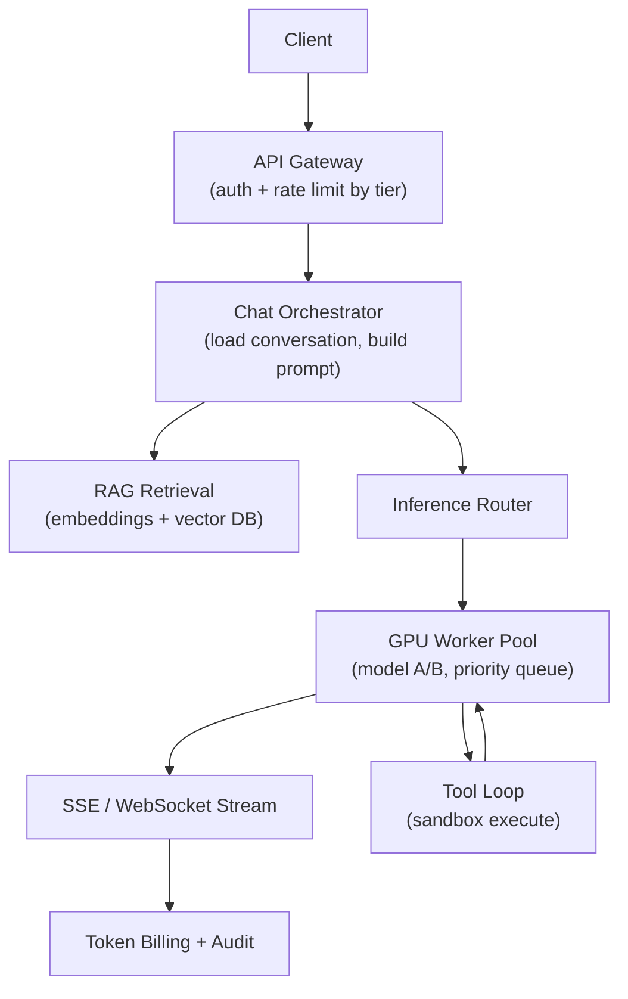

# Problem 39: ChatGPT (LLM Chat Platform)

## Business Problem
Serve conversational AI to millions of users: accept prompts (text + files), route to **LLM inference**, stream tokens back in real time, manage conversation history, enforce rate limits/tiers, and run tool calls (search, code, plugins) safely.

## Hard Requirements
- **Streaming responses** — first token in **< 1 s** where possible.
- Context window management (truncate/summarize long threads).
- **GPU inference cluster** scaling; queue during demand spikes.
- Safety: content moderation, prompt injection defenses, PII filtering.
- Billing by tokens; API keys and tier-based rate limits.

## Why One Pattern Is Not Enough
| If you only use… | What breaks |
| --- | --- |
| Sync HTTP until full completion | Timeouts; poor UX on long answers |
| One model server | GPU OOM; no A/B of models |
| Unlimited context in prompt | Cost explosion; model limits |
| Tool calls without sandbox | Remote code execution risk |

You need **streaming API**, **inference queue**, **RAG pipeline** (optional), **agent/tool orchestration**, **moderation pipeline**, and **token accounting**.

## Architecture Overview


## Pattern Mix
| Concern | Patterns | Role |
| --- | --- | --- |
| Streaming | [SSE/WebSocket](../Frontend_patterns/), [Pipeline](../Concurrency_patterns/07-pipeline.md) | Token-by-token delivery |
| Inference | [Queue-Based Load Leveling](../Scalability_patterns/09-queue-based-load-leveling.md), [Bulkhead](../Resilience_Pattern/04-bulkhead.md) | Free vs paid pools |
| Context | [RAG](../AI_Agentic_patterns/01-rag-retrieval-augmented-generation.md), summarization | Long thread handling |
| Agents | [Agent Loop](../AI_Agentic_patterns/), tool registry | Multi-step reasoning |
| Safety | [Moderation Pipeline](../Security_patterns/), [Fail Closed](../Resilience_Pattern/05-fail-fast.md) | Block harmful I/O |
| Billing | [Metering](../Data_domain_patterns/), [Idempotency](../Distributed_system_patterns/20-idempotency.md) | Token usage per request |
| Rate limits | [Token Bucket](../Distributed_system_patterns/22-token-bucket.md), [Rate Limiting](../Distributed_system_patterns/18-rate-limiting.md) | TPM/RPM caps |
| Cache | [Prompt Cache](../AI_Agentic_patterns/) | Reuse prefix embeddings |

## Happy-Path Flow
1. User sends message → orchestrator appends to thread → retrieves RAG chunks if enabled.
2. Job enqueued to inference with priority (Plus > free).
3. GPU worker streams tokens → gateway forwards SSE to client.
4. Model invokes `web_search` tool → orchestrator runs tool → second inference pass.
5. Complete → persist assistant message → deduct token quota.

## Failure Scenarios
- **GPU queue full:** Return 429 with retry-after; [Load Shedding](../Resilience_Pattern/08-load-shedding.md) on free tier.
- **Tool timeout:** Return partial answer; log tool failure.
- **Moderation hit mid-stream:** Truncate response; replace with policy message.

## TypeScript Sketch
```typescript
async function* chatStream(userId: string, threadId: string, message: string) {
  await rateLimit.check(userId, 'chat');
  const context = await threads.buildContext(threadId, message);
  const job = await inference.enqueue({ model: 'gpt-4', context, stream: true });
  for await (const chunk of job.stream()) {
    if (await moderation.block(chunk.text)) break;
    yield chunk;
  }
  await billing.recordTokens(userId, job.usage);
}
```

## Patterns Used
[RAG](../AI_Agentic_patterns/01-rag-retrieval-augmented-generation.md) · [Queue-Based Load Leveling](../Scalability_patterns/09-queue-based-load-leveling.md) · [Rate Limiting](../Distributed_system_patterns/18-rate-limiting.md) · [Pipeline](../Concurrency_patterns/07-pipeline.md) · [Bulkhead](../Resilience_Pattern/04-bulkhead.md)
