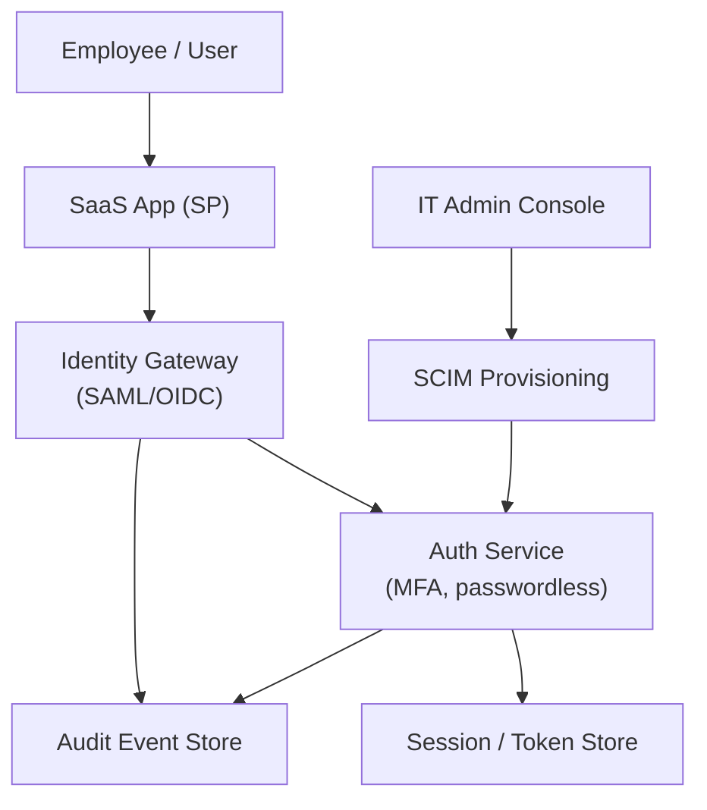

# Problem 40: Enterprise SSO & Identity Platform (Okta-Style)

> **Porter Value Chain:** Firm Infrastructure

## Business Problem
Enterprises need one place to manage **identity** across hundreds of apps: SSO via SAML/OIDC, MFA, user provisioning, and audit logs for every login. IT admins onboard/offboard employees; apps trust the identity provider — not local passwords.

## Hard Requirements
- **SSO login** in < 2 s for federated apps.
- Support **SAML, OIDC, SCIM** provisioning.
- **MFA** (TOTP, push, WebAuthn) enforced by policy.
- **Multi-tenant** — each customer org isolated.
- Immutable **audit trail** for compliance (SOC2, HIPAA).

## Why One Pattern Is Not Enough
| If you only use… | What breaks |
| --- | --- |
| Shared user table for all orgs | Cross-tenant data leak |
| Session stored only in one app | Logout doesn't propagate |
| Sync SCIM in HTTP request | Timeouts; partial provisioning |
| No rate limit on login | Credential stuffing succeeds |

You need **Multi-tenant isolation**, **token federation**, **session management**, **SCIM async provisioning**, and **audit event sourcing**.

## Architecture Overview


## Pattern Mix
| Concern | Patterns | Role |
| --- | --- | --- |
| Multi-tenant | [Multi-Tenant Partitioning](../Data_domain_patterns/21-multi-tenant-partitioning.md), [RBAC](../Security_patterns/) | Org-scoped users and policies |
| Auth | [OAuth2](../Security_patterns/), token federation | SAML/OIDC trust |
| Abuse | [Rate Limiting](../Distributed_system_patterns/18-rate-limiting.md), [Token Bucket](../Distributed_system_patterns/22-token-bucket.md) | Login brute-force protection |
| Provisioning | [Outbox](../Distributed_system_patterns/11-outbox-pattern.md), [Queue-Based Load Leveling](../Scalability_patterns/09-queue-based-load-leveling.md) | Async SCIM sync |
| Audit | [Event Sourcing](../Data_domain_patterns/15-event-sourcing.md) | Every login and admin action |
| Resilience | [Circuit Breaker](../Resilience_Pattern/01-circuit-breaker.md) | IdP upstream failures |

## Happy-Path Flow
1. User hits App → redirect to IdP **OIDC** authorize.
2. User completes **MFA** → IdP issues short-lived token.
3. App validates token → creates local session stub.
4. IT admin deprovisions user via **SCIM** → async revoke all sessions.

## Failure Scenarios
| Failure | Response |
| --- | --- |
| MFA device lost | Backup codes + admin recovery workflow |
| SCIM partial failure | Retry with idempotency; DLQ for manual fix |
| Token replay | Short TTL + rotation; revoke list in cache |
| IdP outage | Cached JWKS; optional read-only degrade policy |

## TypeScript Sketch
```typescript
async function authenticate(orgId: string, credentials: LoginDto) {
  await rateLimit.check(`login:${orgId}:${credentials.ip}`, 10, 3600);
  const user = await auth.verify(orgId, credentials);
  if (user.mfaRequired) return { step: 'MFA_REQUIRED', challengeId: user.challengeId };
  const session = await sessions.create({ orgId, userId: user.id, ttlSec: 3600 });
  await audit.append({ type: 'LOGIN_SUCCESS', orgId, userId: user.id });
  return { sessionToken: session.token };
}
```

## Patterns Used (quick links)
[Multi-Tenant Partitioning](../Data_domain_patterns/21-multi-tenant-partitioning.md) · [Rate Limiting](../Distributed_system_patterns/18-rate-limiting.md) · [Event Sourcing](../Data_domain_patterns/15-event-sourcing.md) · [Outbox](../Distributed_system_patterns/11-outbox-pattern.md) · [Circuit Breaker](../Resilience_Pattern/01-circuit-breaker.md)
