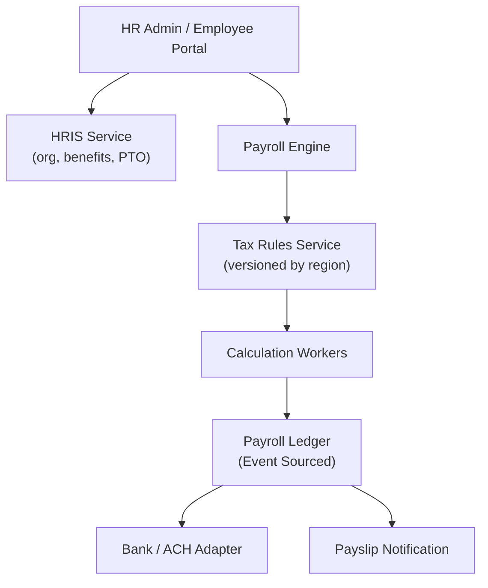

# Problem 41: HRIS + Payroll Platform (Workday / ADP-Style)

> **Porter Value Chain:** Human Resource Management

## Business Problem
Companies run **payroll** for thousands of employees across regions with different tax rules, benefits, and pay schedules. HR manages hiring, org structure, time-off, and compensation — payroll must never double-pay or miss a tax withholding.

## Hard Requirements
- **Bi-weekly pay runs** for 100k+ employees without error.
- **Regional tax rules** versioned and auditable.
- Benefits enrollment windows; eligibility rules.
- **Idempotent** pay run per period + employer.
- Employee self-service portal for payslips.

## Why One Pattern Is Not Enough
| If you only use… | What breaks |
| --- | --- |
| One global tax table | Wrong withholding per state/country |
| Pay run without idempotency | Double paycheck on retry |
| Sync calc in single thread | Misses payroll deadline |
| HR and payroll same monolith DB | Lock contention on pay day |

You need **Sharding by employer**, **saga pay run**, **event-sourced payroll ledger**, **async calculation workers**, and **idempotent batch jobs**.

## Architecture Overview


## Pattern Mix
| Concern | Patterns | Role |
| --- | --- | --- |
| Isolation | [Sharding](../Scalability_patterns/03-sharding.md), [Multi-Tenant Partitioning](../Data_domain_patterns/21-multi-tenant-partitioning.md) | Per employer |
| Pay run | [Saga](../Distributed_system_patterns/10-saga.md), [Job Scheduler](./36-job-scheduler.md) | Batch with compensate |
| Correctness | [Idempotency](../Distributed_system_patterns/20-idempotency.md), [Event Sourcing](../Data_domain_patterns/15-event-sourcing.md) | One run per period |
| Scale | [Queue-Based Load Leveling](../Scalability_patterns/09-queue-based-load-leveling.md), [Bulkhead](../Resilience_Pattern/04-bulkhead.md) | Parallel calc workers |
| Payout | [Outbox](../Distributed_system_patterns/11-outbox-pattern.md), [Adapter](../Structural%20Patterns/Adapter.md) | Reliable ACH file delivery |

## Happy-Path Flow
1. HR closes timecards for period → triggers **pay run** job (idempotent key = `employerId:period`).
2. Workers compute gross → deductions → net per employee using **versioned tax rules**.
3. **Ledger** records all line items as events.
4. **Outbox** sends ACH batch to bank adapter → payslip emails async.

## Failure Scenarios
| Failure | Response |
| --- | --- |
| Worker crash mid-run | Resume from checkpoint; idempotent line items |
| Bank reject one ACH | Saga: partial retry; manual review queue |
| Tax rule update mid-run | Lock rule version at run start |
| Employee terminated same day | Eligibility rules in saga branch |

## TypeScript Sketch
```typescript
async function runPayroll(employerId: string, period: string) {
  const key = `${employerId}:${period}`;
  if (await idempotency.exists(key)) return idempotency.result(key);
  const ruleVersion = await taxRules.lockVersion(employerId, period);
  const employees = await hris.activeEmployees(employerId);
  await queue.enqueueBatch(employees.map(e => ({ employerId, period, employeeId: e.id, ruleVersion })));
  const result = await ledger.finalizeRun(employerId, period);
  await idempotency.save(key, result);
  return result;
}
```

## Patterns Used (quick links)
[Saga](../Distributed_system_patterns/10-saga.md) · [Idempotency](../Distributed_system_patterns/20-idempotency.md) · [Event Sourcing](../Data_domain_patterns/15-event-sourcing.md) · [Sharding](../Scalability_patterns/03-sharding.md) · [Job Scheduler](./36-job-scheduler.md)
