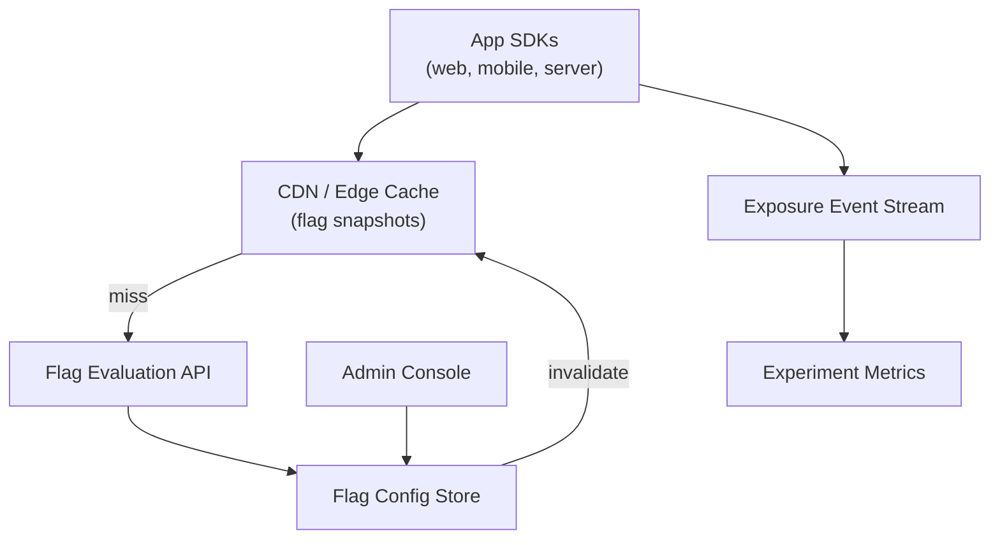

# Problem 42: Feature Flag & Experimentation Platform (LaunchDarkly-Style)

> **Porter Value Chain:** Technology Development

## Business Problem
Product and engineering teams roll out features **gradually**, run **A/B tests**, and **kill-switch** bad releases without redeploying. SDKs in mobile, web, and backend must evaluate flags in **< 10 ms** at billions of requests/day.

## Hard Requirements
- Flag evaluation **< 10 ms** p99.
- **Percentage rollouts** and user targeting (country, tier).
- Consistent bucketing — same user always same variant.
- Instant kill switch propagation globally.
- Experiment metrics tied to exposure events.

## Why One Pattern Is Not Enough
| If you only use… | What breaks |
| --- | --- |
| Flag config in app config file | Requires deploy to change |
| Random % per request | Same user sees A and B |
| DB lookup every evaluation | Latency and DB meltdown |
| No audit on flag changes | Who turned on production flag? |

You need **Edge-cached flag config**, **consistent hashing for bucketing**, **Pub/Sub invalidation**, **event stream for exposures**, and **versioned flag state**.

## Architecture Overview


## Pattern Mix
| Concern | Patterns | Role |
| --- | --- | --- |
| Speed | [CDN](../Scalability_patterns/05-cdn.md), [Cache-Aside](../Scalability_patterns/04-cache-aside.md) | Push config to edge |
| Bucketing | [Consistent Hashing](../Distributed_system_patterns/), [Sharding](../Scalability_patterns/03-sharding.md) | Stable user → variant |
| Updates | [Pub/Sub](../Messaging_Integration_patterns/08-pub-sub.md) | Instant invalidation |
| Experiments | [Event Streaming](../Messaging_Integration_patterns/), [CQRS](../Scalability_patterns/06-cqrs.md) | Exposure vs conversion |
| Safety | [Event Sourcing](../Data_domain_patterns/15-event-sourcing.md) | Audit flag changes |

## Happy-Path Flow
1. Admin sets flag `new-checkout` → 10% rollout, target `country=US`.
2. Config version bumped → **Pub/Sub** invalidates edge caches.
3. SDK evaluates locally from snapshot → user bucket hash → variant B.
4. SDK emits **exposure event** async → experiment dashboard updates.

## Failure Scenarios
| Failure | Response |
| --- | --- |
| Edge cache stale | TTL 30s max; SDK polls version header |
| Evaluation API down | SDK uses last known snapshot (fail-safe default) |
| Bucket algorithm change | New experiment ID; don't mix with old |
| Kill switch | Default-off override in snapshot priority |

## TypeScript Sketch
```typescript
function evaluate(flag: FlagConfig, userId: string, attrs: Record<string, string>): boolean {
  if (!flag.enabled) return false;
  if (flag.targets && !flag.targets.every(([k, v]) => attrs[k] === v)) return false;
  const bucket = hash32(`${flag.key}:${userId}`) % 100;
  return bucket < flag.rolloutPercent;
}
```

## Patterns Used (quick links)
[CDN](../Scalability_patterns/05-cdn.md) · [Cache-Aside](../Scalability_patterns/04-cache-aside.md) · [Pub/Sub](../Messaging_Integration_patterns/08-pub-sub.md) · [CQRS](../Scalability_patterns/06-cqrs.md) · [Event Sourcing](../Data_domain_patterns/15-event-sourcing.md)
