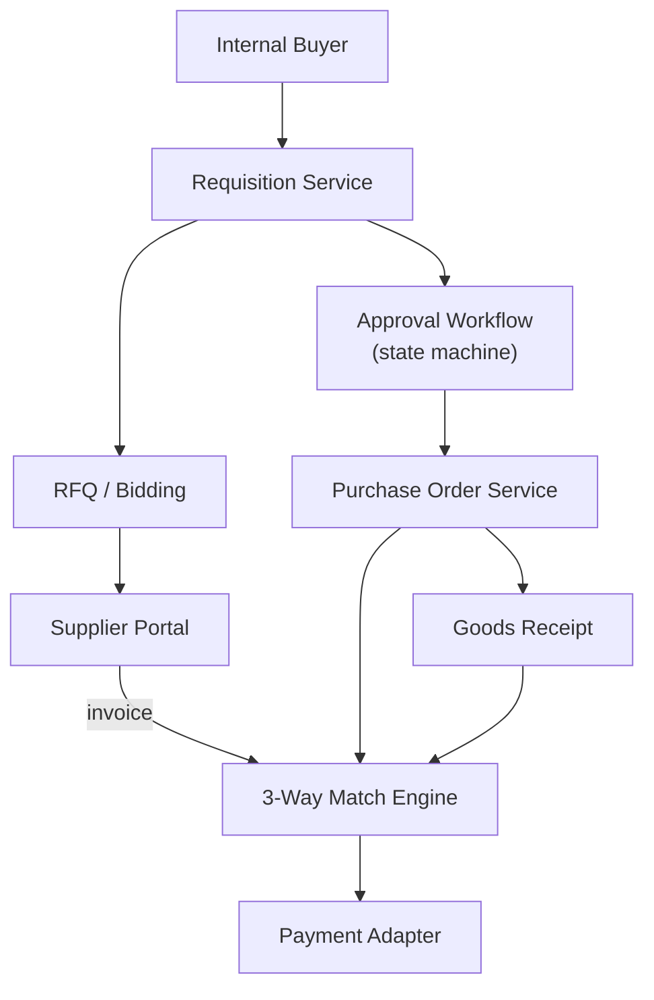

# Problem 43: Supplier Portal & PO Workflow (SAP Ariba-Style)

> **Porter Value Chain:** Procurement

## Business Problem
Enterprises buy goods and services through **approved suppliers**. Flow: requisition → RFQ → bids → approval chain → purchase order → goods receipt → **3-way match** (PO, receipt, invoice) before payment.

## Hard Requirements
- Multi-step **approval workflow** with delegation.
- **3-way match** prevents overpayment.
- Supplier portal for bids and invoice upload.
- Audit trail for SOX compliance.
- Support 10k POs/day across business units.

## Why One Pattern Is Not Enough
| If you only use… | What breaks |
| --- | --- |
| Email-based approvals | Lost threads; no audit |
| Pay invoice without receipt | Fraud and duplicate pay |
| Single approval table | Bottleneck on CFO |
| Supplier-specific formats | Manual data entry errors |

You need **State machine workflow**, **saga for PO lifecycle**, **Anti-Corruption Layer** for suppliers, **Outbox notifications**, and **event-sourced audit**.

## Architecture Overview


## Pattern Mix
| Concern | Patterns | Role |
| --- | --- | --- |
| Workflow | [State Machine](../Data_domain_patterns/), [Saga](../Distributed_system_patterns/10-saga.md) | Req → PO → pay |
| Integration | [Anti-Corruption Layer](../Distributed_system_patterns/15-anti-corruption-layer.md), [Adapter](../Structural%20Patterns/Adapter.md) | Supplier formats |
| Audit | [Event Sourcing](../Data_domain_patterns/15-event-sourcing.md) | SOX trail |
| Notify | [Outbox](../Distributed_system_patterns/11-outbox-pattern.md), [Event Notification](../Messaging_Integration_patterns/10-event-notification.md) | Approver alerts |
| Correctness | [Idempotency](../Distributed_system_patterns/20-idempotency.md) | Duplicate invoice reject |

## Happy-Path Flow
1. Buyer creates requisition → routes to manager approval chain.
2. Approved req → **RFQ** sent to qualified suppliers.
3. Winning bid → **PO issued** → supplier confirms.
4. Goods received → invoice uploaded → **3-way match** → payment saga.

## Failure Scenarios
| Failure | Response |
| --- | --- |
| Approver OOO | Delegation rules; escalate after SLA |
| Partial receipt | Partial match; pay prorated amount |
| Duplicate invoice | Idempotency on invoice number + supplier |
| Price mismatch | Hold for buyer review; never auto-pay |

## TypeScript Sketch
```typescript
async function threeWayMatch(poId: string, receiptId: string, invoiceId: string) {
  const [po, receipt, invoice] = await Promise.all([
    poStore.get(poId), receiptStore.get(receiptId), invoiceStore.get(invoiceId),
  ]);
  if (invoice.amount > po.amount || receipt.qty < invoice.qty) {
    return { status: 'REVIEW_REQUIRED', reason: 'MISMATCH' };
  }
  return paymentSaga.start({ poId, invoiceId, amount: invoice.amount });
}
```

## Patterns Used (quick links)
[Saga](../Distributed_system_patterns/10-saga.md) · [Event Sourcing](../Data_domain_patterns/15-event-sourcing.md) · [Anti-Corruption Layer](../Distributed_system_patterns/15-anti-corruption-layer.md) · [Outbox](../Distributed_system_patterns/11-outbox-pattern.md) · [Idempotency](../Distributed_system_patterns/20-idempotency.md)
