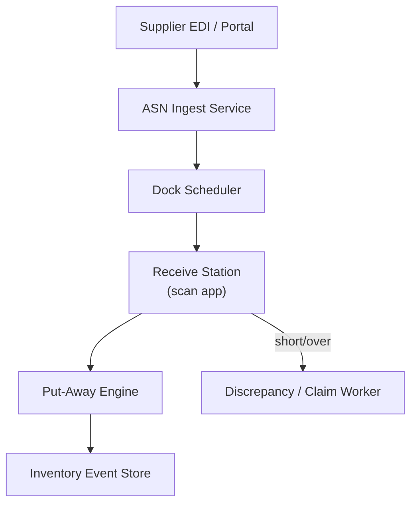

# Problem 44: Warehouse Receiving & ASN System (WMS Inbound)

> **Porter Value Chain:** Inbound Logistics

## Business Problem
Distribution centers receive truckloads from suppliers. **Advance Ship Notices (ASN)** describe expected cartons; dock staff scan, count, and **put away** to bin locations. Discrepancies trigger supplier claims.

## Hard Requirements
- Process **ASN before truck arrives** for dock scheduling.
- Scan-to-receive with **barcode validation**.
- Put-away directs worker to optimal bin.
- Reconcile expected vs received quantities.
- Support 50k carton scans/day per warehouse.

## Why One Pattern Is Not Enough
| If you only use… | What breaks |
| --- | --- |
| Receive without ASN | Dock chaos; no expected qty |
| Manual spreadsheet reconcile | Errors; slow supplier claims |
| Single receive queue | Peak truck hours backlog |
| Put-away rules in worker's head | Lost inventory in wrong bins |

You need **ASN ingestion pipeline**, **idempotent scan events**, **put-away rule engine**, **event-sourced inventory**, and **dock scheduling queue**.

## Architecture Overview


## Pattern Mix
| Concern | Patterns | Role |
| --- | --- | --- |
| Ingest | [Pipeline](../Concurrency_patterns/07-pipeline.md), [Anti-Corruption Layer](../Distributed_system_patterns/15-anti-corruption-layer.md) | EDI → canonical ASN |
| Scans | [Idempotency](../Distributed_system_patterns/20-idempotency.md) | Duplicate scan ignored |
| Inventory | [Event Sourcing](../Data_domain_patterns/15-event-sourcing.md) | Receive events append-only |
| Scheduling | [Queue-Based Load Leveling](../Scalability_patterns/09-queue-based-load-leveling.md), [Priority Queue](../Concurrency_patterns/) | Dock slots |
| Scale | [Sharding](../Scalability_patterns/03-sharding.md) | Per warehouse partition |

## Happy-Path Flow
1. Supplier sends **ASN** → expected pallets/cartons by SKU.
2. **Dock scheduler** assigns door and time slot.
3. Worker scans carton barcode → system validates against ASN → records receive event.
4. **Put-away** suggests bin → worker confirms → inventory updated.

## Failure Scenarios
| Failure | Response |
| --- | --- |
| ASN never arrived | Receive as blind; flag for reconciliation |
| Duplicate scan | Idempotent on scanId |
| Wrong bin put-away | Correct with adjustment event |
| Over-receive vs PO | Hold for supervisor approval |

## TypeScript Sketch
```typescript
async function receiveScan(warehouseId: string, scan: { barcode: string; dockId: string }) {
  const idKey = `scan:${scan.barcode}:${scan.dockId}`;
  if (!(await idempotency.tryClaim(idKey))) return { status: 'DUPLICATE' };
  const expected = await asn.lookup(warehouseId, scan.barcode);
  await inv.append({ type: 'CARTON_RECEIVED', warehouseId, sku: expected.sku, qty: expected.qty });
  const bin = await putAway.suggest(warehouseId, expected.sku);
  return { status: 'OK', suggestedBin: bin };
}
```

## Patterns Used (quick links)
[Event Sourcing](../Data_domain_patterns/15-event-sourcing.md) · [Pipeline](../Concurrency_patterns/07-pipeline.md) · [Idempotency](../Distributed_system_patterns/20-idempotency.md) · [Queue-Based Load Leveling](../Scalability_patterns/09-queue-based-load-leveling.md) · [Sharding](../Scalability_patterns/03-sharding.md)
