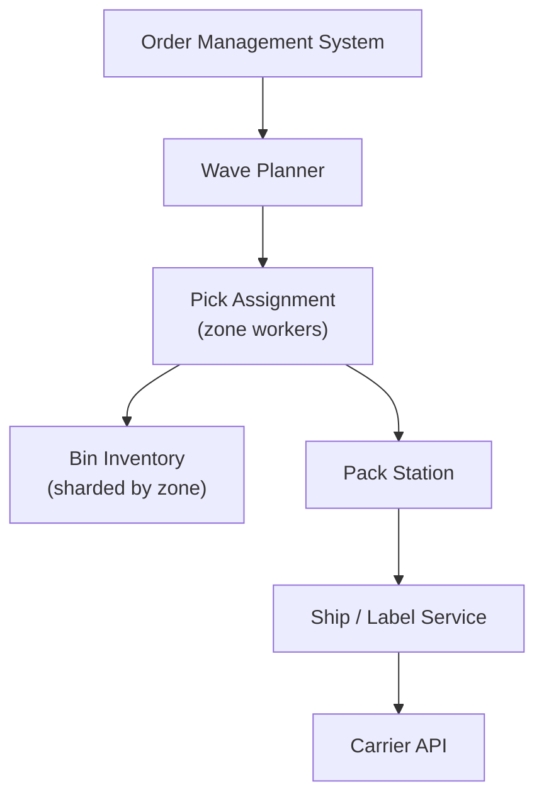

# Problem 45: Order Fulfillment — Pick-Pack-Ship (Amazon FC-Style)

> **Porter Value Chain:** Operations

## Business Problem
E-commerce **fulfillment centers** pick items from bins, pack cartons, and hand off to carriers. Systems assign **pick waves**, prevent double-pick of the same inventory, and optimize pack station throughput.

## Hard Requirements
- **No double-pick** of same bin qty for two orders.
- Wave planning groups orders by cut-off time.
- Pack scan validates all items before label print.
- Handoff to carrier with tracking number.
- 1M+ order lines/day per mega-FC.

## Why One Pattern Is Not Enough
| If you only use… | What breaks |
| --- | --- |
| First-come DB update on bin qty | Race → oversell physical stock |
| One picker one order always | Inefficient walking paths |
| Pack without validation scan | Wrong item shipped |
| Sync label API in pick loop | Pick station idle |

You need **Distributed lock / CAS on bin allocation**, **wave queue**, **saga order→pick→pack→ship**, **CQRS for FC dashboard**, and **bulkhead per zone**.

## Architecture Overview


## Pattern Mix
| Concern | Patterns | Role |
| --- | --- | --- |
| Allocation | [Distributed Lock](../Distributed_system_patterns/21-distributed-lock.md), compare-and-set | One pick per bin line |
| Lifecycle | [Saga](../Distributed_system_patterns/10-saga.md) | Pick → pack → ship |
| Planning | [Queue-Based Load Leveling](../Scalability_patterns/09-queue-based-load-leveling.md), [Job Scheduler](./36-job-scheduler.md) | Wave batches |
| Visibility | [CQRS](../Scalability_patterns/06-cqrs.md) | FC ops dashboard |
| Resilience | [Bulkhead](../Resilience_Pattern/04-bulkhead.md), [Circuit Breaker](../Resilience_Pattern/01-circuit-breaker.md) | Carrier API isolated |

## Happy-Path Flow
1. Orders cut off → **wave planner** creates pick tasks by zone.
2. Picker gets task list → scans bin + item → **CAS** decrements bin qty.
3. Tote arrives at pack → scan validates all SKUs → print label.
4. **Ship saga** commits → carrier tracking → OMS updated.

## Failure Scenarios
| Failure | Response |
| --- | --- |
| Bin empty (sync drift) | Exception pick; cycle count trigger |
| Label API timeout | Retry; don't double-ship same carton |
| Picker abandons task | Release allocation after TTL |
| Damaged item at pack | Substitute or short-ship saga branch |

## TypeScript Sketch
```typescript
async function confirmPick(taskId: string, binId: string, sku: string, qty: number) {
  const ok = await bins.compareAndDecrement(binId, sku, qty);
  if (!ok) throw new BinShortError(binId, sku);
  await pickTasks.complete(taskId, { binId, sku, qty });
  return { nextStop: await routing.packStation(taskId) };
}
```

## Patterns Used (quick links)
[Distributed Lock](../Distributed_system_patterns/21-distributed-lock.md) · [Saga](../Distributed_system_patterns/10-saga.md) · [CQRS](../Scalability_patterns/06-cqrs.md) · [Queue-Based Load Leveling](../Scalability_patterns/09-queue-based-load-leveling.md) · [Bulkhead](../Resilience_Pattern/04-bulkhead.md)
